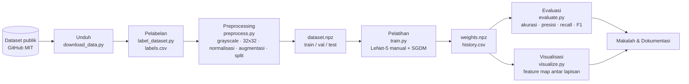

# 00 — Ringkasan & Pipeline Penelitian

Dokumen ini memberi gambaran umum sistem deteksi jalan berlubang berbasis CNN
yang inti algoritmanya ditulis manual dengan NumPy.

## Tujuan

Mengklasifikasikan citra jalan menjadi dua kelas: **normal** (label 0) dan
**pothole / berlubang** (label 1), menggunakan arsitektur **LeNet-5** yang seluruh
operasi maju (forward) dan mundur (backward)-nya diturunkan dan dikodekan sendiri.

## Pipeline penelitian

## Tahapan dan berkas terkait

| Tahap | Berkas | Keluaran |
|-------|--------|----------|
| 1. Dataset | `src/download_data.py` | `data/raw/{pothole,normal}/` + `SOURCE.txt` |
| 2. Pelabelan | `src/label_dataset.py` | `data/labeled/labels.csv` |
| 3. Preprocessing | `src/preprocess.py` | `data/processed/dataset.npz`, `norm_stats.json` |
| 4. Inti CNN | `src/cnn/*` | modul forward/backward manual |
| 5. Pelatihan | `src/train.py` | `experiments/weights.npz`, `history.csv` |
| 6. Evaluasi | `src/evaluate.py` | metrik + figur confusion matrix/kurva |
| 7. Visualisasi | `src/visualize.py` | peta fitur tiap lapisan |

## Prinsip "tanpa magic"

Seluruh komponen pembelajaran inti — konvolusi, pooling, ReLU, softmax,
cross-entropy, dan backpropagation — berada di `src/cnn/` dan ditulis manual.
Kebenarannya dibuktikan dengan **numerical gradient checking** (`src/cnn/gradcheck.py`),
yang membandingkan gradien analitik dengan gradien numerik (galat < 1e-5).

Library pihak ketiga hanya menjadi *helper* pinggiran:
- **Pillow** — membaca & me-resize citra,
- **scikit-learn** — `train_test_split` (pembagian data),
- **matplotlib** — menggambar kurva & peta fitur.

Lihat dokumen berikut untuk detail aliran data antar hidden layer:
[01-arsitektur](01-arsitektur.md) · [02-forward-pass](02-forward-pass.md) ·
[03-backpropagation](03-backpropagation.md) · [04-training-loop](04-training-loop.md) ·
[05-struktur-kode](05-struktur-kode.md) · [06-formula](06-formula.md).
