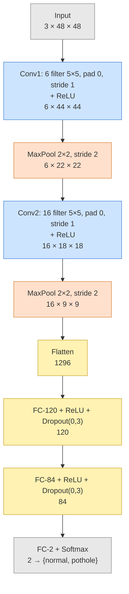
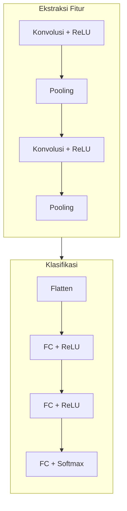

# 01 — Arsitektur LeNet-5 & Aliran Dimensi Hidden Layer

Dokumen ini memperlihatkan **pergerakan data** saat melewati tiap hidden layer
CNN, lengkap dengan perubahan bentuk (dimensi) tensor.

## Rumus ukuran feature map

Setiap kali tensor melewati lapisan konvolusi atau pooling, dimensi spasialnya
berubah mengikuti rumus (notasi slide ITB):

$$\text{output} = \frac{W - N + 2P}{S} + 1$$

dengan W = tinggi/lebar masukan, N = ukuran kernel, P = padding, S = stride.

## Diagram arsitektur (aliran dimensi)

## Perhitungan dimensi langkah demi langkah

| Tahap | Operasi | Rumus | Keluaran |
|-------|---------|-------|----------|
| Input | — | — | 3 × 48 × 48 |
| Conv1 | 6×(5×5), P=0, S=1 | (48 − 5 + 0)/1 + 1 = 44 | 6 × 44 × 44 |
| Pool1 | max 2×2, S=2 | (44 − 2)/2 + 1 = 22 | 6 × 22 × 22 |
| Conv2 | 16×(5×5), P=0, S=1 | (22 − 5 + 0)/1 + 1 = 18 | 16 × 18 × 18 |
| Pool2 | max 2×2, S=2 | (18 − 2)/2 + 1 = 9 | 16 × 9 × 9 |
| Flatten | 16·9·9 | — | 1296 |
| FC1 | 1296 → 120 | — | 120 |
| FC2 | 120 → 84 | — | 84 |
| FC3 | 84 → 2 | — | 2 |

## Tiga lapisan utama CNN

- **Lapisan Konvolusi (+ReLU)** — mendeteksi pola lokal (tepi, tekstur, retakan).
- **Lapisan Pooling** — meringkas & mengecilkan dimensi spasial (max pooling).
- **Lapisan Terhubung Penuh (MLP)** — menggabungkan fitur menjadi keputusan kelas.

LeNet asli memakai *average pooling* + *sigmoid*; di sini dipakai *max pooling* +
*ReLU* (varian modern) karena lebih stabil dilatih, tanpa mengurangi sifat
"manual" dari implementasi.
