# 02 — Forward Pass (Aliran Data Maju)

Forward pass adalah perjalanan data dari citra masukan hingga peluang kelas.
Tiap hidden layer menerima keluaran lapisan sebelumnya, mengolahnya, dan
meneruskannya ke lapisan berikutnya.

## Aliran data antar lapisan

```mermaid
flowchart LR
    X["x<br/>(N,3,48,48)"] -->|"konvolusi 6@5×5"| H1["a1<br/>(N,6,44,44)"]
    H1 -->|"ReLU max(0,·)"| H1r["(N,6,44,44)"]
    H1r -->|"max-pool 2×2"| H2["(N,6,22,22)"]
    H2 -->|"konvolusi 16@5×5"| H3["a2<br/>(N,16,18,18)"]
    H3 -->|"ReLU"| H3r["(N,16,18,18)"]
    H3r -->|"max-pool 2×2"| H4["(N,16,9,9)"]
    H4 -->|"flatten"| V["(N,1296)"]
    V -->|"W·x+b, ReLU"| F1["(N,120)"]
    F1 -->|"W·x+b, ReLU"| F2["(N,84)"]
    F2 -->|"W·x+b"| Z["skor z<br/>(N,2)"]
    Z -->|"softmax"| P["peluang p<br/>(N,2)"]
```



## Operasi tiap lapisan (ringkas)

1. **Konvolusi** — setiap filter digeser ke seluruh citra menghasilkan satu
   *feature map*:
   $$O[f,i,j] = b_f + \sum_c \sum_m \sum_n X[c,\,iS+m,\,jS+n]\cdot W[f,c,m,n]$$
   Diimplementasikan efisien lewat **im2col** (tiap jendela → satu kolom matriks),
   sehingga konvolusi menjadi satu perkalian matriks `W_col @ X_col`.

2. **ReLU** — `f(u) = max(0, u)`, membuang nilai negatif (non-linearitas).

3. **Max Pooling** — ambil nilai maksimum tiap jendela 2×2, mengecilkan dimensi
   spasial setengahnya dan memberi sedikit invariansi terhadap pergeseran.

4. **Flatten** — ubah tensor `(N,16,9,9)` menjadi vektor `(N,1296)`.

5. **Fully-Connected** — `y = Wx + b`, menggabungkan seluruh fitur.

6. **Softmax** — ubah skor menjadi peluang:
   $$p_i = \frac{e^{z_i}}{\sum_{j=1}^{K} e^{z_j}}$$

## Implementasi (model.py)

```python
def forward(self, x):
    out = x
    for layer in self.layers:   # conv1, relu1, pool1, conv2, relu2, pool2,
        out = layer.forward(out)  # flatten, fc1, relu3, fc2, relu4, fc3
    return out                  # skor mentah (logit), softmax dihitung di loss
```

Tiap lapisan menyimpan *cache* (masukan/indeks argmax) yang diperlukan saat
backward — lihat [03-backpropagation](03-backpropagation.md).
