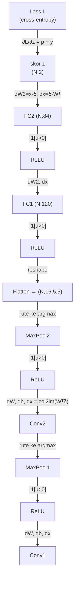

# 03, Backpropagation (Aliran Gradien Mundur)

Backpropagation menghitung gradien loss terhadap setiap parameter dengan
menerapkan **aturan rantai** dari lapisan terakhir ke lapisan pertama. Gradien
mengalir berlawanan arah dengan forward pass.

## Aliran gradien antar lapisan



## Gradien tiap lapisan

| Lapisan | Gradien terhadap masukan | Gradien parameter |
|---------|--------------------------|-------------------|
| Softmax+CE | `∂L/∂z = (p − y)/N` |, |
| Dense | `dx = δ Wᵀ` | `dW = xᵀ δ`, `db = Σ δ` |
| ReLU | `dx = δ ⊙ 1[u>0]` |, |
| Flatten | `dx = reshape(δ)` |, |
| MaxPool | gradien hanya ke posisi argmax |, |
| Conv2D | `dx = col2im(W_col ᵀ δ_col)` | `dW = δ_col · X_colᵀ`, `db = Σ δ` |

## Mengapa softmax + cross-entropy diturunkan bersama?

Jika dihitung terpisah, turunan softmax berupa matriks Jacobian K×K yang rumit.
Namun saat digabung dengan cross-entropy, seluruh suku saling menyederhanakan
menjadi bentuk yang sangat ringkas dan stabil secara numerik:

$$\frac{\partial L}{\partial z_i} = p_i - y_i$$

Inilah titik awal aliran gradien, vektor `p − y` di lapisan keluaran.

## Implementasi (model.py)

```python
def backward(self, dscores):
    grad = dscores                      # ∂L/∂z = p − y
    for layer in reversed(self.layers): # urutan mundur
        grad = layer.backward(grad)     # tiap lapisan kembalikan dx
    return grad
```

Setiap lapisan berparameter mengisi `self.grads["W"]` dan `self.grads["b"]` saat
`backward()`, yang kemudian dipakai optimizer untuk memperbarui bobot
(lihat [04-training-loop](04-training-loop.md)).

## Verifikasi kebenaran (gradient checking)

Kebenaran seluruh turunan di atas dibuktikan dengan `src/cnn/gradcheck.py`:
gradien analitik dibandingkan dengan gradien numerik (beda hingga terpusat).
Hasil galat relatif tipikal **1e-9 hingga 1e-11** (< ambang 1e-5) untuk semua
lapisan, bukti bahwa backward diturunkan dengan benar.
