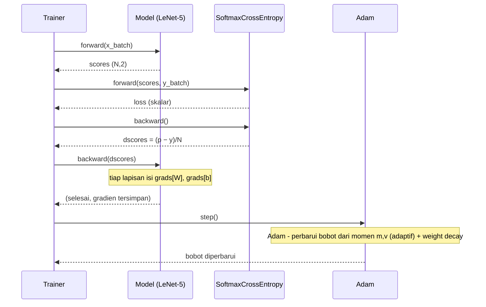
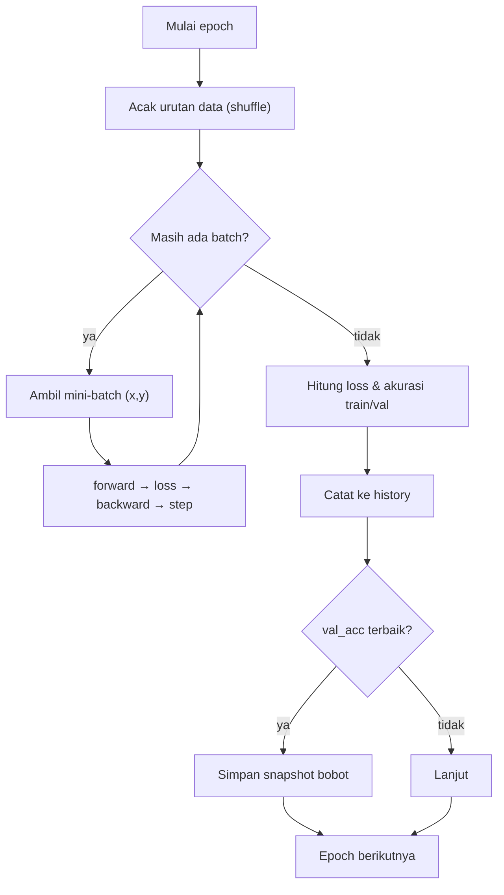

# 04 — Training Loop (Satu Iterasi Pelatihan)

Pelatihan mengulang empat langkah untuk tiap mini-batch: forward → loss →
backward → update. Diagram berikut menunjukkan interaksi antar komponen.

## Sequence diagram satu iterasi

## Satu epoch

## Aturan pembaruan (Adam)

Adam mengadaptasi laju tiap parameter θ dari estimasi momen pertama (m) dan kedua
(v) gradien ∇:

$$m \leftarrow \beta_1 m + (1-\beta_1)\nabla,\quad
v \leftarrow \beta_2 v + (1-\beta_2)\nabla^2,\quad
\theta \leftarrow \theta - \eta\,\frac{\hat m}{\sqrt{\hat v}+\varepsilon}$$

dengan η = 1e-3 (meluruh mengikuti jadwal *cosine*) dan L2 *weight decay* 1e-4
ditambahkan pada gradien bobot W. (Optimizer `SGDMomentum` juga tersedia sebagai
alternatif.)

## Hyperparameter pelatihan

| Parameter | Nilai |
|-----------|-------|
| Learning rate (η) | 1e-3 (Adam) |
| Jadwal LR | cosine decay |
| Weight decay (L2) | 1e-4 (hanya W) |
| Dropout (FC) | 0.3 |
| Batch size | 32 |
| Epoch | 40 |
| Optimizer | Adam |
| Loss | Cross-entropy |
| Inisialisasi | He (Conv/FC ber-ReLU), Xavier (output) |
| Ensembel (seed) | 42, 7, 123 (rata-rata softmax) + TTA |

## Pemilihan bobot terbaik (early stopping ringan)

Karena dataset kecil, model cenderung *overfit* setelah beberapa epoch. Trainer
menyimpan snapshot bobot pada epoch dengan **akurasi validasi tertinggi**, lalu
memulihkannya di akhir pelatihan. Dengan begitu `weights.npz` mewakili model
generalisasi terbaik, bukan epoch terakhir yang sudah overfit.
