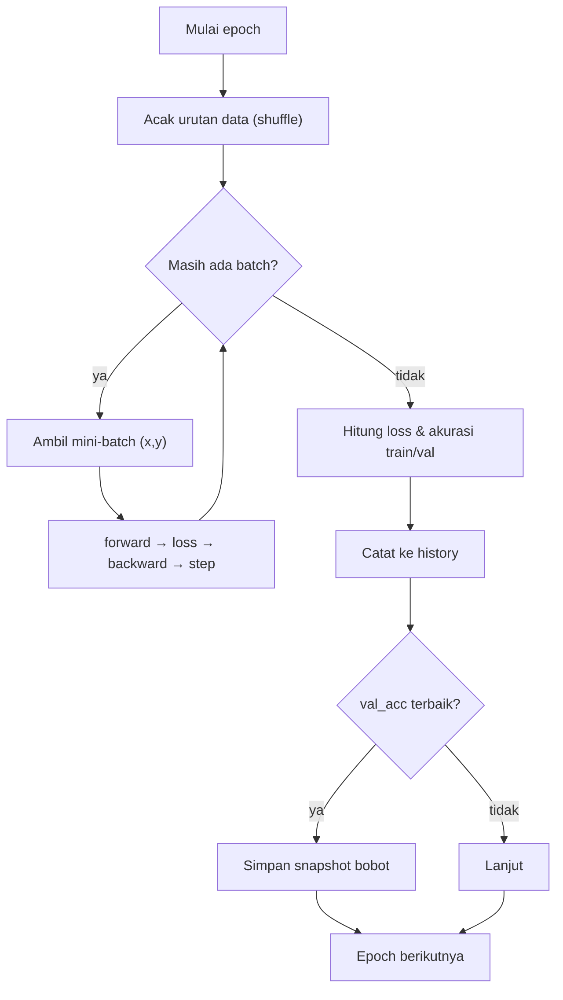

# 04 — Training Loop (Satu Iterasi Pelatihan)

Pelatihan mengulang empat langkah untuk tiap mini-batch: forward → loss →
backward → update. Diagram berikut menunjukkan interaksi antar komponen.

## Sequence diagram satu iterasi

```mermaid
sequenceDiagram
    participant TR as Trainer
    participant M as Model (LeNet-5)
    participant L as SoftmaxCrossEntropy
    participant O as SGDMomentum

    TR->>M: forward(x_batch)
    M-->>TR: scores (N,2)
    TR->>L: forward(scores, y_batch)
    L-->>TR: loss (skalar)
    TR->>L: backward()
    L-->>TR: dscores = (p − y)/N
    TR->>M: backward(dscores)
    Note over M: tiap lapisan isi grads[W], grads[b]
    M-->>TR: (selesai, gradien tersimpan)
    TR->>O: step()
    Note over O: v ← μv − lr·∇ ; θ ← θ + v
    O-->>TR: bobot diperbarui
```

## Satu epoch



## Aturan pembaruan (SGD + momentum)

Untuk tiap parameter θ dengan gradien ∇:

$$v \leftarrow \mu\,v - \eta\,\nabla \qquad \theta \leftarrow \theta + v$$

dengan η (learning rate) = 0.01 dan μ (momentum) = 0.9.

## Hyperparameter pelatihan

| Parameter | Nilai |
|-----------|-------|
| Learning rate (η) | 0.01 |
| Momentum (μ) | 0.9 |
| Batch size | 32 |
| Epoch | 15 |
| Optimizer | SGD + momentum |
| Loss | Cross-entropy |
| Inisialisasi | He (Conv/FC ber-ReLU), Xavier (output) |

## Pemilihan bobot terbaik (early stopping ringan)

Karena dataset kecil, model cenderung *overfit* setelah beberapa epoch. Trainer
menyimpan snapshot bobot pada epoch dengan **akurasi validasi tertinggi**, lalu
memulihkannya di akhir pelatihan. Dengan begitu `weights.npz` mewakili model
generalisasi terbaik, bukan epoch terakhir yang sudah overfit.
