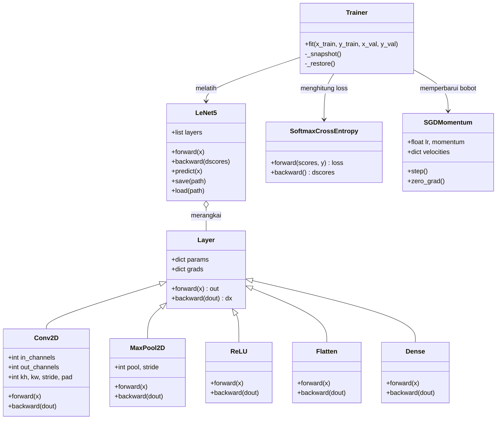
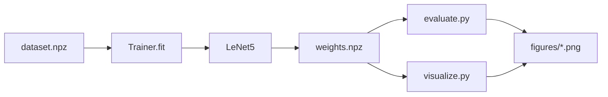

# 05 — Struktur Kode (Class Diagram)

Modul inti `src/cnn/` dirancang modular: tiap lapisan adalah objek dengan
antarmuka `forward`/`backward` yang seragam, sehingga model hanya merangkai
daftar lapisan.

## Diagram kelas

## Tanggung jawab tiap berkas

| Berkas | Isi |
|--------|-----|
| `tensor_utils.py` | `im2col`, `col2im`, `conv_output_size` |
| `init.py` | inisialisasi He & Xavier |
| `layers.py` | `Conv2D`, `MaxPool2D`, `ReLU`, `Flatten`, `Dense` |
| `losses.py` | `softmax`, `SoftmaxCrossEntropy` |
| `optim.py` | `SGDMomentum` |
| `metrics.py` | confusion matrix, akurasi, presisi, recall, F1 |
| `model.py` | `LeNet5` (rakit lapisan, simpan/muat bobot) |
| `trainer.py` | `Trainer` (training loop + best-val checkpoint) |
| `gradcheck.py` | numerical gradient checking |

## Alur data antar objek

