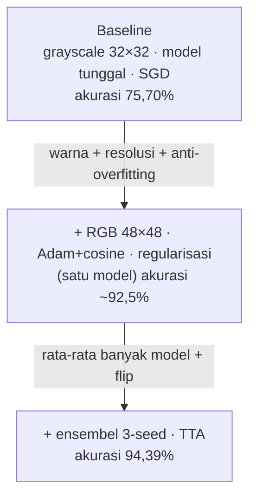

# Catatan Pengembangan — Perjalanan Proyek

Halaman ini merekam **apa yang dikerjakan dan mengapa** selama pengembangan, dari
model dasar sampai situs & makalah yang sekarang. Ditulis naratif per tahap
(masalah → yang dilakukan → hasil) agar mudah diikuti, dengan detail teknis kunci
di tiap langkah. Untuk ringkasan padat per rilis, lihat `CHANGELOG.md` di repo.

## Garis besar akurasi

## Tahap 1 — Menaikkan akurasi 75,7% → 94,4%

**Masalah.** Model dasar (grayscale 32×32, model tunggal, SGD+momentum, 15 epoch)
hanya mencapai **akurasi uji 75,70%** dan jelas *overfitting* — akurasi latih
mendekati 100% tetapi validasi mentok ~80–84%.

**Yang dilakukan** (semua tetap murni-NumPy, tanpa framework):

1. **Sinyal masukan (pengungkit terbesar).** Beralih dari grayscale ke **RGB** dan
   dari 32×32 ke **48×48** agar warna serta detail tekstur/bayangan lubang terjaga.
   `flat_dim` dibuat dinamis agar arsitektur mendukung ukuran selain 32. *Satu
   model naik dari ~79% ke ~92,5%.*
2. **Regularisasi (anti-overfitting).** Menambah lapisan **Dropout 0.3** (inverted,
   dengan mode train/eval), **L2 weight decay 1e-4** (hanya bobot W), dan
   **augmentasi daring** acak per-batch (flip, geser ±3px, kontras, kecerahan,
   noise) yang menggantikan augmentasi luring statis yang mudah dihafal.
3. **Optimasi pelatihan.** Optimizer **Adam** (lr 1e-3) + **jadwal cosine**; epoch
   dinaikkan ke 40; bobot val-terbaik disimpan lalu dipulihkan.
4. **Inferensi.** **Ensembel 3-seed** [42, 7, 123] (rata-rata softmax) dipadu
   **test-time augmentation** (rata-rata citra asli + flip). *Mengangkat 92,5%
   menjadi 94,39%.*

**Hasil (107 citra uji).** Akurasi **94,39%** (+18,7), presisi 91,53%, recall
**98,18%**, F1 **94,74%** — confusion matrix TP 54 / TN 47 / FP 5 / FN 1.
Berkas kunci: `config.py`, `src/cnn/{augment,layers,model,optim,trainer}.py`,
`src/{preprocess,train,evaluate}.py`.

## Tahap 2 — Menyelaraskan dokumen, makalah & situs

**Masalah.** Commit peningkatan akurasi hanya mengubah kode & figur; seluruh prosa
(makalah, docs, situs) masih menuliskan angka lama 75,7%, arsitektur grayscale
32×32, model tunggal, dan tak menyebut ensembel.

**Yang dilakukan.** Menyelaraskan semua teks ke keadaan yang ter-commit: makalah
(abstrak, metodologi, hasil, confusion matrix, riwayat 40 epoch), docs 00–05,
`index.html` (hero + kartu statistik + diagram), `PANDUAN` & `README`. Angka
dikonfirmasi dari commit + figur `confusion_matrix.png`. Mirror `web/static/content`
di-regenerate dari sumber.

## Tahap 3 — Melatih ulang ensembel secara lokal

**Masalah.** Bobot 94,4% dilatih di mesin lain dan **gitignored** — tak tersedia di
mesin ini; bobot lama tak kompatibel dengan arsitektur baru (boot server gagal).

**Yang dilakukan.** Karena data mentah tersedia, dijalankan `preprocess` (RGB 48×48)
lalu latih **3-seed ensembel** dari nol. Hasil evaluasi **mereproduksi 94,39% persis**
(F1 94,74%, confusion matrix identik). Bobot per-seed kemudian di-commit agar
mesin lain bisa deploy tanpa latih ulang.

## Tahap 4 — Server inferensi & pipeline deploy

**Masalah.** `web/server.py` masih grayscale 32×32 + model tunggal — tak bisa
menyajikan model RGB48 ensembel.

**Yang dilakukan.** Menulis ulang `server.py`: preprocessing **RGB 48×48**, memuat
**ensembel per-seed**, menerapkan **TTA**, dropout mati saat inferensi; `build-image.sh`
mem-bundle bobot per-seed. Alur rilis: `web/build-image.sh <tag>` → `docker build` +
`k3d image import` → menaikkan `newTag` di manifes `homelab-platform` (branch `master`)
yang di-watch **ArgoCD** (auto-sync). Situs live: **potholes.arisjirat.com**.

## Tahap 5 — Makalah: kode ↔ diagram & bedah-kode

Dokumentasi teknis dinilai terlalu tinggi-level. Ditambahkan **komponen "codepair"**
(kode di kiri, diagram alur di kanan pada desktop; menjadi tab di layar sempit),
lalu **LAMPIRAN A — bedah kode 17 modul** (im2col/col2im, Conv fwd/bwd, ReLU,
MaxPool, Flatten, Dense, Dropout, Softmax+CE, init, rakit LeNet-5, SGD, Adam,
trainer, augment, preprocess, ensembel+TTA): tiap bagian berisi potongan kode setia
+ penjelasan baris demi baris + diagram. Semua diagram divalidasi otomatis
(`mermaid.parse`) sebelum rilis.

## Tahap 6 — Keterbacaan: syntax highlight & diagram vertikal

Kode di makalah diberi **syntax highlighting** (highlight.js) dengan palet selaras
tema, dan **seluruh flowchart dibuat vertikal (TB)** agar pas di kolom diagram yang
sempit. Diagram juga diperbesar (tak lagi mengecil ke ukuran natural). Satu diagram
sequence yang error (akibat simbol `;`/`√`/diakritik) diperbaiki.

## Tahap 7 — Lapisan ramah pembaca awam

Setelah direview dengan kacamata pembaca awam, ditambahkan: **Kamus Istilah**
(glosarium ~35 istilah + simbol matematika, tiap entri definisi + analogi), **24
callout "💡 Untuk awam"** (analogi sehari-hari) setelah tiap rumus utama & pembuka
bagian teknis, **primer** di kepala LAMPIRAN A, kotak **"📐 cara membaca rumus"**,
serta penjinakan jargon di halaman muka (legend Conv/Pool/FC/Softmax, gloss
"ensembel = panel juri").

## Ringkasan rilis situs

| Rilis | Isi utama |
|-------|-----------|
| v6 | Model RGB48 ensembel 94,4% live + situs & prosa 94,4% + `server.py` RGB48+TTA |
| v7 | Komponen kode↔diagram, perbaikan & pembesaran diagram |
| v8 | Syntax highlight + semua diagram vertikal |
| v9 | LAMPIRAN A: bedah kode 17 modul |
| v10 | Lapisan ramah awam: glosarium, callout, primer |
