# DETEKSI JALAN BERLUBANG MENGGUNAKAN CONVOLUTIONAL NEURAL NETWORK (CNN) YANG DIIMPLEMENTASIKAN DARI NOL DENGAN ARSITEKTUR LeNet-5

**Makalah Penelitian — Pemrosesan Citra Digital & Pembelajaran Mendalam**

---

## ABSTRAK

Jalan berlubang merupakan salah satu penyebab kerusakan kendaraan dan kecelakaan
lalu lintas. Identifikasi lubang jalan secara manual memerlukan waktu dan biaya
besar, sehingga diperlukan sistem otomatis berbasis pengolahan citra. Penelitian
ini membangun sistem klasifikasi citra jalan menjadi dua kelas — **normal** dan
**berlubang (pothole)** — menggunakan *Convolutional Neural Network* (CNN)
dengan arsitektur **LeNet-5**. Berbeda dengan kebanyakan penelitian yang
memakai pustaka siap pakai (TensorFlow/Keras/PyTorch), seluruh **inti algoritma**
pada penelitian ini — operasi konvolusi, *pooling*, fungsi aktivasi ReLU,
*softmax*, *cross-entropy*, dan *backpropagation* — **diturunkan secara matematis
dan diimplementasikan manual menggunakan NumPy** tanpa fasilitas diferensiasi
otomatis. Kebenaran implementasi turunan (gradien) dibuktikan melalui *numerical
gradient checking* dengan galat relatif berkisar 10⁻⁹–10⁻¹¹. Dataset terdiri
dari 712 citra (348 normal, 364 berlubang) yang diunduh dari repositori publik,
lalu di-*preprocessing* menjadi citra **RGB 48×48**, dinormalisasi,
diaugmentasi secara daring, dan dibagi 70/15/15. Model dilatih dengan optimizer
**Adam** (η=1×10⁻³) berjadwal *cosine* selama 40 epoch, dengan regularisasi
(*weight decay* L2 + *dropout*), lalu digabung menjadi **ensembel 3 model**
(*seed* berbeda) dipadu *test-time augmentation*. Hasil pengujian pada data uji
memperoleh **akurasi 94,39%**, **presisi 91,53%**, **recall 98,18%**, dan
**F1-score 94,74%**. Temuan utama menunjukkan implementasi manual mampu belajar
dengan benar (terbukti dapat *overfit* sempurna pada subset kecil dan lulus
*gradient checking*), dan bahwa kombinasi kanal RGB, resolusi lebih tinggi,
regularisasi, augmentasi daring, serta ensembel menjaga generalisasi pada
dataset kecil sehingga akurasi uji mencapai 94,39%.

**Kata kunci:** deteksi jalan berlubang, convolutional neural network, LeNet-5,
backpropagation, implementasi dari nol, pengolahan citra digital.

*Abstract — This study builds a road image classifier (normal vs pothole) using a
LeNet-5 Convolutional Neural Network whose core operations (convolution, pooling,
ReLU, softmax, cross-entropy, backpropagation) are derived and implemented from
scratch in NumPy, without any deep-learning framework or autograd. Backward
correctness is verified by numerical gradient checking (relative error 1e-9–1e-11).
On 712 images preprocessed to 48×48 RGB, trained with Adam + cosine LR,
regularization (L2 weight decay + dropout) and a 3-seed ensemble with test-time
augmentation, the model attains 94.39% accuracy, 91.53% precision, 98.18% recall,
and 94.74% F1 on the test set.*

---

## DAFTAR ISI

1. BAB I — PENDAHULUAN
2. BAB II — TINJAUAN PUSTAKA
3. BAB III — METODOLOGI PENELITIAN
4. BAB IV — HASIL DAN PEMBAHASAN
5. BAB V — TEMUAN
6. BAB VI — KESIMPULAN DAN SARAN
7. DAFTAR PUSTAKA

---

# BAB I — PENDAHULUAN

## 1.1 Latar Belakang

Infrastruktur jalan merupakan tulang punggung mobilitas masyarakat dan
perekonomian. Namun, kondisi jalan yang rusak — terutama berlubang — masih
menjadi masalah serius di banyak wilayah, termasuk Indonesia. Jalan berlubang
tidak hanya mempercepat kerusakan komponen kendaraan (ban, suspensi, pelek),
tetapi juga meningkatkan risiko kecelakaan lalu lintas, khususnya bagi pengendara
sepeda motor yang jumlahnya dominan.

Proses inventarisasi kerusakan jalan secara konvensional dilakukan melalui survei
manual oleh petugas. Cara ini memerlukan tenaga, waktu, dan biaya yang besar,
serta rentan terhadap subjektivitas penilai. Seiring berkembangnya teknologi
*computer vision* (yakni komputer "melihat" dan memahami isi gambar) dan *deep learning* (cabang AI yang belajar sendiri dari banyak contoh), identifikasi kerusakan jalan dapat
diotomatisasi melalui analisis citra: kamera merekam permukaan jalan, lalu sebuah
model klasifikasi menentukan apakah suatu citra mengandung lubang atau tidak.

*Convolutional Neural Network* (CNN) adalah arsitektur *deep learning* yang sangat
efektif untuk data bertopologi grid (data yang tersusun kotak-kotak rapi seperti piksel pada foto) seperti citra. CNN mampu **belajar fitur
secara otomatis** langsung dari data, menggantikan ekstraksi fitur manual yang
selama ini menjadi tahap tersulit dalam pengolahan citra klasik. Keunggulan
inilah yang membuat CNN menjadi metode dominan pada tugas klasifikasi citra,
deteksi objek, hingga segmentasi.

Sebagian besar implementasi CNN dewasa ini mengandalkan pustaka tingkat tinggi
(TensorFlow, Keras, PyTorch) yang menyembunyikan detail matematis di balik
fungsi siap pakai — sering disebut sebagai "kotak hitam" (*black box*). Bagi
tujuan pembelajaran, pendekatan ini menyisakan kesenjangan pemahaman: bagaimana
sebenarnya konvolusi dihitung? Bagaimana gradien mengalir mundur melalui lapisan
*pooling*? Mengapa *softmax* dan *cross-entropy* selalu dipasangkan? (istilah *softmax* dan *cross-entropy* dijelaskan di BAB II)

Penelitian ini menjawab kesenjangan tersebut dengan **mengimplementasikan inti
CNN dari nol** menggunakan NumPy, tanpa fasilitas diferensiasi otomatis. Setiap
operasi maju (*forward*) dan turunan mundurnya (*backward*) diturunkan secara
eksplisit dan dikodekan manual. Arsitektur yang dipilih adalah **LeNet-5**, model
CNN klasik yang relatif sederhana sehingga ideal untuk dipelajari ("minim magic"),
namun tetap memuat seluruh komponen esensial CNN modern: konvolusi, *pooling*,
lapisan terhubung penuh, dan *softmax*.

## 1.2 Rumusan Masalah

Berdasarkan latar belakang, rumusan masalah penelitian ini adalah:

1. Bagaimana mengimplementasikan operasi inti CNN (konvolusi, *pooling*, ReLU,
   *softmax*, *cross-entropy*, dan *backpropagation*) secara manual tanpa pustaka
   *deep learning*?
2. Bagaimana membuktikan bahwa implementasi turunan (gradien) yang ditulis manual
   sudah benar?
3. Bagaimana kinerja model LeNet-5 hasil implementasi manual dalam
   mengklasifikasikan citra jalan berlubang, diukur dengan akurasi, presisi,
   *recall*, dan F1-score?

## 1.3 Tujuan Penelitian

1. Menurunkan dan mengimplementasikan seluruh komponen inti CNN secara manual
   menggunakan NumPy.
2. Memverifikasi kebenaran *backpropagation* melalui *numerical gradient checking*.
3. Melatih dan menguji model LeNet-5 untuk klasifikasi citra jalan berlubang serta
   melaporkan metrik evaluasinya secara jujur.
4. Memvisualisasikan pergerakan data antar *hidden layer* untuk memahami cara
   kerja CNN.

## 1.4 Batasan Masalah

1. Tugas dibatasi pada **klasifikasi citra biner** (normal vs berlubang), bukan
   deteksi objek (*bounding box*) maupun segmentasi.
2. Citra masukan diubah menjadi **RGB berukuran 48×48** agar pelatihan murni
   NumPy (tanpa GPU) tetap selesai dalam waktu wajar dan dapat direproduksi.
3. Pustaka pihak ketiga hanya dipakai sebagai *helper* pinggiran: Pillow (baca/
   resize citra), scikit-learn (pembagian data), dan matplotlib (visualisasi).
   **Inti pembelajaran 100% manual.**
4. Arsitektur dibatasi pada LeNet-5 (varian ReLU + *max pooling*).

## 1.5 Manfaat Penelitian

- **Akademis:** memberikan pemahaman mendalam mengenai mekanika internal CNN yang
  biasanya tersembunyi di balik pustaka, beserta bukti matematis kebenarannya.
- **Praktis:** menjadi prototipe sistem deteksi jalan berlubang otomatis yang
  dapat dikembangkan lebih lanjut untuk pemantauan kondisi jalan.

---

# BAB II — TINJAUAN PUSTAKA

## 2.1 Penelitian Terdahulu (Jurnal Acuan)

Bagian ini merangkum lima penelitian relevan tentang deteksi/klasifikasi
kerusakan jalan berbasis CNN dan *deep learning*.

**[1] Identification of Road Damage Using Convolutional Neural Network (CNN)**
(Jurnal Ilmiah Sistem Informasi / JUISI). Penelitian ini menerapkan CNN untuk
mengidentifikasi kerusakan jalan dan memperoleh akurasi keseluruhan **97,50%**,
presisi rata-rata 96,77%, *recall* 99,37%, serta F1-score 97,72%. Hasil ini
menunjukkan potensi CNN yang sangat tinggi bila didukung data memadai dan
arsitektur yang tepat.

**[2] Deteksi Kerusakan Jalan Berdasarkan Citra Digital Menggunakan CNN**
(Jurnal Indonesia: Manajemen Informatika dan Komunikasi / JIMIK, STMIKI).
Penelitian ini membangun model CNN untuk mengklasifikasikan citra jalan rusak
dan utuh. Studi tersebut juga membandingkan arsitektur konvensional dengan
ResNet-18, di mana ResNet-18 unggul (akurasi ~92%) dibanding CNN sederhana
(~85%) karena kemampuan *residual block* mengatasi masalah *vanishing gradient*.

**[3] Implementasi Algoritma YOLO untuk Mendeteksi Jalan Berlubang dan Retak**
(JITSI: Jurnal Ilmiah Teknologi Sistem Informasi). Penelitian ini memakai
pendekatan deteksi objek (YOLO). Dengan pembagian data latih–validasi 90%–10%,
diperoleh tingkat keyakinan tertinggi 97%, mAP 93,2%, F1-score 88,7%, *recall*
90,8%, dan presisi 86,7% pada epoch ke-100. Ini menegaskan pendekatan deteksi
objek cocok untuk melokalisasi posisi lubang, melengkapi pendekatan klasifikasi.

**[4] Automatic Classifier of Road Condition and Early Warning System for
Potholes** (Indonesian Journal of Artificial Intelligence and Data Mining /
IJAIDM, UIN Suska). Penelitian ini mengklasifikasikan kondisi jalan menggunakan
dataset besar berisi 22.538 citra dalam dua kelas (pothole dan normal), serta
mengusulkan sistem peringatan dini. Ukuran dataset yang besar menjadi faktor
penting dalam mencapai generalisasi yang baik.

**[5] Arya et al., RDD2022: A Multi-national Image Dataset for Automatic Road
Damage Detection** (arXiv). Penelitian ini menyediakan dataset citra kerusakan
jalan berskala multinasional (termasuk data dari beberapa negara) untuk deteksi
kerusakan jalan otomatis, dan menjadi tolok ukur (*benchmark*) penting di bidang
ini. Dataset RDD juga memuat empat tipe kerusakan: retak memanjang, retak
melintang, retak buaya (*alligator crack*), dan lubang (*pothole*).

**Tabel 2.1. Perbandingan penelitian terdahulu**

| No | Metode | Tugas | Dataset | Metrik utama |
|----|--------|-------|---------|--------------|
| [1] | CNN | Klasifikasi | — | Akurasi 97,5% |
| [2] | CNN vs ResNet-18 | Klasifikasi | Citra digital jalan | Akurasi 85% vs 92% |
| [3] | YOLO | Deteksi objek | Lubang & retak | mAP 93,2%; F1 88,7% |
| [4] | CNN | Klasifikasi | 22.538 citra | — (dataset besar) |
| [5] | Benchmark (RDD2022) | Deteksi | Multinasional | Dataset acuan |
| **Penelitian ini** | **CNN LeNet-5 (manual/dari nol) + ensembel** | **Klasifikasi** | **712 citra** | **Akurasi 94,4%; F1 94,7%** |

Posisi penelitian ini berbeda dari kelima acuan: alih-alih mengejar akurasi
tertinggi dengan pustaka siap pakai, fokusnya adalah **transparansi dan
pemahaman** — membuktikan bahwa CNN dapat dibangun dan dilatih dengan benar dari
prinsip dasar.

## 2.2 Pembelajaran Mendalam (Deep Learning)

*Deep learning* adalah cabang *machine learning* di mana model belajar
melaksanakan tugas klasifikasi langsung dari data (citra, teks, suara). Istilah
"*deep*" merujuk pada banyaknya lapisan dalam jaringan: jaringan saraf
tradisional hanya memiliki 2–3 lapisan, sedangkan jaringan dalam dapat memiliki
puluhan hingga ratusan lapisan. Perbedaan mendasar antara *machine learning*
klasik dan *deep learning* terletak pada ekstraksi fitur: pada *machine learning*
fitur dirancang manual, sedangkan *deep learning* menggabungkan ekstraksi fitur
dan klasifikasi dalam satu jaringan yang dilatih bersama.

## 2.3 Convolutional Neural Network (CNN)

CNN (ConvNet) adalah algoritma *deep learning* yang umum dipakai untuk memproses
data bertopologi grid seperti citra. Secara ringkas, **CNN = ANN + konvolusi**.
Tidak seperti jaringan saraf biasa, neuron pada CNN tersusun dalam tiga dimensi
(lebar, tinggi, kedalaman). CNN terdiri atas tiga jenis lapisan utama:

1. **Lapisan Konvolusi (+ ReLU)** — ekstraksi fitur lokal.
2. **Lapisan Pooling** — peringkasan & pengurangan dimensi spasial.
3. **Lapisan Terhubung Penuh (Fully-Connected/MLP)** — klasifikasi.

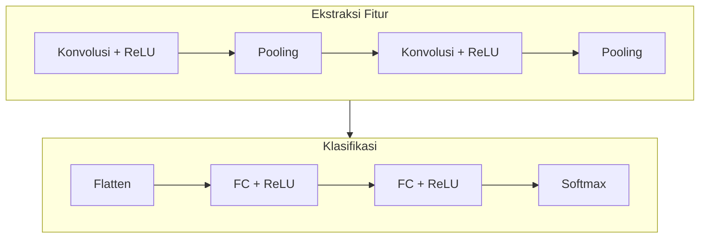
```mermaid
flowchart TB
    subgraph FE["Ekstraksi Fitur"]
        c1["Konvolusi + ReLU"] --> p1["Pooling"] --> c2["Konvolusi + ReLU"] --> p2["Pooling"]
    end
    subgraph CL["Klasifikasi"]
        fl["Flatten"] --> d1["FC + ReLU"] --> d2["FC + ReLU"] --> sm["Softmax"]
    end
    FE --> CL
```

### 2.3.1 Lapisan Konvolusi

Lapisan konvolusi melakukan operasi konvolusi pada citra masukan dengan sejumlah
penapis (*filter/kernel*). Tiap penapis menghasilkan satu *feature map*. Untuk
satu filter *f* dan posisi keluaran (*i*, *j*):

$$O[f,i,j] = b_f + \sum_{c}\sum_{m}\sum_{n} X[c,\,iS+m,\,jS+n]\cdot W[f,c,m,n]$$

> 💡 **Untuk awam:** Bayangkan sebuah "stempel" kecil (W) yang digeser ke seluruh bagian foto. Di tiap posisi, stempel menempel pada sepetak piksel (X), lalu tiap angka dikalikan dan semuanya dijumlahkan (itulah arti tanda Σ, "jumlahkan semua"), ditambah sedikit angka penyesuai (b). Hasilnya (O) adalah satu nilai yang menyatakan seberapa cocok pola di petak itu dengan stempel — misalnya seberapa jelas ada garis tepi lubang.

Ukuran *feature map* keluaran dihitung dengan rumus:

$$\text{output} = \frac{W - N + 2P}{S} + 1$$

dengan W = tinggi/lebar masukan, N = ukuran kernel, P = *padding*, dan S =
*stride*. Terdapat tiga jenis *padding*: *valid* (tanpa padding), *same* (ukuran
keluaran sama dengan masukan), dan *full*.

> 💡 **Untuk awam:** Rumus ini cuma menghitung ukuran gambar setelah "stempel" selesai digeser ke seluruh permukaan. Karena stempel tidak bisa keluar dari tepi foto, beberapa baris piksel di pinggir tak terpakai, sehingga gambar hasilnya sedikit lebih kecil dari aslinya. Itu sebabnya di tiap lapisan gambar makin menyusut, mirip foto yang dipangkas pinggirnya berkali-kali.

Penapis yang berbeda menghasilkan *feature map* yang berbeda — misalnya penapis
Sobel mendeteksi tepi, penapis *box blur* memperhalus. Pada CNN, nilai penapis
**tidak ditentukan manual** melainkan **dipelajari** melalui pelatihan.

### 2.3.2 Fungsi Aktivasi ReLU

*Rectified Linear Unit* memetakan nilai negatif ke nol dan mempertahankan nilai
positif:

$$f(u) = \max(0, u)$$

> 💡 **Untuk awam:** Ini seperti keran satu arah: kalau angka yang masuk bernilai negatif, keran menutup dan keluarannya jadi 0; kalau positif, angka dibiarkan lewat apa adanya. Aturan sederhana "buang yang negatif, loloskan yang positif" inilah yang membuat jaringan mampu menangkap pola yang rumit.

ReLU memberi sifat non-linier yang memungkinkan jaringan memodelkan hubungan
kompleks, sekaligus mempercepat pelatihan dibanding sigmoid karena tidak
mengalami saturasi pada sisi positif.

### 2.3.3 Lapisan Pooling

*Pooling* mengurangi dimensi spasial *feature map* untuk menekan beban komputasi
dan memberi sedikit invariansi terhadap pergeseran. Dua jenis yang umum: *max
pooling* (mengambil nilai maksimum jendela) dan *average pooling* (mengambil
rata-rata). Umumnya CNN memakai *max pooling* dengan jendela 2×2 dan *stride* 2.

### 2.3.4 Lapisan Terhubung Penuh dan Softmax

Setelah ekstraksi fitur, *feature map* diratakan (*flatten*) lalu dialirkan ke
lapisan terhubung penuh (MLP). Lapisan terakhir menghasilkan vektor berdimensi K
(jumlah kelas) yang diubah menjadi peluang oleh fungsi *softmax*:

$$\sigma(\vec{z})_i = \frac{e^{z_i}}{\sum_{j=1}^{K} e^{z_j}}$$

> 💡 **Untuk awam:** Softmax mengubah skor mentah tiap kelas menjadi persentase keyakinan yang totalnya pas 100%. Mirip penghitungan suara pemilu: tiap kandidat (kelas) mendapat porsi suara, dan semua porsi kalau dijumlahkan pasti 100%. Jadi model bisa berkata, misalnya, "80% yakin berlubang, 20% normal".

Keluaran *softmax* bernilai 0–1 dan berjumlah satu, sehingga dapat ditafsirkan
sebagai distribusi peluang antar kelas. Metode pembelajaran yang dipakai adalah
*supervised learning* dengan mekanisme *backpropagation*.

## 2.4 Prinsip Backpropagation dan Aturan Rantai

*Backpropagation* adalah algoritma untuk menghitung gradien fungsi loss terhadap
seluruh parameter jaringan secara efisien, dengan menerapkan **aturan rantai**
(*chain rule*) kalkulus secara berulang dari lapisan keluaran ke lapisan masukan.

Misalkan sebuah jaringan merupakan komposisi fungsi berlapis:

$$L = f_n(f_{n-1}(\cdots f_1(x)))$$

Aturan rantai menyatakan bahwa turunan loss terhadap keluaran lapisan ke-*k*
dapat diperoleh dari turunan loss terhadap keluaran lapisan ke-(*k*+1):

$$\frac{\partial L}{\partial h_k} = \frac{\partial L}{\partial h_{k+1}} \cdot \frac{\partial h_{k+1}}{\partial h_k}$$

> 💡 **Untuk awam:** "Loss" (L) adalah ukuran seberapa besar model salah menebak. Untuk memperbaiki diri, model perlu tahu tiap lapisan menyumbang berapa banyak ke kesalahan itu — inilah gradien (lambang ∂ berarti "seberapa berpengaruh", dan δ adalah kesalahan yang datang dari lapisan sesudahnya). Rumus ini menghitungnya secara mundur, lapis demi lapis dari belakang ke depan, seperti efek domino yang jatuh berantai atau keterlambatan kereta yang merembet ke stasiun-stasiun sebelumnya.

Inilah inti efisiensi *backpropagation*: alih-alih menghitung ulang turunan dari
awal untuk tiap parameter, gradien "diwariskan" mundur lapis demi lapis. Setiap
lapisan hanya perlu mengetahui gradien yang datang dari lapisan sesudahnya
(disebut *upstream gradient*, dilambangkan δ), lalu:

1. menghitung gradien terhadap parameternya sendiri (untuk pembaruan bobot), dan
2. meneruskan gradien terhadap masukannya ke lapisan sebelumnya.

Pola "forward menyimpan cache, backward memakai cache" inilah yang menjadi dasar
desain modular pada implementasi penelitian ini: tiap lapisan adalah objek dengan
metode `forward(x)` dan `backward(δ)` yang seragam.

## 2.5 Metrik Evaluasi dan Confusion Matrix

Kinerja klasifikasi biner diukur dengan *confusion matrix* yang mencatat empat
kemungkinan hasil prediksi (kelas positif = pothole):

- **TP** (*true positive*): berlubang, diprediksi berlubang — benar.
- **TN** (*true negative*): normal, diprediksi normal — benar.
- **FP** (*false positive*): normal, diprediksi berlubang — salah (alarm palsu).
- **FN** (*false negative*): berlubang, diprediksi normal — salah (lubang terlewat).

Dari keempatnya diturunkan empat metrik:

$$\text{Akurasi} = \frac{TP+TN}{TP+TN+FP+FN}, \qquad
\text{Presisi} = \frac{TP}{TP+FP}$$
$$\text{Recall} = \frac{TP}{TP+FN}, \qquad
F1 = \frac{2\cdot\text{Presisi}\cdot\text{Recall}}{\text{Presisi}+\text{Recall}}$$

**Akurasi** mengukur proporsi prediksi benar secara keseluruhan, namun bisa
menyesatkan bila kelas tak seimbang. **Presisi** menjawab "dari semua yang
diprediksi berlubang, berapa yang benar?", sedangkan **recall** menjawab "dari
semua lubang sebenarnya, berapa yang berhasil ditemukan?". **F1-score** adalah
rata-rata harmonik presisi dan recall, memberi satu angka ringkas yang seimbang.
Dalam konteks keselamatan jalan, recall sering lebih diutamakan karena lubang
yang terlewat (FN) lebih berbahaya daripada peringatan palsu (FP).

## 2.6 Arsitektur LeNet-5

LeNet-5 diperkenalkan oleh Yann LeCun untuk pengenalan tulisan tangan dan
merupakan salah satu CNN pertama yang berhasil dilatih dengan *backpropagation*.
Strukturnya: Konvolusi 5×5 → *pooling* → Konvolusi 5×5 → *pooling* → FC-120 →
FC-84 → keluaran. LeNet asli memakai *average pooling* dan fungsi *sigmoid*.

Pada penelitian ini dipakai **varian modern**: *max pooling* dan *ReLU*, yang
lebih stabil dilatih, sambil tetap mempertahankan kerangka LeNet-5 yang sederhana
dan mudah dipelajari. Tabel 2.2 membandingkan LeNet dengan AlexNet (CNN
generasi berikut yang jauh lebih dalam) untuk menempatkan LeNet pada konteks.

**Tabel 2.2. Perbandingan LeNet dan AlexNet**

| Aspek | LeNet-5 | AlexNet |
|-------|---------|---------|
| Masukan | 32×32×1 (grayscale) | 227×227×3 (RGB) |
| Jumlah konvolusi | 2 | 5 |
| Aktivasi | sigmoid (asli) | ReLU |
| Pooling | average (asli) | max |
| Jumlah kelas | 10 | 1000 |
| Parameter | ~60 ribu | ~60 juta |

Kesederhanaan LeNet-5 menjadikannya pilihan ideal untuk implementasi manual:
seluruh aliran dimensi dan gradien dapat ditelusuri dengan mudah.

---

# BAB III — METODOLOGI PENELITIAN

## 3.1 Alur Penelitian

Penelitian mengikuti tujuh tahap berurutan, dari pengumpulan data hingga
visualisasi, sebagaimana digambarkan pada diagram berikut.

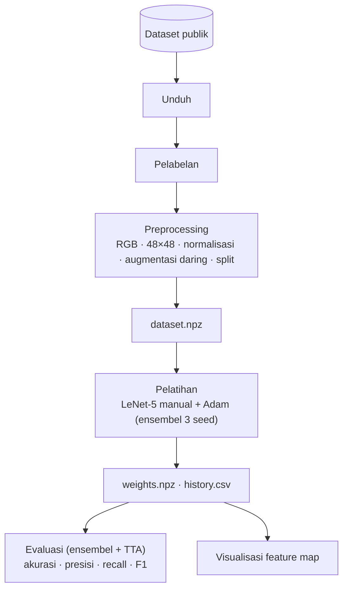
```mermaid
flowchart TB
    A[("Dataset publik")] --> B["Unduh"]
    B --> C["Pelabelan"]
    C --> D["Preprocessing<br/>RGB · 48×48 · normalisasi · augmentasi daring · split"]
    D --> E["dataset.npz"]
    E --> F["Pelatihan<br/>LeNet-5 manual + Adam (ensembel 3 seed)"]
    F --> G["weights.npz · history.csv"]
    G --> H["Evaluasi (ensembel + TTA)<br/>akurasi · presisi · recall · F1"]
    G --> I["Visualisasi feature map"]
```

Alur ini selaras dengan kerangka pelatihan CNN baku (memuat data → membagi data
latih/validasi → mendefinisikan arsitektur → menentukan opsi pelatihan → melatih
→ menguji).

## 3.2 Dataset

Dataset diunduh otomatis dari repositori publik GitHub berlisensi MIT yang
menyimpan citra jalan dalam dua folder kelas: *Pothole* (berlubang) dan *Plain*
(normal). Hanya berkas citra yang diperlukan yang diunduh melalui
`raw.githubusercontent.com`, kemudian disusun menjadi:

- `data/raw/pothole/` → label 1 (berlubang)
- `data/raw/normal/` → label 0 (normal)

Total **712 citra** berhasil diunduh dan diverifikasi (tidak korup). Catatan:
dataset ini bersifat umum (bukan khusus Indonesia). Pipeline dirancang agar mudah
diganti sumbernya — untuk data khusus Indonesia (misalnya Roboflow *Road Damage
Indonesia* atau subset RDD2022 Indonesia) cukup meletakkan citra pada kedua
folder kelas tersebut, lalu menjalankan kembali pipeline.

## 3.3 Pelabelan

Karena citra sudah terpisah per folder kelas, pelabelan dilakukan dengan membaca
struktur folder dan menulis berkas `labels.csv` berisi pasangan (path, label).
Hasil pelabelan dirangkum pada Tabel 3.1.

**Tabel 3.1. Hasil pelabelan dataset**

| Kelas | Label | Jumlah | Proporsi |
|-------|-------|--------|----------|
| normal | 0 | 348 | 48,9% |
| pothole | 1 | 364 | 51,1% |
| **Total** | | **712** | 100% |

Dataset relatif **seimbang** (≈49% : 51%), sehingga metrik akurasi cukup
representatif tanpa perlu penanganan kelas tak seimbang.

## 3.4 Preprocessing

Tahap *preprocessing* mengubah citra mentah beragam ukuran menjadi tensor seragam
siap latih, melalui lima langkah:

**1. Kanal warna (RGB).** Citra dipertahankan dalam **tiga kanal RGB** karena
informasi warna (mis. kontras aspal gelap vs genangan/bayangan di dalam lubang)
menambah sinyal diskriminatif dibanding grayscale. Sebagai pembanding, sweep
konfigurasi menunjukkan model RGB 48px mencapai test ~92,5% berbanding ~79% pada
varian grayscale 32px. Implementasi tetap menyediakan opsi grayscale via rumus
luminansi BT.601 ($Y = 0{,}299R + 0{,}587G + 0{,}114B$), namun konfigurasi final
memakai RGB.

**2. Resize.** Setiap citra di-*resize* menjadi **48×48** piksel — resolusi lebih
tinggi dari 32×32 agar detail tekstur lubang lebih terjaga, dengan tetap menjaga
biaya komputasi murni-NumPy dalam batas wajar.

**3. Normalisasi.** Nilai piksel diskalakan ke rentang [0, 1] lalu
distandardisasi:

$$x' = \frac{x - \mu}{\sigma}$$

> 💡 **Untuk awam:** Rumus ini menyetel semua foto ke "standar" yang sama sebelum dipelajari. μ adalah tingkat terang rata-rata semua foto, dan σ adalah seberapa lebar variasi terang-gelapnya. Dengan mengurangi rata-rata lalu membaginya, setiap foto seolah dipotret pada pencahayaan yang seragam, sehingga model tidak tertipu hanya karena satu foto kebetulan lebih terang atau lebih gelap.

dengan μ dan σ (satu skalar global, dipakai bersama untuk ketiga kanal) dihitung
dari data latih. Diperoleh **μ = 0,4728** dan **σ = 0,2172**. Standardisasi
mempercepat konvergensi karena menyamakan skala fitur.

**4. Augmentasi daring (data latih saja).** Untuk memperbanyak variasi dan
menekan *overfitting*, augmentasi dilakukan **daring** (*on-the-fly*) secara acak
per-*batch* setiap epoch, sehingga model tidak pernah melihat citra yang sama
persis dua kali. Transformasi yang diterapkan: *flip* horizontal (p=0,5),
pergeseran ±3 piksel (*edge-replicate*), penyesuaian kontras ×U(0,85; 1,15),
kecerahan +U(−0,15; 0,15), dan derau Gaussian (σ=0,05). Berbeda dari augmentasi
luring, teknik ini tidak menggandakan jumlah berkas melainkan meragamkan data
latih pada tiap iterasi.

**5. Pembagian data (split).** Data dibagi *stratified* (proporsi kelas terjaga)
menjadi 70% latih, 15% validasi, dan 15% uji. Hasil pembagian dirangkum pada
Tabel 3.2.

**Tabel 3.2. Pembagian data**

| Subset | Jumlah | Keterangan |
|--------|--------|------------|
| Latih (train) | 498 | + augmentasi daring acak tiap epoch |
| Validasi (val) | 107 | tanpa augmentasi |
| Uji (test) | 107 | tanpa augmentasi |

Contoh citra hasil *preprocessing* ditunjukkan pada Gambar 3.1.

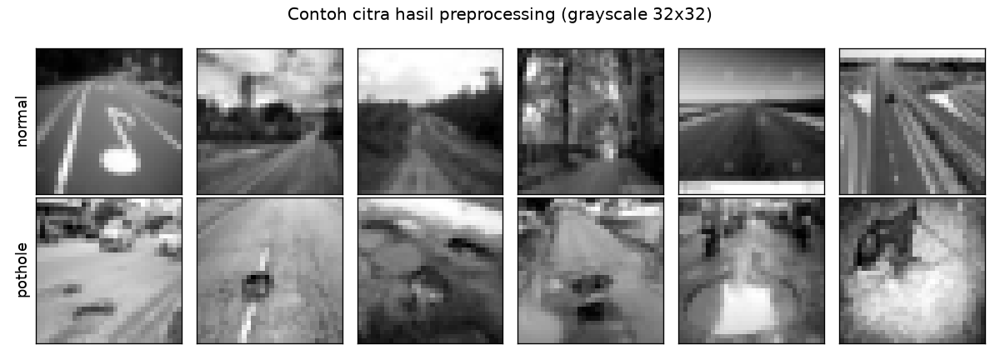

*Gambar 3.1. Contoh citra RGB 48×48 untuk kelas normal (atas) dan pothole
(bawah).*

## 3.5 Arsitektur Model

Model LeNet-5 yang diimplementasikan menerima citra 3×48×48 (RGB) dan menghasilkan
dua keluaran kelas. Aliran dimensi tiap *hidden layer* ditunjukkan pada Gambar 3.2.

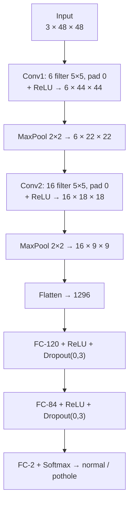
```mermaid
flowchart TB
    A["Input<br/>3 × 48 × 48"]
    B["Conv1: 6 filter 5×5, pad 0<br/>+ ReLU → 6 × 44 × 44"]
    C["MaxPool 2×2 → 6 × 22 × 22"]
    D["Conv2: 16 filter 5×5, pad 0<br/>+ ReLU → 16 × 18 × 18"]
    E["MaxPool 2×2 → 16 × 9 × 9"]
    F["Flatten → 1296"]
    G["FC-120 + ReLU + Dropout(0,3)"]
    H["FC-84 + ReLU + Dropout(0,3)"]
    I["FC-2 + Softmax → normal / pothole"]
    A --> B --> C --> D --> E --> F --> G --> H --> I
```

*Gambar 3.2. Arsitektur LeNet-5 (adaptasi RGB 48×48 + dropout) dan aliran dimensi
antar hidden layer.*

Perhitungan dimensi memakai rumus (W − N + 2P)/S + 1, dirangkum pada Tabel 3.3.

**Tabel 3.3. Perhitungan dimensi tiap lapisan**

| Tahap | Operasi | Rumus | Keluaran |
|-------|---------|-------|----------|
| Input | — | — | 3 × 48 × 48 |
| Conv1 | 6×(5×5), P=0, S=1 | (48−5)/1+1 = 44 | 6 × 44 × 44 |
| Pool1 | max 2×2, S=2 | (44−2)/2+1 = 22 | 6 × 22 × 22 |
| Conv2 | 16×(5×5), P=0, S=1 | (22−5)/1+1 = 18 | 16 × 18 × 18 |
| Pool2 | max 2×2, S=2 | (18−2)/2+1 = 9 | 16 × 9 × 9 |
| Flatten | 16·9·9 | — | 1296 |
| FC1 | 1296 → 120 | — | 120 |
| FC2 | 120 → 84 | — | 84 |
| FC3 | 84 → 2 | — | 2 |

## 3.6 Penurunan Formula (Forward dan Backward)

Bagian inti penelitian: setiap operasi diturunkan secara matematis lalu dikodekan
manual. *Forward* menghitung keluaran; *backward* menghitung gradien loss
terhadap masukan dan parameter memakai aturan rantai.

> 📐 **Cara membaca rumus di bab ini:** tidak perlu latar matematika untuk
> mengikuti — cukup terjemahkan simbolnya. **∂L/∂W** dibaca "seberapa besar
> kesalahan (L) berubah bila bobot W digeser sedikit", yaitu arah untuk memperbaiki
> W. **Σ** berarti "jumlahkan semua angka dalam daftar". **ᵀ** berarti "tukar baris
> jadi kolom" (tabel diputar). **δ** dan **∇** keduanya adalah gradien — sinyal
> koreksi yang mengalir mundur dari hasil ke tiap bagian model. **𝒩** berarti angka
> acak yang diambil dari sebaran berbentuk lonceng (banyak di tengah, jarang di tepi).
> Rincian tiap istilah ada di KAMUS ISTILAH (LAMPIRAN B).

### 3.6.1 Konvolusi

Operasi maju seperti Persamaan pada 2.3.1. Untuk efisiensi, konvolusi
diimplementasikan dengan teknik **im2col**: tiap jendela konvolusi diratakan
menjadi satu kolom matriks, sehingga konvolusi menjadi satu perkalian matriks
`W_col @ X_col`. Gradien mundurnya:

$$\frac{\partial L}{\partial W} = \delta_{\text{col}} \cdot X_{\text{col}}^{\top},\quad
\frac{\partial L}{\partial b_f} = \sum_{i,j}\delta[f,i,j],\quad
\frac{\partial L}{\partial X} = \text{col2im}(W_{\text{col}}^{\top}\,\delta_{\text{col}})$$

> 💡 **Untuk awam:** Setelah tahu model salah, tiap angka di dalam "stempel" (bobot W) diberi tahu seberapa besar ia ikut menyebabkan kesalahan tadi, lalu digeser sedikit ke arah yang benar. Yang paling berkontribusi pada kesalahan dikoreksi paling banyak, yang tak bersalah nyaris tak diubah. Ini seperti evaluasi tim: tiap anggota diberi masukan sesuai porsi kesalahannya, lalu memperbaiki diri.

Fungsi `col2im` mengakumulasikan kontribusi gradien tiap piksel yang muncul di
banyak jendela.

### 3.6.2 ReLU

$$f(u)=\max(0,u), \qquad \frac{\partial L}{\partial u} = \delta\cdot\mathbb{1}[u>0]$$

> 💡 **Untuk awam:** Simbol 𝟙[u>0] adalah sebuah saklar: bernilai 1 kalau tadi keran ReLU terbuka (angkanya positif), dan 0 kalau tertutup. Artinya hanya bagian gambar yang tadi "menyala" saat langkah maju yang ikut dikoreksi saat belajar; bagian yang tadi mati diabaikan. Umpan balik hanya dikirim ke jalur yang memang aktif.

### 3.6.3 Max Pooling

*Forward* mengambil nilai maksimum tiap jendela dan menyimpan posisinya (argmax).
*Backward* meneruskan gradien **hanya** ke posisi pemenang; posisi lain bernilai
nol.

### 3.6.4 Lapisan Terhubung Penuh

$$y = xW + b,\qquad
\frac{\partial L}{\partial W} = x^{\top}\delta,\quad
\frac{\partial L}{\partial b} = \sum\delta,\quad
\frac{\partial L}{\partial x} = \delta W^{\top}$$

> 💡 **Untuk awam:** Baris pertama (y = xW + b) menggabungkan semua ciri (x) dengan bobot kepentingannya (W) lalu menjumlahkannya — mirip menghitung nilai akhir dari banyak mata pelajaran yang punya bobot berbeda-beda. Tiga rumus di bawahnya hanyalah petunjuk arah perbaikan: seberapa harus mengubah bobot W, angka tambahan b, dan seberapa besar kesalahan diteruskan mundur ke x.

### 3.6.5 Softmax + Cross-Entropy

*Cross-entropy* untuk label benar (one-hot):

$$L = -\sum_i y_i \ln p_i$$

Jika softmax dan cross-entropy diturunkan **bersama**, gradiennya menyederhana
menjadi bentuk yang sangat ringkas dan stabil:

$$\frac{\partial L}{\partial z_i} = p_i - y_i$$

Inilah alasan keduanya selalu dipasangkan. Vektor (p − y) menjadi titik awal
aliran gradien mundur.

> 💡 **Untuk awam:** Cross-entropy mengukur "seberapa kaget" model terhadap jawaban yang benar — makin pede tapi ternyata salah, makin besar hukumannya. Hebatnya, hasil akhirnya sangat sederhana: (p − y), yaitu selisih antara tebakan model (p) dan jawaban sebenarnya (y). Kalau tebakan sudah tepat, selisihnya nol dan tak ada yang perlu diperbaiki.

### 3.6.6 Inisialisasi Bobot

$$\text{He (ReLU)}:\; W\sim\mathcal{N}\!\Big(0,\tfrac{2}{n_{in}}\Big), \qquad
\text{Xavier}:\; W\sim\mathcal{N}\!\Big(0,\tfrac{1}{n_{in}}\Big)$$

Inisialisasi He dipakai pada lapisan ber-ReLU, Xavier pada lapisan keluaran.

> 💡 **Untuk awam:** Sebelum mulai belajar, bobot diisi angka-angka acak yang diambil dari sebaran berbentuk lonceng (kebanyakan dekat nol, sedikit yang jauh). Tujuannya menyetel "volume awal" yang pas: kalau terlalu keras jaringan bisa meledak, kalau terlalu pelan tak ada sinyal yang terdengar. He dan Xavier hanyalah dua resep untuk menentukan lebar sebaran acak itu agar cocok dengan jenis lapisannya.

### 3.6.7 Aliran Gradien Mundur

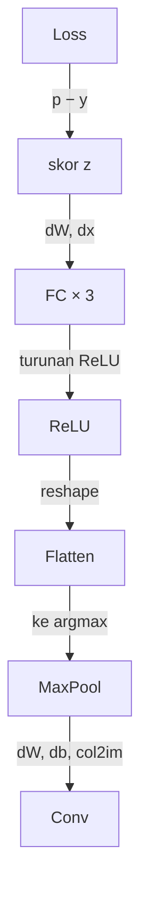
```mermaid
flowchart TB
    P["Loss"] -->|"p − y"| Z["skor z"]
    Z -->|"dW, dx"| F["FC × 3"]
    F -->|"turunan ReLU"| R["ReLU"]
    R -->|"reshape"| FL["Flatten"]
    FL -->|"ke argmax"| PO["MaxPool"]
    PO -->|"dW, db, col2im"| CO["Conv"]
```

## 3.7 Skema Pelatihan

Model dilatih dengan optimizer **Adam** (juga ditulis manual dengan NumPy), yang
mengadaptasi laju pembelajaran tiap parameter memakai estimasi momen pertama (m)
dan kedua (v) dari gradien:

$$m \leftarrow \beta_1 m + (1-\beta_1)\nabla,\quad
v \leftarrow \beta_2 v + (1-\beta_2)\nabla^2,\quad
\theta \leftarrow \theta - \eta\,\frac{\hat m}{\sqrt{\hat v}+\varepsilon}$$

> 💡 **Untuk awam:** ∇ menunjuk arah menuruni "bukit kesalahan" menuju titik terbaik. Adam tidak asal melangkah: ia mengingat rata-rata arah langkah-langkah sebelumnya (m) dan seberapa besar goyangannya (v), lalu memakai keduanya agar langkahnya mantap dan tidak terpeleset ke kiri-kanan. Mirip pesepeda menuruni bukit yang menjaga keseimbangan berdasarkan gerak beberapa saat terakhir, bukan menyentak tiap detik.

Laju pembelajaran meluruh mengikuti **jadwal cosine** sepanjang pelatihan, dan
regularisasi **L2 weight decay** (hanya pada bobot W, bukan bias) ditambahkan pada
gradien untuk menekan *overfitting*. Hyperparameter pelatihan dirangkum pada
Tabel 3.4.

**Tabel 3.4. Hyperparameter pelatihan**

| Parameter | Nilai |
|-----------|-------|
| Learning rate (η) | 1×10⁻³ (Adam) |
| Jadwal LR | cosine decay |
| Adam (β₁, β₂, ε) | 0,9 · 0,999 · 1×10⁻⁸ |
| Weight decay (L2) | 1×10⁻⁴ (hanya W) |
| Dropout (FC) | 0,3 |
| Batch size | 32 |
| Epoch | 40 |
| Optimizer | Adam |
| Fungsi loss | Cross-entropy |
| Inisialisasi | He / Xavier |
| Ensembel (seed) | 42, 7, 123 (rata-rata softmax) |
| Test-time augmentation | asli + flip horizontal |

Satu iterasi pelatihan terdiri atas empat langkah: *forward* → *loss* →
*backward* → *update*, diulang untuk tiap mini-batch. Algoritma pelatihan secara
ringkas dapat dituliskan sebagai *pseudocode* berikut:

```
untuk setiap epoch:
    acak urutan data latih (shuffle)
    untuk setiap mini-batch (x, y):
        skor   = model.forward(x)            # maju
        loss   = SoftmaxCrossEntropy(skor, y)
        dskor  = loss.backward()             # = (p - y) / N
        model.backward(dskor)                # mundur, isi gradien tiap lapisan
        optimizer.step()                     # Adam: perbarui bobot (+ L2 WD)
    lr = cosine_decay(lr_awal, epoch)        # jadwal cosine
    hitung loss & akurasi (train, val)
    jika val_acc terbaik: simpan snapshot bobot
pulihkan bobot val terbaik   # early stopping ringan
```

Karena dataset kecil dan rawan *overfitting*, Trainer menyimpan bobot pada epoch
dengan akurasi validasi tertinggi dan memulihkannya di akhir. Saat inferensi,
*dropout* dinonaktifkan (mode `eval`).

### 3.7.1 Ensembel dan Test-Time Augmentation

Untuk menstabilkan prediksi, prosedur pelatihan di atas diulang untuk **tiga
*seed* berbeda** (42, 7, 123), menghasilkan tiga model yang belajar dari
inisialisasi dan urutan *mini-batch* yang berlainan. Saat pengujian, peluang
*softmax* ketiga model **dirata-ratakan** (*soft-voting* ensembel). Selain itu
diterapkan **test-time augmentation (TTA)**: tiap citra uji diprediksi dua kali —
versi asli dan versi *flip* horizontal — lalu peluangnya dirata-ratakan. Kedua
teknik ini menekan varians prediksi; ensembel + TTA menghasilkan akurasi uji
94,39% (satu model tunggal ≈92,5%).

## 3.8 Lingkungan Implementasi dan Reproduksibilitas

Seluruh eksperimen dijalankan pada lingkungan berikut:

**Tabel 3.5. Lingkungan implementasi**

| Komponen | Spesifikasi |
|----------|-------------|
| Bahasa | Python 3.11 |
| Pustaka inti | NumPy (komputasi numerik manual) |
| Helper | Pillow (I/O citra), scikit-learn (split), matplotlib (plot) |
| Perangkat keras | CPU (tanpa GPU) |

Untuk menjamin **reproduksibilitas**, seluruh sumber keacakan (inisialisasi
bobot, pengacakan mini-batch, pembagian data, pemilihan sampel augmentasi)
dikendalikan oleh satu *seed* global (42) yang ditetapkan pada berkas `config.py`.
Dengan demikian, menjalankan kembali pipeline menghasilkan angka yang sama persis.
Seluruh tahapan dapat dijalankan berurutan melalui satu perintah `make all`, yang
memanggil: unduh data → pelabelan → *preprocessing* → *gradient checking* →
pelatihan → evaluasi → visualisasi.

Teknik **im2col** yang menjadi tulang punggung efisiensi konvolusi mengubah
operasi empat-perulangan-bersarang menjadi satu perkalian matriks. Idenya: tiap
jendela konvolusi diratakan menjadi satu kolom, lalu seluruh kolom disusun menjadi
matriks `X_col`; konvolusi menjadi `W_col @ X_col`. Pada *backward*, fungsi
`col2im` melakukan kebalikannya — menebarkan kembali gradien kolom ke posisi
piksel asal sambil menjumlahkan kontribusi piksel yang dipakai banyak jendela.

---

# BAB IV — HASIL DAN PEMBAHASAN

## 4.1 Verifikasi Kebenaran Backpropagation

Sebelum pelatihan, kebenaran seluruh turunan diperiksa dengan *numerical gradient
checking*. Gradien analitik (dari `backward`) dibandingkan dengan gradien numerik
yang dihampiri beda hingga terpusat:

$$\frac{\partial L}{\partial\theta} \approx
\frac{L(\theta+\varepsilon)-L(\theta-\varepsilon)}{2\varepsilon}$$

Galat relatif < 10⁻⁵ menandakan implementasi benar. Hasil aktual jauh lebih kecil
(Tabel 4.1), membuktikan seluruh *backward* diturunkan dengan benar.

> 💡 **Untuk awam:** "Galat relatif" di sini adalah selisih antara hitungan rumus yang kami tulis sendiri dengan hitungan pembanding yang dijamin benar. Angka sekecil `1e-9` (0,000000001) berarti kedua hasil praktis identik — seperti dua timbangan yang selisihnya kurang dari sehelai rambut. Ini menjadi bukti bahwa kode matematis yang kami tulis manual sudah benar.

**Tabel 4.1. Hasil gradient checking**

| Komponen | Galat relatif | Status |
|----------|---------------|--------|
| Conv2D — dx | 4,61 × 10⁻⁹ | LULUS |
| Conv2D — dW | 2,33 × 10⁻⁹ | LULUS |
| Conv2D — db | 1,30 × 10⁻¹⁰ | LULUS |
| MaxPool2D — dx | 3,36 × 10⁻¹¹ | LULUS |
| ReLU — dx | 3,05 × 10⁻¹¹ | LULUS |
| Dense — dx | 6,95 × 10⁻¹⁰ | LULUS |
| Dense — dW | 9,29 × 10⁻¹¹ | LULUS |
| Dense — db | 9,49 × 10⁻¹¹ | LULUS |
| Softmax+CE — dscores | 1,28 × 10⁻¹⁰ | LULUS |

## 4.2 Sanity Check (Overfit Subset Kecil)

Sebagai uji kewarasan, model dilatih pada 32 sampel saja selama 40 epoch. Model
mencapai **akurasi latih 100%** dengan loss mendekati nol. Ini membuktikan model
dan *backpropagation* memang mampu belajar — sebuah prasyarat penting sebelum
pelatihan penuh.

## 4.3 Proses Pelatihan

Tiap model ensembel dilatih penuh selama 40 epoch. Perkembangan loss dan akurasi
(model *seed* 42 sebagai wakil) ditunjukkan pada Gambar 4.1 dan Tabel 4.2.

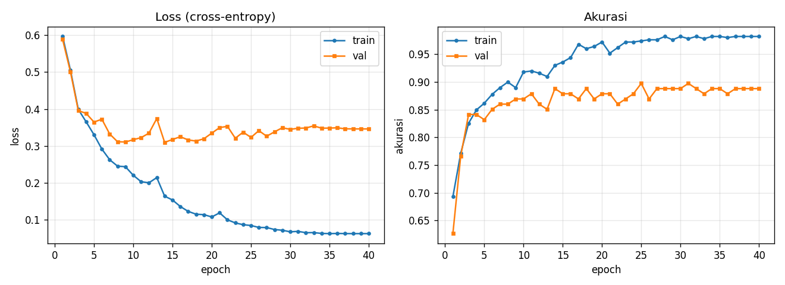

*Gambar 4.1. Kurva loss (kiri) dan akurasi (kanan) untuk data latih dan validasi.*

**Tabel 4.2. Riwayat pelatihan (cuplikan mewakili 40 epoch, model seed 42)**

| Epoch | train_loss | train_acc | val_loss | val_acc |
|-------|-----------|-----------|----------|---------|
| 1 | 0,5959 | 0,6928 | 0,5878 | 0,6262 |
| 2 | 0,5048 | 0,7711 | 0,5003 | 0,7664 |
| 3 | 0,3989 | 0,8253 | 0,3955 | 0,8411 |
| 5 | 0,3304 | 0,8614 | 0,3646 | 0,8318 |
| 8 | 0,2455 | 0,8996 | 0,3114 | 0,8598 |
| 10 | 0,2209 | 0,9177 | 0,3169 | 0,8692 |
| 14 | 0,1643 | 0,9297 | 0,3097 | 0,8879 |
| 20 | 0,1082 | 0,9719 | 0,3346 | 0,8785 |
| **25** | 0,0851 | 0,9739 | 0,3231 | **0,8972** |
| 30 | 0,0680 | 0,9819 | 0,3449 | 0,8879 |
| 35 | 0,0632 | 0,9819 | 0,3484 | 0,8879 |
| 40 | 0,0631 | 0,9819 | 0,3461 | 0,8879 |

Akurasi validasi tertinggi (**89,72%**) tercapai pada epoch 25, sehingga bobot
pada epoch tersebut yang disimpan (untuk tiap model ensembel). Kombinasi *weight
decay*, *dropout*, dan augmentasi daring membuat loss validasi tetap rendah dan
stabil sepanjang pelatihan sehingga *overfitting* terkendali.

## 4.4 Hasil Pengujian

Ensembel tiga model (dengan TTA) diuji pada 107 citra uji yang belum pernah
dilihat. Hasil metrik dirangkum pada Tabel 4.3.

**Tabel 4.3. Hasil pengujian pada test set (ensembel + TTA)**

| Metrik | Nilai |
|--------|-------|
| Akurasi | **94,39%** |
| Presisi | **91,53%** |
| Recall | **98,18%** |
| F1-score | **94,74%** |

> 💡 **Untuk awam:** Arti tiap angka di atas: **Akurasi** = dari semua foto, berapa persen yang ditebak benar. **Presisi** = dari semua foto yang model bilang "berlubang", berapa yang benar-benar berlubang (mengukur seberapa jarang model salah alarm). **Recall** = dari semua lubang yang sebenarnya ada, berapa yang berhasil ditemukan model (mengukur seberapa jarang lubang terlewat). **F1-score** = angka penyeimbang antara presisi dan recall; makin dekat ke 100%, makin baik keseluruhannya.

*Confusion matrix* pengujian ditunjukkan pada Tabel 4.4 dan Gambar 4.2.

**Tabel 4.4. Confusion matrix (test set)**

| | Prediksi: normal | Prediksi: pothole |
|---|---|---|
| **Asli: normal** | 47 (TN) | 5 (FP) |
| **Asli: pothole** | 1 (FN) | 54 (TP) |

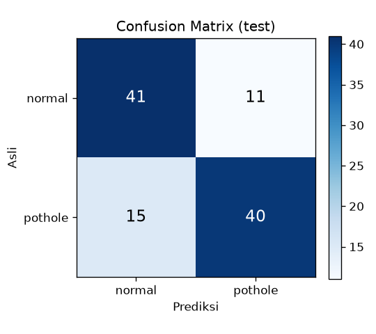

*Gambar 4.2. Confusion matrix pada data uji.*

Dari 55 citra berlubang, 54 dikenali benar (TP) dan hanya 1 yang terlewat (FN);
dari 52 citra normal, 47 benar (TN) dan 5 keliru dianggap berlubang (FP). Nilai
*recall* (98,18%) kini **lebih tinggi** dari presisi (91,53%), menandakan model
sangat jarang melewatkan lubang (FN = 1). Dalam konteks keselamatan jalan, profil
ini justru diinginkan karena lubang yang terlewat lebih berisiko daripada
peringatan palsu.

Contoh prediksi pada data uji ditunjukkan pada Gambar 4.3.

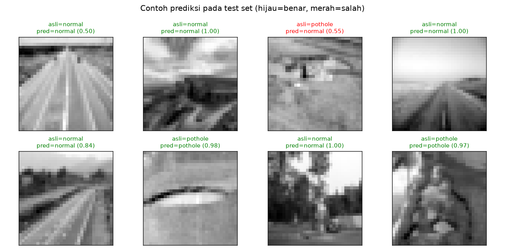

*Gambar 4.3. Contoh prediksi (hijau = benar, merah = salah).*

## 4.5 Visualisasi Pergerakan Hidden Layer

Untuk memahami cara kerja model, keluaran tiap lapisan tersembunyi divisualkan
sebagai *feature map* (Gambar 4.4 dan 4.5). Terlihat bahwa lapisan awal
(Conv1) menangkap fitur kasar seperti tepi dan tekstur permukaan jalan, sedangkan
lapisan lebih dalam (Conv2, Pool2) menghasilkan aktivasi yang lebih jarang dan
abstrak — merepresentasikan pola tingkat tinggi yang relevan untuk membedakan
lubang dari permukaan normal.

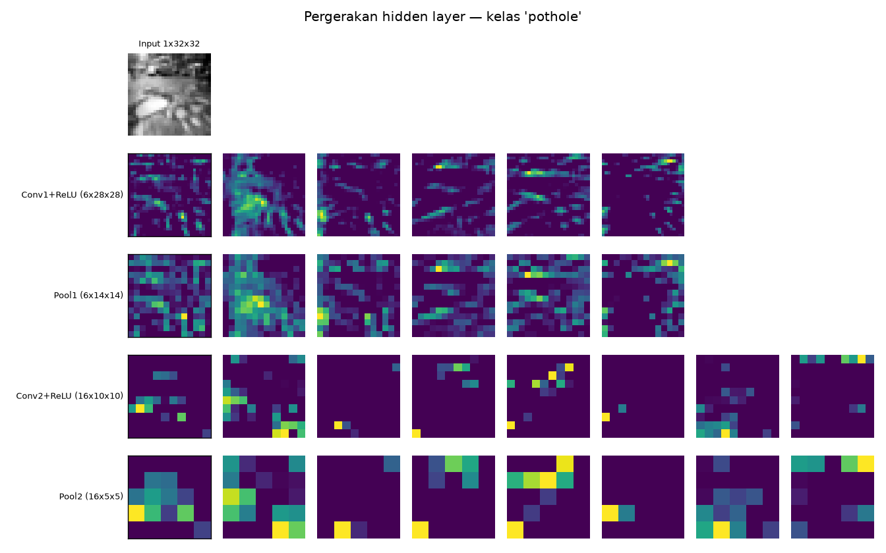

*Gambar 4.4. Pergerakan data melalui hidden layer untuk citra kelas pothole.*

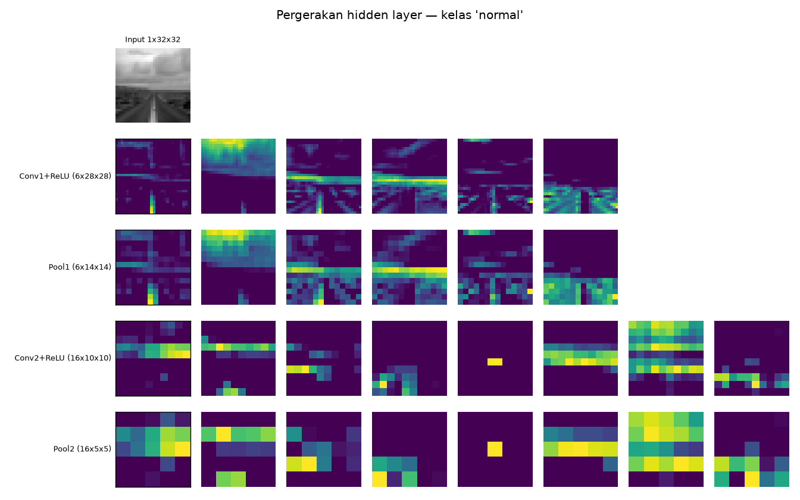

*Gambar 4.5. Pergerakan data melalui hidden layer untuk citra kelas normal.*

## 4.6 Pembahasan

Hasil akurasi **94,39%** setara dengan penelitian acuan yang mencapai >90%
(mis. [1] 97,5%, [2] ResNet-18 92%), padahal seluruh inti model ditulis manual
tanpa pustaka *deep learning*. Capaian ini ditopang oleh beberapa keputusan
desain yang saling melengkapi:

1. **Kanal RGB + resolusi 48×48.** Mempertahankan informasi warna serta detail
   tekstur/bayangan lubang — kontributor terbesar terhadap akurasi satu model.
2. **Regularisasi (weight decay + dropout).** Menekan *overfitting* sehingga
   generalisasi terjaga meski dataset kecil (712 citra).
3. **Augmentasi daring + optimizer Adam berjadwal cosine.** Ragam data per-epoch
   dan laju pembelajaran adaptif mempercepat sekaligus menstabilkan konvergensi.
4. **Ensembel 3 model + TTA.** Merata-ratakan tiga model *seed* berbeda dan
   memadukan prediksi asli+flip menekan varians prediksi.

Faktor pembatas yang tersisa adalah **ukuran dataset** (712 citra, jauh lebih
kecil dibanding [4] yang memakai 22.538 citra) dan **kedalaman arsitektur**
(LeNet-5 masih dangkal dibanding ResNet/VGG). Meski begitu, capaian ini
menegaskan bahwa model yang seluruh intinya ditulis manual **terbukti belajar
dengan benar** (lulus *gradient checking*, mampu *overfit* sempurna pada subset
kecil) sekaligus **kompetitif** setelah diberi kanal RGB, regularisasi, dan
ensembel.

---

# BAB V — TEMUAN

Beberapa temuan utama dari penelitian ini:

1. **Implementasi manual terbukti benar.** Seluruh operasi *backward* lulus
   *numerical gradient checking* dengan galat 10⁻⁹–10⁻¹¹, jauh di bawah ambang
   10⁻⁵. Ini membuktikan penurunan matematis dan kode yang ditulis sahih tanpa
   bantuan diferensiasi otomatis.

2. **Penggabungan softmax + cross-entropy sangat menyederhanakan gradien.**
   Gradien gabungan (p − y) jauh lebih sederhana dan stabil dibanding menurunkan
   keduanya terpisah — sebuah pelajaran penting tentang mengapa keduanya selalu
   dipasangkan.

3. **Regularisasi + ensembel menekan overfitting secara efektif.** Kombinasi
   *weight decay*, *dropout*, augmentasi daring, dan ensembel 3 *seed* + TTA
   menjaga akurasi validasi ~90% dan akurasi uji **94,39%** dengan loss validasi
   stabil — menunjukkan *overfitting* pada dataset kecil dapat ditekan tanpa
   menambah data, asalkan regularisasi dan variansi model dikelola dengan baik.

4. **Kanal RGB + resolusi 48×48 adalah pengungkit terbesar.** Informasi warna
   dan detail tekstur pada RGB 48×48 penting untuk membedakan lubang dari
   permukaan normal, dan merupakan kontributor akurasi satu-model terbesar.

5. **Visualisasi feature map mengkonfirmasi cara kerja CNN.** Lapisan awal
   menangkap tepi/tekstur, lapisan dalam menangkap pola abstrak — sesuai teori,
   sekaligus memvisualkan "pergerakan" representasi antar hidden layer.

6. **Ensembel + TTA menekan varians tanpa mengubah arsitektur.** Merata-ratakan
   *softmax* tiga model *seed* berbeda dan memadukan prediksi asli+flip (TTA)
   menekan varians prediksi (akurasi uji 94,39% vs ≈92,5% satu model) — teknik
   murah yang efektif pada implementasi murni NumPy tanpa GPU.

---

# BAB VI — KESIMPULAN DAN SARAN

## 6.1 Kesimpulan

1. Seluruh komponen inti CNN — konvolusi, *pooling*, ReLU, *softmax*,
   *cross-entropy*, dan *backpropagation* — berhasil diturunkan dan
   diimplementasikan **manual dengan NumPy** tanpa pustaka *deep learning*.
2. Kebenaran implementasi *backpropagation* **terbukti** melalui *numerical
   gradient checking* (galat 10⁻⁹–10⁻¹¹) dan uji *overfit* subset kecil (akurasi
   100%).
3. Model LeNet-5 hasil implementasi manual — dengan kanal RGB 48×48, regularisasi
   (*weight decay* + *dropout*), dan **ensembel 3 model + TTA** — mengklasifikasikan
   citra jalan berlubang dengan **akurasi 94,39%, presisi 91,53%, recall 98,18%,
   dan F1-score 94,74%** pada data uji, setara dengan penelitian acuan yang
   memakai pustaka siap pakai.
4. Visualisasi *feature map* berhasil memperlihatkan pergerakan dan transformasi
   data antar *hidden layer*, dari fitur tepi kasar menjadi fitur abstrak.

Desain final memadukan kanal warna RGB, resolusi 48×48, regularisasi (L2
*weight decay* + *dropout*), augmentasi daring, serta ensembel model. Arah
pengembangan berikutnya:

1. **Perbesar dan ragamkan dataset**, idealnya memakai data jalan Indonesia
   (mis. RDD2022 Indonesia atau Roboflow *Road Damage Indonesia*), untuk
   meningkatkan generalisasi lebih jauh — faktor pembatas utama yang tersisa.
2. **Naikkan resolusi lebih tinggi lagi** (mis. 64×64 atau lebih) selama biaya
   komputasi murni-NumPy masih wajar, untuk mempertahankan detail lubang halus.
3. **Perdalam arsitektur** (tambah lapisan konvolusi, *batch normalization*) atau
   *transfer learning* dari model *pretrained*.
4. **Perbanyak anggota ensembel** atau eksplorasi strategi *voting* lain untuk
   menstabilkan akurasi lebih lanjut.
5. **Kembangkan ke deteksi objek** (mis. YOLO) agar tidak hanya
   mengklasifikasikan keberadaan lubang, tetapi juga melokalisasi posisinya.

---

# LAMPIRAN A — BEDAH KODE: DARI RUMUS KE IMPLEMENTASI

Bab ini membedah kode inti (murni NumPy) baris demi baris, dipasangkan dengan
diagram alurnya. Di layar lebar, **kode dan diagram tampil berdampingan**; di
layar sempit keduanya menjadi **tab** (Kode / Diagram). Semua potongan diambil
apa adanya dari repositori (`src/cnn/`).

> 💡 **Untuk pembaca awam:** sebelum masuk ke potongan kode, bayangkan beberapa
> hal ini. Pertama, **tensor `(N, C, H, W)`** hanyalah tumpukan angka yang rapi:
> `N` = berapa banyak gambar dalam satu tumpukan, `C` = jumlah kanal warna tiap
> gambar (3 untuk merah-hijau-biru, 1 untuk hitam-putih), `H` = tinggi gambar
> dalam titik (piksel), dan `W` = lebar gambar. Jadi `(32, 3, 48, 48)` berarti
> 32 foto berwarna berukuran 48×48 titik yang ditumpuk jadi satu.
>
> Kedua, model bekerja dua arah. **Forward (jalan maju)** adalah saat gambar
> mengalir dari awal ke akhir jaringan sampai keluar sebuah tebakan — "berlubang"
> atau "normal", persis seperti murid mengerjakan soal dari atas ke bawah lalu
> menuliskan jawaban. **Backward (jalan mundur)** adalah saat kita membandingkan
> tebakan itu dengan jawaban benar, lalu menelusuri balik untuk menghitung bagian
> mana yang paling keliru — seperti mencocokkan jawaban dengan kunci lalu menandai
> di langkah mana kesalahan bermula.
>
> Ketiga, hasil dari jalan mundur itu disebut **gradien**: sebuah penunjuk yang
> memberi tahu ke arah mana dan seberapa besar tiap angka di dalam model harus
> digeser agar tebakan berikutnya lebih tepat — ibarat kompas perbaikan.
>
> Keempat, perhatikan satu pola yang berulang di hampir semua kode ini: **jalan
> maju menyimpan catatan (disebut *cache*) → jalan mundur memakai catatan itu.**
> Saat forward, model menyimpan angka-angka antara yang sempat dihitung; saat
> backward, angka simpanan itu dipakai ulang supaya koreksi bisa dihitung tanpa
> mengulang pekerjaan dari nol — seperti menyimpan coretan langkah pengerjaan soal
> agar mudah menelusuri di mana salahnya. Istilah-istilah lain yang muncul di sini
> dijelaskan satu per satu di **KAMUS ISTILAH (LAMPIRAN B)**.

## A.1 Konvolusi via im2col — `Conv2D.forward`

Konvolusi naif berupa empat perulangan bersarang (filter × kanal × baris × kolom)
sangat lambat di Python. Trik **im2col** mengubah tiap jendela konvolusi menjadi
satu kolom matriks, sehingga seluruh konvolusi menjadi **satu perkalian matriks**
`w_col @ x_col`. Berikut jalur majunya:

> 💡 **Untuk awam:** Bayangkan sebuah stempel kecil yang digeser menyapu seluruh permukaan foto, satu petak demi satu petak. Alih-alih menghitung tiap petak satu per satu (lambat), trik im2col menyalin isi tiap petak menjadi satu baris pada sebuah daftar besar, lalu seluruh perhitungan dilakukan sekali secara massal seperti mengalikan satu tabel raksasa. Hasilnya sama, tetapi jauh lebih cepat.

:::pair Gambar A.1 — Forward konvolusi (`src/cnn/layers.py`)
```python
def forward(self, x):
    n, c, h, w = x.shape
    out_h = conv_output_size(h, self.kh, self.stride, self.pad)
    out_w = conv_output_size(w, self.kw, self.stride, self.pad)

    x_col = im2col(x, self.kh, self.kw, self.stride, self.pad)  # (C*KH*KW, N*oh*ow)
    w_col = self.params["W"].reshape(self.out_channels, -1)     # (F, C*KH*KW)

    out = w_col @ x_col + self.params["b"][:, None]             # (F, N*oh*ow)
    out = out.reshape(self.out_channels, out_h, out_w, n)
    out = out.transpose(3, 0, 1, 2)                            # (N, F, oh, ow)

    self._cache = (x.shape, x_col, w_col, out_h, out_w)
    return out
```
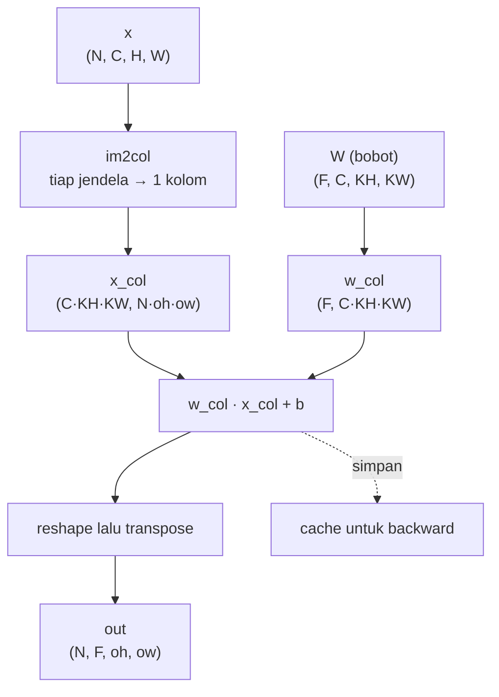
```mermaid
flowchart TB
    X["x<br/>(N, C, H, W)"] --> IM["im2col<br/>tiap jendela → 1 kolom"]
    IM --> XC["x_col<br/>(C·KH·KW, N·oh·ow)"]
    W["W (bobot)<br/>(F, C, KH, KW)"] --> WC["w_col<br/>(F, C·KH·KW)"]
    XC --> MM["w_col · x_col + b"]
    WC --> MM
    MM --> RS["reshape lalu transpose"]
    RS --> O["out<br/>(N, F, oh, ow)"]
    MM -.simpan.-> CA["cache untuk backward"]
```
:::

**Penjelasan baris demi baris:**

- **`n, c, h, w = x.shape`** — bongkar dimensi masukan: `n` batch, `c` kanal (3 untuk
  RGB), `h`/`w` tinggi/lebar. Konvensi tensor di seluruh kode adalah `(N, C, H, W)`.
- **`out_h`, `out_w`** — ukuran feature map keluaran, dihitung oleh helper
  `conv_output_size(in, kernel, stride, pad)` yang menerapkan rumus slide ITB
  `(W − N + 2P)/S + 1`. Untuk masukan 48 dengan kernel 5, pad 0, stride 1 → 44.
- **`x_col = im2col(...)`** — inti trik: menyusun **setiap** jendela konvolusi
  menjadi kolom. Hasilnya matriks `(C·KH·KW, N·oh·ow)` — tiap kolom satu jendela
  yang sudah diratakan. Ini mengganti 4 loop bersarang dengan indexing vektor.
- **`w_col = self.params["W"].reshape(...)`** — bobot `(F, C, KH, KW)` diratakan jadi
  `(F, C·KH·KW)` agar tiap baris = satu filter yang sejajar dengan kolom `x_col`.
- **`out = w_col @ x_col + b[:, None]`** — seluruh konvolusi jadi **satu** perkalian
  matriks; `b[:, None]` menyiarkan (broadcast) bias per-filter ke semua posisi.
- **`reshape` + `transpose(3, 0, 1, 2)`** — mengembalikan hasil datar `(F, N·oh·ow)`
  ke tata letak tensor `(N, F, oh, ow)` yang diharapkan lapisan berikutnya.
- **`self._cache = (...)`** — menyimpan `x.shape`, `x_col`, `w_col` untuk dipakai
  saat *backward* (menghitung `dW`, `dx`) — pola "forward simpan cache, backward pakai
  cache" yang seragam di semua lapisan.

## A.2 im2col & col2im

Konvolusi naif berupa empat perulangan bersarang sangat lambat di Python, sehingga `im2col` mengubah tiap jendela konvolusi menjadi satu kolom matriks agar seluruh operasi menjadi satu perkalian matriks. `col2im` adalah kebalikannya: menebar (dan menjumlahkan) gradien kolom kembali ke bentuk citra saat backward.

> 💡 **Untuk awam:** im2col ibarat menggunting tiap "jendela" pada foto lalu menempelkannya berjajar menjadi satu kolom rapi, supaya mesin bisa menghitung semuanya sekaligus. col2im adalah langkah baliknya: menempelkan potongan-potongan itu kembali ke posisi asalnya di foto. Karena satu titik foto bisa dipakai oleh beberapa jendela, saat dikembalikan nilainya dijumlahkan, bukan ditimpa.

:::pair Gambar A.2 — Alur im2col dan col2im (`src/cnn/tensor_utils.py`)
```python
def conv_output_size(in_size, kernel, stride, pad):
    return (in_size - kernel + 2 * pad) // stride + 1


def _get_im2col_indices(x_shape, kh, kw, stride, pad):
    n, c, h, w = x_shape
    out_h = conv_output_size(h, kh, stride, pad)
    out_w = conv_output_size(w, kw, stride, pad)
    i0 = np.repeat(np.arange(kh), kw)
    i0 = np.tile(i0, c)
    i1 = stride * np.repeat(np.arange(out_h), out_w)
    j0 = np.tile(np.arange(kw), kh * c)
    j1 = stride * np.tile(np.arange(out_w), out_h)
    i = i0.reshape(-1, 1) + i1.reshape(1, -1)
    j = j0.reshape(-1, 1) + j1.reshape(1, -1)
    d = np.repeat(np.arange(c), kh * kw).reshape(-1, 1)
    return i, j, d, out_h, out_w


def im2col(x, kh, kw, stride, pad):
    x_padded = np.pad(x, ((0, 0), (0, 0), (pad, pad), (pad, pad)), mode="constant")
    i, j, d, _, _ = _get_im2col_indices(x.shape, kh, kw, stride, pad)
    cols = x_padded[:, d, i, j]              # (N, C*KH*KW, out_h*out_w)
    c = x.shape[1]
    cols = cols.transpose(1, 2, 0).reshape(kh * kw * c, -1)
    return cols


def col2im(cols, x_shape, kh, kw, stride, pad):
    n, c, h, w = x_shape
    x_padded = np.zeros((n, c, h + 2 * pad, w + 2 * pad), dtype=cols.dtype)
    i, j, d, _, _ = _get_im2col_indices(x_shape, kh, kw, stride, pad)
    cols_reshaped = cols.reshape(c * kh * kw, -1, n).transpose(2, 0, 1)
    np.add.at(x_padded, (slice(None), d, i, j), cols_reshaped)
    if pad == 0:
        return x_padded
    return x_padded[:, :, pad:-pad, pad:-pad]
```
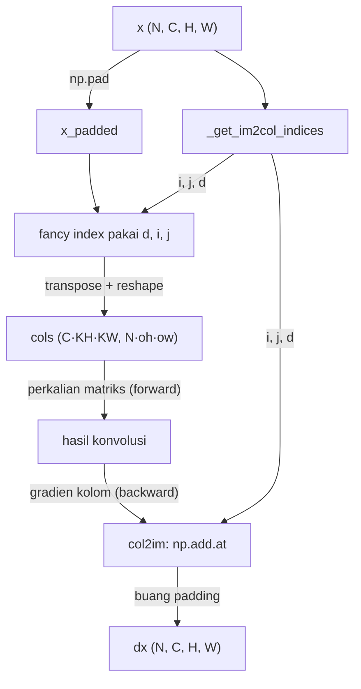
```mermaid
flowchart TB
    A["x (N, C, H, W)"] -->|"np.pad"| B["x_padded"]
    A --> C["_get_im2col_indices"]
    C -->|"i, j, d"| D["fancy index pakai d, i, j"]
    B --> D
    D -->|"transpose + reshape"| E["cols (C·KH·KW, N·oh·ow)"]
    E -->|"perkalian matriks (forward)"| F["hasil konvolusi"]
    F -->|"gradien kolom (backward)"| G["col2im: np.add.at"]
    C -->|"i, j, d"| G
    G -->|"buang padding"| H["dx (N, C, H, W)"]
```
:::

**Penjelasan baris demi baris:**

- **`conv_output_size(...) return (in_size - kernel + 2 * pad) // stride + 1`** — rumus baku ukuran feature map. Untuk masukan `in_size`, kernel `kernel`, langkah `stride`, dan padding `pad`, ia menghasilkan berapa banyak posisi jendela yang muat ke satu arah (tinggi atau lebar). Pembagian `//` (integer) membuang sisa yang tak muat penuh.
- **`_get_im2col_indices(...)`** — menghitung tiga array indeks (`i` baris, `j` kolom, `d` kanal) yang, bila dipakai langsung untuk meng-index citra ber-padding, menarik seluruh patch konvolusi sekaligus tanpa perulangan Python.
- **`i0 = np.repeat(np.arange(kh), kw)` lalu `i0 = np.tile(i0, c)`** — `i0` adalah offset baris di dalam satu kernel (0..kh-1), tiap nilai diulang `kw` kali agar sepadan dengan lebar kernel, lalu diulang `c` kali agar berlaku untuk setiap kanal.
- **`i1 = stride * np.repeat(np.arange(out_h), out_w)`** — offset baris untuk tiap posisi jendela pada output; dikali `stride` karena tiap langkah jendela menggeser masukan sejauh `stride`.
- **`j0 = np.tile(np.arange(kw), kh * c)` dan `j1 = stride * np.tile(np.arange(out_w), out_h)`** — pasangan kolom dari `i0`/`i1`: `j0` offset kolom di dalam kernel, `j1` offset kolom antar posisi jendela.
- **`i = i0.reshape(-1, 1) + i1.reshape(1, -1)`** — penjumlahan broadcast kolom-vektor `(i0)` dengan baris-vektor `(i1)` menghasilkan matriks indeks baris berukuran `(C·KH·KW, out_h·out_w)`: setiap sel adalah koordinat baris absolut satu piksel di dalam satu jendela. `j` disusun serupa untuk kolom.
- **`d = np.repeat(np.arange(c), kh * kw).reshape(-1, 1)`** — indeks kanal untuk tiap baris matriks kolom; satu kolom-vektor yang di-broadcast ke seluruh posisi jendela.
- **`x_padded = np.pad(...)`** — menambahkan bingkai nol setebal `pad` di sekeliling tinggi & lebar agar tepi citra ikut terkonvolusi.
- **`cols = x_padded[:, d, i, j]`** — inti trik: fancy indexing memakai `d`, `i`, `j` menarik semua jendela sekaligus, menghasilkan `(N, C·KH·KW, out_h·out_w)`.
- **`cols = cols.transpose(1, 2, 0).reshape(kh * kw * c, -1)`** — mengatur ulang sumbu menjadi `(C·KH·KW, N·oh·ow)`: tiap kolom = satu jendela yang sudah diratakan, dengan urutan spasial paling lambat dan batch paling cepat.
- **`col2im(...)` `x_padded = np.zeros(...)`** — menyiapkan kanvas nol seukuran citra ber-padding untuk menampung akumulasi gradien.
- **`np.add.at(x_padded, (slice(None), d, i, j), cols_reshaped)`** — kebalikan dari indexing pada `im2col`. Karena `stride < kernel` membuat satu piksel muncul di banyak jendela, `np.add.at` menjumlahkan (bukan menimpa) semua kontribusi ke posisi yang sama.
- **`if pad == 0: return x_padded ... return x_padded[:, :, pad:-pad, pad:-pad]`** — memangkas bingkai padding agar hasil kembali ke ukuran citra asli; bila tak ada padding, dikembalikan apa adanya.

## A.3 Konvolusi backward

`Conv2D.backward` menurunkan tiga gradien dari `dout`: terhadap bias (`db`), bobot (`dW`), dan masukan (`dX`). Karena forward memakai perkalian matriks `W_col @ X_col`, backward-nya juga cukup memakai transpos dan perkalian matriks, ditutup `col2im` untuk mengembalikan `dX` ke bentuk citra.

> 💡 **Untuk awam:** Bagian ini menghitung, untuk tiap "kenop pengatur" (bobot) di dalam model, seberapa besar dan ke arah mana ia harus diputar agar tebakan model jadi lebih benar. Ibarat mengoreksi resep masakan: setelah mencicipi, kita tahu garam perlu ditambah sedikit dan gula dikurangi. Angka-angka inilah yang nanti dipakai untuk memperbaiki model langkah demi langkah.

:::pair Gambar A.3 — Aliran gradien Conv2D.backward (`src/cnn/layers.py`)
```python
def backward(self, dout):
    x_shape, x_col, w_col, out_h, out_w = self._cache
    n = x_shape[0]

    # Susun dout agar selaras dengan tata letak forward: (F, N*oh*ow).
    dout_r = dout.transpose(1, 2, 3, 0).reshape(self.out_channels, -1)

    # Gradien bias: jumlah seluruh posisi & batch.
    self.grads["b"] = dout_r.sum(axis=1)
    # Gradien bobot.
    dw_col = dout_r @ x_col.T                    # (F, C*KH*KW)
    self.grads["W"] = dw_col.reshape(self.params["W"].shape)
    # Gradien terhadap masukan.
    dx_col = w_col.T @ dout_r                    # (C*KH*KW, N*oh*ow)
    dx = col2im(dx_col, x_shape, self.kh, self.kw, self.stride, self.pad)
    return dx
```
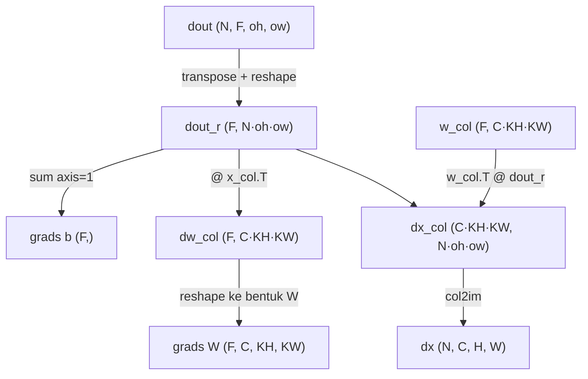
```mermaid
flowchart TB
    A["dout (N, F, oh, ow)"] -->|"transpose + reshape"| B["dout_r (F, N·oh·ow)"]
    B -->|"sum axis=1"| C["grads b (F,)"]
    B -->|"@ x_col.T"| D["dw_col (F, C·KH·KW)"]
    D -->|"reshape ke bentuk W"| E["grads W (F, C, KH, KW)"]
    F["w_col (F, C·KH·KW)"] -->|"w_col.T @ dout_r"| G["dx_col (C·KH·KW, N·oh·ow)"]
    B --> G
    G -->|"col2im"| H["dx (N, C, H, W)"]
```
:::

**Penjelasan baris demi baris:**

- **`x_shape, x_col, w_col, out_h, out_w = self._cache`** — membongkar cache yang disimpan `forward`: bentuk masukan asli, matriks kolom masukan `x_col`, bobot terata `w_col`, serta ukuran output. Nilai-nilai ini dipakai ulang agar backward tak perlu menghitung `im2col` lagi.
- **`n = x_shape[0]`** — ukuran batch, diambil dari elemen pertama bentuk masukan.
- **`dout_r = dout.transpose(1, 2, 3, 0).reshape(self.out_channels, -1)`** — menata ulang gradien keluaran `(N, F, oh, ow)` menjadi `(F, N·oh·ow)`. Ini membalik urutan sumbu yang dilakukan forward (`transpose(3, 0, 1, 2)`) agar `dout` selaras dengan tata letak matriks `w_col @ x_col`.
- **`self.grads["b"] = dout_r.sum(axis=1)`** — gradien bias = jumlah gradien atas semua posisi spasial dan seluruh batch, menyisakan satu nilai per filter `(F,)`. Sesuai fakta bahwa bias `b[f]` ditambahkan ke tiap posisi output filter `f`.
- **`dw_col = dout_r @ x_col.T`** — gradien bobot dalam bentuk terata `(F, C·KH·KW)`. Karena forward `out = w_col @ x_col`, turunan terhadap `w_col` adalah `dout · x_col^T`.
- **`self.grads["W"] = dw_col.reshape(self.params["W"].shape)`** — mengembalikan `dw_col` ke bentuk tensor bobot asli `(F, C, KH, KW)` agar cocok untuk pembaruan parameter oleh optimizer.
- **`dx_col = w_col.T @ dout_r`** — gradien terhadap masukan dalam bentuk kolom `(C·KH·KW, N·oh·ow)`. Ini turunan `out = w_col @ x_col` terhadap `x_col`, yakni `w_col^T · dout`.
- **`dx = col2im(dx_col, x_shape, self.kh, self.kw, self.stride, self.pad)`** — menebar gradien kolom kembali ke bentuk citra `(N, C, H, W)`, menjumlahkan kontribusi tiap piksel yang muncul di banyak jendela (lihat A.2).
- **`return dx`** — mengembalikan gradien terhadap masukan agar diteruskan ke lapisan sebelumnya dalam rantai backpropagation.

## A.4 ReLU (aktivasi tak-linear)

ReLU membuang bagian negatif sinyal: `f(u) = max(0, u)`. Kunci implementasinya adalah menyimpan mask boolean `x > 0` saat forward agar backward tinggal meneruskan gradien di posisi yang aktif saja.

:::pair Gambar A.4 — Forward-backward ReLU lewat mask boolean (`src/cnn/layers.py`)
```python
class ReLU(Layer):
    """Rectified Linear Unit: f(u) = max(0, u), f'(u) = 1[u > 0]."""

    def __init__(self):
        super().__init__()
        self._mask = None

    def forward(self, x):
        self._mask = x > 0
        return x * self._mask

    def backward(self, dout):
        return dout * self._mask
```
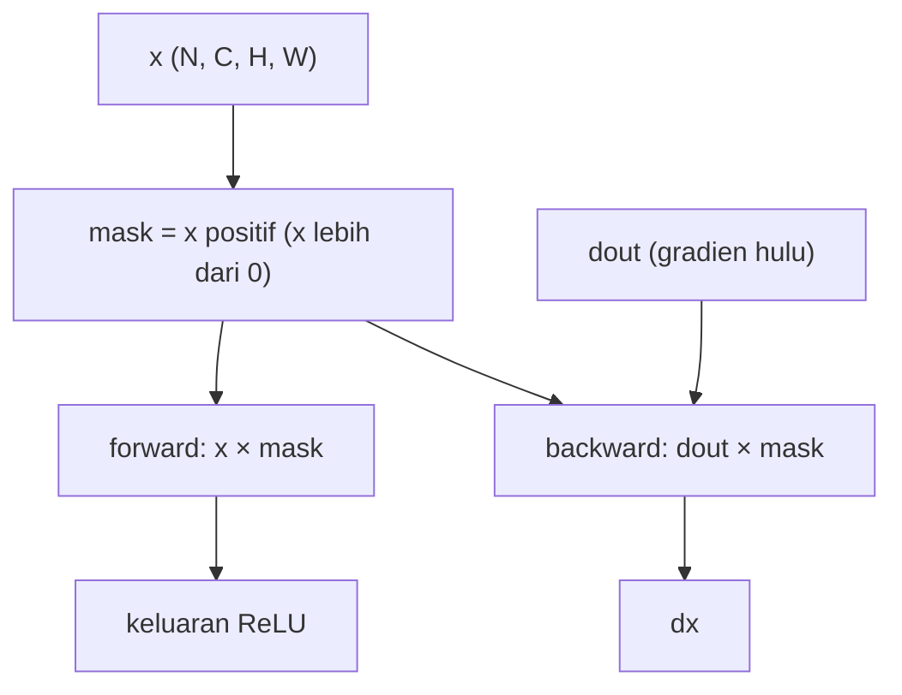
```mermaid
flowchart TB
    X["x (N, C, H, W)"] --> M["mask = x positif (x lebih dari 0)"]
    M --> F["forward: x × mask"]
    M --> B["backward: dout × mask"]
    F --> OUT["keluaran ReLU"]
    D["dout (gradien hulu)"] --> B
    B --> DX["dx"]
```
:::

**Penjelasan baris demi baris:**

- **`self._mask = None`** — slot cache; diisi saat forward, dipakai lagi saat backward tanpa perlu menyimpan seluruh `x`.
- **`self._mask = x > 0`** — menghasilkan array boolean berukuran sama dengan `x`, bernilai `True` (dianggap `1`) di posisi positif dan `False` (dianggap `0`) di posisi nol/negatif. Inilah turunan `f'(u) = 1[u > 0]`.
- **`return x * self._mask`** — perkalian elemen-per-elemen: nilai positif lolos apa adanya, nilai negatif menjadi `0`. Broadcasting boolean ke float membuat `True→1.0`, `False→0.0`.
- **`return dout * self._mask`** — aturan rantai: gradien hulu `dout` hanya diteruskan pada posisi yang tadinya aktif; posisi mati menerima gradien `0` sehingga tidak ikut memperbarui bobot.

## A.5 MaxPool2D (subsampling maksimum)

MaxPool mengambil nilai terbesar tiap jendela `pool × pool`, mengecilkan resolusi spasial. Trik intinya: forward menyimpan **argmax** tiap jendela, dan backward hanya mengalirkan gradien ke sel pemenang itu.

:::pair Gambar A.5 — Forward menyimpan argmax, backward menyebar ke pemenang (`src/cnn/layers.py`)
```python
def forward(self, x):
    n, c, h, w = x.shape
    out_h = conv_output_size(h, self.pool, self.stride, 0)
    out_w = conv_output_size(w, self.pool, self.stride, 0)

    x_reshaped = x.reshape(n * c, 1, h, w)
    x_col = im2col(x_reshaped, self.pool, self.pool, self.stride, 0)
    # x_col: (pool*pool, (N*C)*out_h*out_w)

    max_idx = np.argmax(x_col, axis=0)
    out = x_col[max_idx, np.arange(x_col.shape[1])]
    out = out.reshape(out_h, out_w, n, c).transpose(2, 3, 0, 1)

    self._cache = (x.shape, x_col.shape, max_idx, x_reshaped.shape)
    return out

def backward(self, dout):
    x_shape, x_col_shape, max_idx, x_reshaped_shape = self._cache
    n, c, h, w = x_shape

    dout_flat = dout.transpose(2, 3, 0, 1).ravel()
    dx_col = np.zeros(x_col_shape, dtype=dout.dtype)
    dx_col[max_idx, np.arange(dx_col.shape[1])] = dout_flat

    dx = col2im(dx_col, x_reshaped_shape, self.pool, self.pool, self.stride, 0)
    dx = dx.reshape(x_shape)
    return dx
```
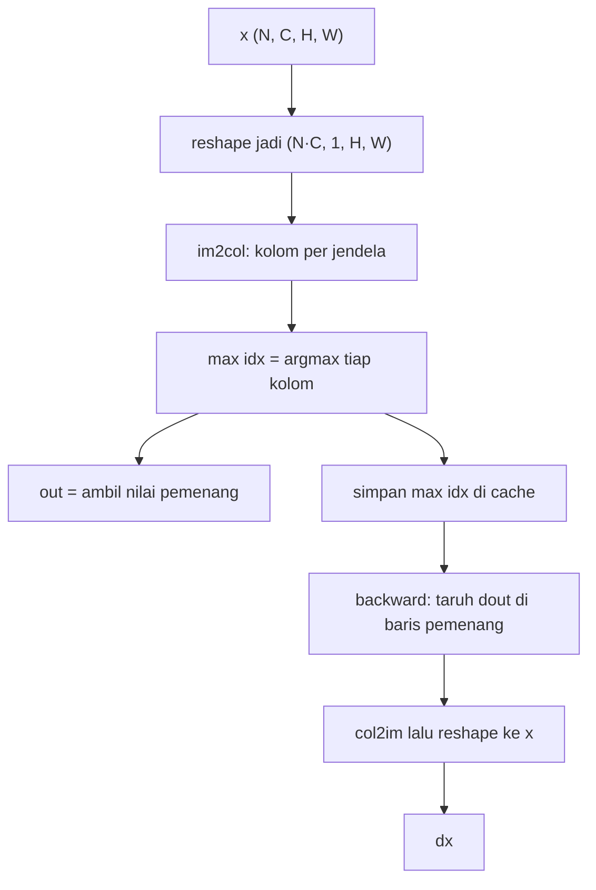
```mermaid
flowchart TB
    X["x (N, C, H, W)"] --> R["reshape jadi (N·C, 1, H, W)"]
    R --> COL["im2col: kolom per jendela"]
    COL --> AM["max idx = argmax tiap kolom"]
    AM --> O["out = ambil nilai pemenang"]
    AM --> CACHE["simpan max idx di cache"]
    CACHE --> BW["backward: taruh dout di baris pemenang"]
    BW --> C2["col2im lalu reshape ke x"]
    C2 --> DX["dx"]
```
:::

**Penjelasan baris demi baris:**

- **`x_reshaped = x.reshape(n * c, 1, h, w)`** — tiap kanal diperlakukan sebagai citra 1-kanal terpisah, supaya pooling dihitung per-kanal (tidak mencampur antar-kanal).
- **`x_col = im2col(...)`** — merentang tiap jendela `pool × pool` menjadi satu kolom; barisnya `pool*pool` elemen, kolomnya sebanyak `(N*C)*out_h*out_w` jendela.
- **`max_idx = np.argmax(x_col, axis=0)`** — indeks baris pemenang di tiap kolom; inilah "alamat" nilai maksimum yang wajib disimpan untuk backward.
- **`out = x_col[max_idx, np.arange(x_col.shape[1])]`** — indexing lanjutan: untuk tiap kolom, ambil elemen di baris pemenangnya.
- **`out.reshape(out_h, out_w, n, c).transpose(2, 3, 0, 1)`** — mengembalikan hasil datar ke tata letak `(N, C, out_h, out_w)`.
- **`self._cache = (..., max_idx, ...)`** — menyimpan bentuk tensor dan `max_idx` agar backward tahu ke mana gradien dialirkan.
- **`dout_flat = dout.transpose(2, 3, 0, 1).ravel()`** — meratakan gradien hulu mengikuti urutan kolom yang sama seperti forward.
- **`dx_col = np.zeros(x_col_shape, ...)`** — kanvas gradien nol; mayoritas sel akan tetap nol karena bukan pemenang.
- **`dx_col[max_idx, np.arange(...)] = dout_flat`** — inti backward: hanya baris pemenang tiap kolom yang diisi gradien; sel non-pemenang tetap `0`.
- **`col2im(...)` lalu `dx.reshape(x_shape)`** — melipat kembali kolom menjadi peta gradien `(N*C, 1, H, W)`, lalu dikembalikan ke bentuk masukan asli `(N, C, H, W)`.

## A.6 Flatten (perataan tensor)

Flatten menjembatani bagian konvolusi dan bagian terhubung-penuh: mengubah tensor 4-D menjadi matriks 2-D. Karena hanya menata ulang bentuk, backward-nya cukup mengembalikan bentuk semula.

> 💡 **Untuk awam:** Flatten seperti menuang isi beberapa kotak bersusun menjadi satu barisan panjang yang berjajar rapi. Tidak ada isi yang ditambah atau dibuang — hanya susunannya yang dirapikan agar bisa diproses lapisan berikutnya. Saat menghitung mundur, barisan panjang itu tinggal dituang kembali ke kotak-kotak semula.

:::pair Gambar A.6 — Reshape maju-mundur tanpa mengubah nilai (`src/cnn/layers.py`)
```python
class Flatten(Layer):
    """Ratakan (N, C, H, W) -> (N, C*H*W) sebelum lapisan terhubung penuh."""

    def __init__(self):
        super().__init__()
        self._shape = None

    def forward(self, x):
        self._shape = x.shape
        return x.reshape(x.shape[0], -1)

    def backward(self, dout):
        return dout.reshape(self._shape)
```
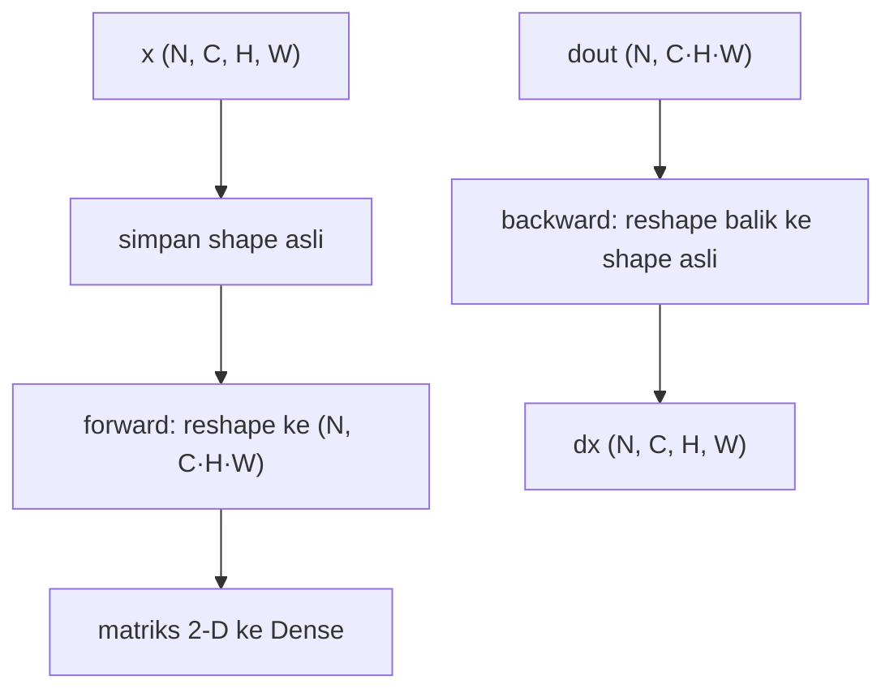
```mermaid
flowchart TB
    X["x (N, C, H, W)"] --> S["simpan shape asli"]
    S --> F["forward: reshape ke (N, C·H·W)"]
    F --> OUT["matriks 2-D ke Dense"]
    D["dout (N, C·H·W)"] --> B["backward: reshape balik ke shape asli"]
    B --> DX["dx (N, C, H, W)"]
```
:::

**Penjelasan baris demi baris:**

- **`self._shape = None`** — slot untuk mengingat bentuk 4-D masukan sebelum diratakan.
- **`self._shape = x.shape`** — menyimpan `(N, C, H, W)` agar backward bisa memulihkan bentuknya persis.
- **`return x.reshape(x.shape[0], -1)`** — mempertahankan dimensi batch `N`, lalu `-1` membiarkan NumPy menghitung sendiri `C*H*W` menjadi satu vektor per sampel. Nilai tidak berubah, hanya tata letak.
- **`return dout.reshape(self._shape)`** — operasi kebalikannya: gradien 2-D dari Dense dilipat kembali ke bentuk 4-D asli agar cocok untuk lapisan konvolusi/pooling di bawahnya.

## A.7 Dense (lapisan terhubung penuh)

Dense adalah perkalian matriks klasik `y = xW + b`. Ia menyimpan masukan `x` saat forward, lalu memakainya untuk menghitung gradien bobot `dW`, bias `db`, dan gradien masukan `dx` saat backward.

> 💡 **Untuk awam:** Lapisan ini bekerja seperti menghitung nilai akhir berbobot: tiap fitur dikalikan dengan bobot kepentingannya, lalu semuanya dijumlahkan menjadi satu skor. Fitur yang dianggap penting diberi bobot besar, yang kurang penting diberi bobot kecil. Dari skor inilah model akhirnya memutuskan "normal" atau "berlubang".

:::pair Gambar A.7 — Forward y=xW+b dan tiga gradien backward (`src/cnn/layers.py`)
```python
def forward(self, x):
    self._x = x
    return x @ self.params["W"] + self.params["b"]

def backward(self, dout):
    self.grads["W"] = self._x.T @ dout
    self.grads["b"] = dout.sum(axis=0)
    return dout @ self.params["W"].T
```
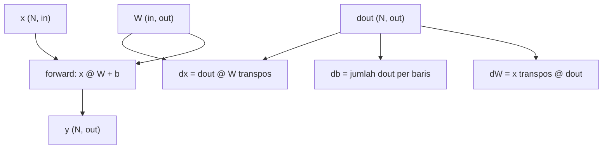
```mermaid
flowchart TB
    X["x (N, in)"] --> F["forward: x @ W + b"]
    W["W (in, out)"] --> F
    F --> Y["y (N, out)"]
    D["dout (N, out)"] --> DW["dW = x transpos @ dout"]
    D --> DB["db = jumlah dout per baris"]
    D --> DX["dx = dout @ W transpos"]
    W --> DX
```
:::

**Penjelasan baris demi baris:**

- **`self._x = x`** — menyimpan masukan; wajib karena `dW` membutuhkan `x` saat backward.
- **`return x @ self.params["W"] + self.params["b"]`** — perkalian matriks `(N, in) @ (in, out) = (N, out)`, lalu `b` di-broadcast ke tiap baris (sampel).
- **`self.grads["W"] = self._x.T @ dout`** — turunan terhadap bobot: `x^T @ dout` menghasilkan matriks `(in, out)` sebangun dengan `W`.
- **`self.grads["b"] = dout.sum(axis=0)`** — turunan terhadap bias: menjumlahkan gradien seluruh sampel dalam batch (sumbu `0`), sebab `b` dipakai bersama oleh semua baris.
- **`return dout @ self.params["W"].T`** — turunan terhadap masukan `(N, out) @ (out, in) = (N, in)`, diteruskan sebagai `dout` bagi lapisan sebelumnya.

## A.8 Dropout (regularisasi inverted dropout)

Dropout mematikan sebagian unit secara acak saat latih untuk mencegah overfitting, dan menjadi identitas saat evaluasi. Skema *inverted dropout* langsung menskalakan `1/(1-p)` saat latih agar inferensi tak perlu penyesuaian.

:::pair Gambar A.8 — Cabang training vs eval dan mask terskala (`src/cnn/layers.py`)
```python
def forward(self, x):
    if not self.training or self.p <= 0.0:
        self._mask = None
        return x
    keep = 1.0 - self.p
    # Skala 1/keep sekaligus (inverted dropout) supaya inferensi tak perlu ubah.
    self._mask = (self.rng.random(x.shape) < keep) / keep
    return x * self._mask

def backward(self, dout):
    if self._mask is None:
        return dout
    return dout * self._mask
```
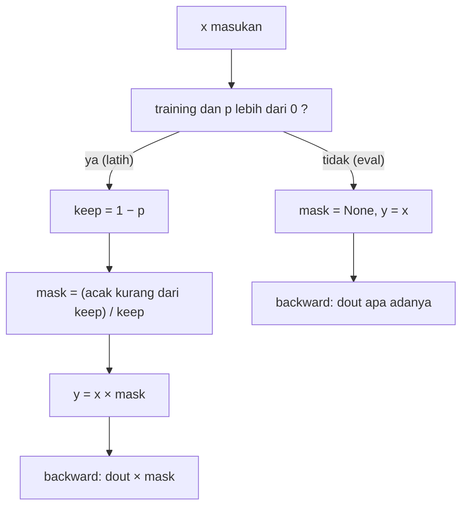
```mermaid
flowchart TB
    X["x masukan"] --> Q["training dan p lebih dari 0 ?"]
    Q -->|"tidak (eval)"| ID["mask = None, y = x"]
    Q -->|"ya (latih)"| K["keep = 1 − p"]
    K --> M["mask = (acak kurang dari keep) / keep"]
    M --> Y["y = x × mask"]
    ID --> BW["backward: dout apa adanya"]
    Y --> BW2["backward: dout × mask"]
```
:::

**Penjelasan baris demi baris:**

- **`if not self.training or self.p <= 0.0:`** — cabang eval/no-op: saat mode evaluasi atau peluang buang `p` nol, lapisan jadi identitas.
- **`self._mask = None; return x`** — menandai tidak ada mask (dipakai backward) dan meneruskan `x` tanpa perubahan.
- **`keep = 1.0 - self.p`** — peluang sebuah unit dipertahankan.
- **`self._mask = (self.rng.random(x.shape) < keep) / keep`** — bangun mask Bernoulli: `rng.random < keep` menghasilkan `True`/`False` (unit hidup/mati), lalu dibagi `keep` sehingga unit yang lolos diperbesar `1/(1-p)`. Inilah *inverted dropout* yang menjaga ekspektasi keluaran tetap sama.
- **`return x * self._mask`** — terapkan mask: sebagian unit di-nol-kan, sisanya terskala.
- **`if self._mask is None: return dout`** — pada mode eval, gradien lewat tanpa diubah.
- **`return dout * self._mask`** — pada mode latih, gradien mengikuti mask yang sama persis dengan forward (unit mati menerima gradien `0`, unit hidup terskala `1/keep`).

## A.9 Softmax + Cross-Entropy

Softmax mengubah skor mentah menjadi peluang antar-kelas, lalu cross-entropy mengukur seberapa jauh peluang itu dari label benar. Keduanya diturunkan bersama karena gradien gabungannya menyederhana menjadi `(p − y)/N`.

:::pair Gambar A.9 — Alur forward loss dan backward gradien softmax+cross-entropy (`src/cnn/losses.py`)
```python
def softmax(z):
    """Softmax stabil-numerik (kurangi maksimum tiap baris sebelum eksponen)."""
    z_shift = z - z.max(axis=1, keepdims=True)
    exp = np.exp(z_shift)
    return exp / exp.sum(axis=1, keepdims=True)


class SoftmaxCrossEntropy:
    """Loss softmax + cross-entropy untuk klasifikasi multi-kelas."""

    def forward(self, scores, y):
        self._probs = softmax(scores)
        self._y = y
        self._n = scores.shape[0]

        # Ambil peluang kelas benar; tambahkan epsilon agar log aman.
        correct_logprobs = -np.log(self._probs[np.arange(self._n), y] + 1e-12)
        return float(np.mean(correct_logprobs))

    def backward(self):
        """Gradien gabungan: (p - y) / N."""
        grad = self._probs.copy()
        grad[np.arange(self._n), self._y] -= 1.0
        grad /= self._n
        return grad
```
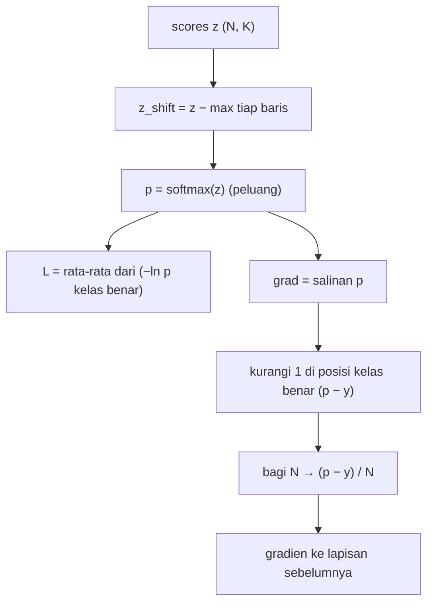
```mermaid
flowchart TB
    Z["scores z (N, K)"] --> SH["z_shift = z − max tiap baris"]
    SH --> P["p = softmax(z) (peluang)"]
    P --> L["L = rata-rata dari (−ln p kelas benar)"]
    P --> G["grad = salinan p"]
    G --> SUB["kurangi 1 di posisi kelas benar (p − y)"]
    SUB --> DIV["bagi N → (p − y) / N"]
    DIV --> OUT["gradien ke lapisan sebelumnya"]
```
:::

**Penjelasan baris demi baris:**

- **`z_shift = z - z.max(axis=1, keepdims=True)`** — kurangi nilai maksimum tiap baris (tiap contoh) sebelum eksponen. Ini trik stabil-numerik: hasil softmax tak berubah, tapi mencegah `np.exp` meluap (overflow) untuk skor besar.
- **`exp = np.exp(z_shift)`** dan **`exp / exp.sum(axis=1, keepdims=True)`** — eksponenkan lalu normalisasi per baris agar tiap baris berjumlah 1, menghasilkan distribusi peluang `p_i = e^{z_i} / Σ_j e^{z_j}`.
- **`self._probs = softmax(scores)`** — simpan peluang hasil forward; dipakai lagi saat backward tanpa hitung ulang.
- **`self._y = y`** dan **`self._n = scores.shape[0]`** — simpan indeks kelas benar (integer, bukan one-hot) dan jumlah contoh `N` untuk perataan.
- **`self._probs[np.arange(self._n), y]`** — pengindeksan fancy: ambil peluang di kolom kelas benar untuk setiap baris sekaligus, menghasilkan vektor sepanjang `N`.
- **`-np.log(... + 1e-12)`** — negatif log-peluang kelas benar; `1e-12` menghindari `log(0)` bila peluang nyaris nol.
- **`float(np.mean(correct_logprobs))`** — rata-ratakan atas seluruh batch menjadi satu skalar loss `L = −(1/N) Σ ln p kelas benar`.
- **`grad = self._probs.copy()`** — mulai gradien dari salinan `p` (jangan ubah `_probs` aslinya).
- **`grad[np.arange(self._n), self._y] -= 1.0`** — kurangi 1 hanya di posisi kelas benar. Karena `y` one-hot bernilai 1 di kelas benar dan 0 di lain, langkah ini setara `p − y`.
- **`grad /= self._n`** — bagi `N` agar konsisten dengan loss yang dirata-ratakan, menghasilkan `(p − y)/N`.

**Intuisi kenapa gradiennya menyederhana jadi (p − y):** turunan cross-entropy terhadap peluang, `∂L/∂p_i = −y_i/p_i`, tampak rumit karena ada pembagian `p_i`. Namun turunan softmax terhadap skor punya bentuk `∂p_i/∂z_j = p_i(δ_ij − p_j)`. Saat aturan rantai mengalikan keduanya dan menjumlahkan atas `i`, faktor `1/p_i` saling meniadakan dengan `p_i` dari softmax, dan suku-suku yang tersisa runtuh rapi menjadi `∂L/∂z_j = p_j − y_j`. Jadi gradien terhadap skor mentah hanyalah selisih antara peluang prediksi dan target one-hot: bila model sudah yakin dan benar (`p ≈ y`) gradien mendekati nol, sedangkan makin salah prediksinya makin besar dorongan koreksinya, tanpa pembagian yang bisa membuat perhitungan tidak stabil.

## A.10 Inisialisasi bobot (He & Xavier)

Inisialisasi yang baik menjaga varians aktivasi stabil antar lapisan agar sinyal tidak meledak atau menghilang. He dipakai untuk ReLU, Xavier untuk lapisan linier/softmax; keduanya menyekala simpangan baku bobot terhadap fan-in.

> 💡 **Untuk awam:** Sebelum model belajar, semua kenop pengaturnya (bobot) diisi dengan tebakan acak sebagai titik awal. Tetapi tebakan acak itu tidak asal — takarannya disetel hati-hati agar sinyal yang mengalir di jaringan tidak "meledak" jadi terlalu besar atau "menghilang" jadi terlalu kecil. Seperti menyetel volume awal radio agar tidak langsung memekakkan telinga atau justru tak terdengar.

:::pair Gambar A.10 — Dua skema inisialisasi bobot Gauss berdasarkan fan-in (`src/cnn/init.py`)
```python
def he_normal(shape, fan_in, rng):
    """Inisialisasi He: std = sqrt(2 / fan_in)."""
    std = np.sqrt(2.0 / fan_in)
    return rng.normal(0.0, std, size=shape).astype(np.float64)


def xavier_normal(shape, fan_in, rng):
    """Inisialisasi Xavier: std = sqrt(1 / fan_in)."""
    std = np.sqrt(1.0 / fan_in)
    return rng.normal(0.0, std, size=shape).astype(np.float64)
```
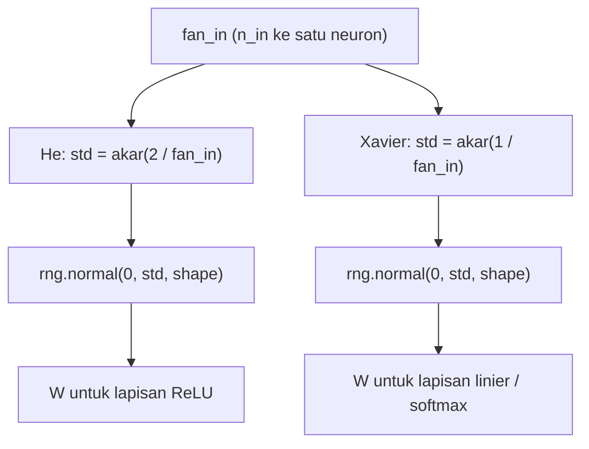
```mermaid
flowchart TB
    FI["fan_in (n_in ke satu neuron)"] --> HE["He: std = akar(2 / fan_in)"]
    FI --> XA["Xavier: std = akar(1 / fan_in)"]
    HE --> RH["rng.normal(0, std, shape)"]
    XA --> RX["rng.normal(0, std, shape)"]
    RH --> WH["W untuk lapisan ReLU"]
    RX --> WX["W untuk lapisan linier / softmax"]
```
:::

**Penjelasan baris demi baris:**

- **`he_normal(shape, fan_in, rng)`** — fungsi inisialisasi He. `shape` bentuk tensor bobot, `fan_in` jumlah masukan ke satu neuron (untuk konvolusi `n_in = C · KH · KW`), `rng` generator acak NumPy agar hasil dapat direproduksi.
- **`std = np.sqrt(2.0 / fan_in)`** — simpangan baku He memakai faktor 2 di pembilang. Faktor 2 ini mengompensasi ReLU yang membuang setengah aktivasi (bagian negatif jadi nol), sehingga varians sinyal tetap terjaga saat merambat maju.
- **`rng.normal(0.0, std, size=shape)`** — tarik sampel dari distribusi Gauss ber-mean 0 dan simpangan baku `std`, sebanyak dan sebentuk `shape`. Mean nol menjaga bobot simetris tanpa bias awal.
- **`.astype(np.float64)`** — paksa tipe presisi ganda agar konsisten dengan perhitungan lain di jaringan.
- **`xavier_normal(shape, fan_in, rng)`** — fungsi inisialisasi Xavier/Glorot, tanda tangan sama dengan He.
- **`std = np.sqrt(1.0 / fan_in)`** — simpangan baku Xavier memakai faktor 1 (bukan 2). Cocok untuk aktivasi linier atau softmax yang tidak memangkas separuh sinyal seperti ReLU, sehingga tak perlu kompensasi ganda.
- **Perbedaan inti He vs Xavier** — keduanya sama-sama Gauss ber-mean 0 dan menyekala `std ∝ 1/√fan_in`; hanya konstanta pembilangnya berbeda (2 untuk He, 1 untuk Xavier), menyesuaikan jenis aktivasi lapisan.

## A.11 Perakitan LeNet-5

Kelas `LeNet5` merakit seluruh lapisan (convolution, pooling, flatten, dense, dropout) menjadi satu daftar berurutan, lalu menjalankan forward/backward dengan menelusuri daftar itu. Dimensi masukan RGB 3×48×48; `flat_dim` dihitung dinamis dari `img_size` agar mendukung ukuran selain 32.

> 💡 **Untuk awam:** Bagian ini merangkai semua lapisan tadi menjadi satu jalur berurutan, seperti menyusun gerbong-gerbong menjadi satu rangkaian kereta. Saat menebak, data berjalan maju menyusuri jalur dari awal ke akhir (forward); saat belajar dari kesalahan, koreksi berjalan mundur menyusuri jalur yang sama dari akhir ke awal (backward).

:::pair Gambar A.11 — Perakitan lapisan & jalur forward/backward (`src/cnn/model.py`)
```python
class LeNet5:
    def __init__(self, num_classes=2, conv1=6, conv2=16, fc1=120, fc2=84,
                 kernel=5, pool=2, seed=42, dropout_p=0.0,
                 in_channels=1, img_size=32):
        rng = np.random.default_rng(seed)
        self.conv1 = Conv2D(in_channels, conv1, kernel, stride=1, pad=0, rng=rng)
        self.relu1 = ReLU()
        self.pool1 = MaxPool2D(pool)
        self.conv2 = Conv2D(conv1, conv2, kernel, stride=1, pad=0, rng=rng)
        # ...
        self.flatten = Flatten()
        # flat_dim dinamis: conv kurangi (k-1), pool bagi 2
        s = img_size
        s = (s - (kernel - 1)) // pool          # setelah conv1 + pool1
        s = (s - (kernel - 1)) // pool          # setelah conv2 + pool2
        flat_dim = conv2 * s * s
        self.fc1 = Dense(flat_dim, fc1, rng=rng, init="he")
        self.drop1 = Dropout(dropout_p, seed=seed + 1)
        # ...
        self.fc3 = Dense(fc2, num_classes, rng=rng, init="xavier")
        self.layers = [
            self.conv1, self.relu1, self.pool1,
            self.conv2, self.relu2, self.pool2,
            self.flatten,
            self.fc1, self.relu3, self.drop1,
            self.fc2, self.relu4, self.drop2,
            self.fc3,
        ]

    def forward(self, x):
        out = x
        for layer in self.layers:
            out = layer.forward(out)
        return out

    def backward(self, dscores):
        grad = dscores
        for layer in reversed(self.layers):
            grad = layer.backward(grad)
        return grad

    def predict_proba(self, x, batch_size=64):
        self.eval()  # dropout mati
        outs = []
        for start in range(0, x.shape[0], batch_size):
            xb = x[start:start + batch_size]
            outs.append(softmax(self.forward(xb)))
        return np.concatenate(outs, axis=0)

    def save(self, path):
        params = {}
        for li, layer in enumerate(self.layers):
            for name, p in layer.params.items():
                params[f"layer{li}_{name}"] = p
        np.savez(path, **params)
```
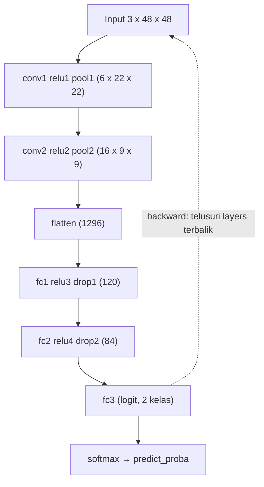
```mermaid
flowchart TB
    A["Input 3 x 48 x 48"] --> B["conv1 relu1 pool1 (6 x 22 x 22)"]
    B --> C["conv2 relu2 pool2 (16 x 9 x 9)"]
    C --> D["flatten (1296)"]
    D --> E["fc1 relu3 drop1 (120)"]
    E --> F["fc2 relu4 drop2 (84)"]
    F --> G["fc3 (logit, 2 kelas)"]
    G -. "backward: telusuri layers terbalik" .-> A
    G --> H["softmax → predict_proba"]
```
:::

**Penjelasan baris demi baris:**

- **`rng = np.random.default_rng(seed)`** — satu generator acak dibagikan ke semua lapisan berbobot agar inisialisasi dapat direproduksi (deterministik dari `seed`).
- **`Conv2D(in_channels, conv1, kernel, stride=1, pad=0)`** — conv1 memetakan `in_channels` (3 untuk RGB) ke 6 peta fitur dengan kernel 5×5 tanpa padding; conv2 dari 6 ke 16 kanal.
- **`s = (s - (kernel - 1)) // pool`** (dua kali) — menghitung ukuran spasial: tiap conv mengurangi sisi sebesar `kernel-1`, tiap pool membaginya `pool`. Untuk 48 → 22 → 9, sehingga `flat_dim = 16 · 9 · 9 = 1296`.
- **`init="he"` vs `init="xavier"`** — fc1/fc2 diinisialisasi He (cocok untuk ReLU sesudahnya), lapisan keluaran fc3 diinisialisasi Xavier (sebelum softmax).
- **`self.drop1 = Dropout(dropout_p, seed=seed + 1)`** — dropout hanya dipasang pada lapisan terhubung penuh; `dropout_p=0` menjadikannya identitas. Seed digeser (`+1`, `+2`) agar tiap dropout memakai mask acak berbeda.
- **`self.layers = [...]`** — satu daftar berurutan menyatukan seluruh lapisan; menjadi sumber tunggal untuk forward, backward, iterasi parameter, dan simpan/muat.
- **`forward`: `for layer in self.layers: out = layer.forward(out)`** — memanggil `forward` tiap lapisan secara berantai, keluaran satu menjadi masukan berikut; hasil akhir logit `(N, K)`.
- **`backward`: `for layer in reversed(self.layers)`** — gradien `dscores` merambat mundur menembus lapisan dalam urutan terbalik (rantai turunan).
- **`predict_proba`** — memanggil `self.eval()` agar dropout mati (inferensi deterministik), lalu memproses `x` per-batch (`batch_size=64`) dan menerapkan `softmax` tiap batch untuk hemat memori; hasil disatukan dengan `np.concatenate`.
- **`save` / `load`** — parameter tiap lapisan disimpan dengan kunci `f"layer{li}_{name}"` (indeks posisi dalam `self.layers` + nama parameter, mis. `layer7_W`); `load` membaca kembali dengan kunci yang sama, sehingga urutan lapisan wajib identik.

## A.12 SGD + Momentum

`SGDMomentum` memperbarui parameter dengan momentum: kecepatan `v` mengakumulasi arah gradien sebelumnya agar konvergensi lebih mulus. Weight decay L2 hanya dikenakan pada matriks bobot `W`, bukan bias.

:::pair Gambar A.12 — Langkah pembaruan SGD dengan momentum (`src/cnn/optim.py`)
```python
class SGDMomentum:
    def __init__(self, layers, lr=0.01, momentum=0.9, weight_decay=0.0):
        self.layers = layers
        self.lr = lr
        self.momentum = momentum
        self.weight_decay = weight_decay
        self.velocities = {}
        for li, layer in enumerate(layers):
            for name, p in layer.params.items():
                self.velocities[(li, name)] = np.zeros_like(p)

    def step(self):
        for li, layer in enumerate(self.layers):
            for name in layer.params:
                grad = layer.grads[name]
                if self.weight_decay and name == "W":
                    grad = grad + self.weight_decay * layer.params[name]
                v = self.velocities[(li, name)]
                v *= self.momentum
                v -= self.lr * grad
                layer.params[name] += v
```
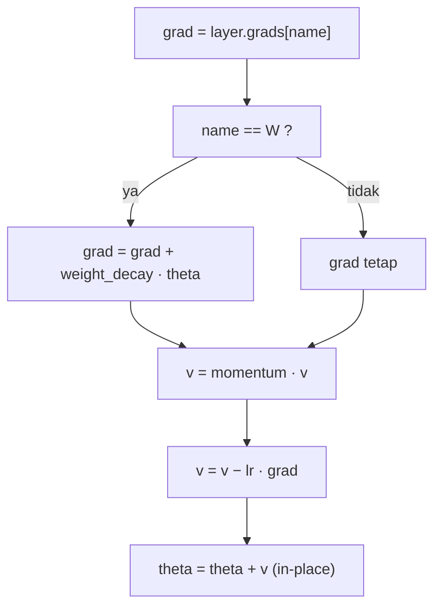
```mermaid
flowchart TB
    A["grad = layer.grads[name]"] --> B["name == W ?"]
    B -->|"ya"| C["grad = grad + weight_decay · theta"]
    B -->|"tidak"| D["grad tetap"]
    C --> E["v = momentum · v"]
    D --> E
    E --> F["v = v − lr · grad"]
    F --> G["theta = theta + v (in-place)"]
```
:::

**Penjelasan baris demi baris:**

- **`self.velocities[(li, name)] = np.zeros_like(p)`** — tiap parameter memperoleh vektor kecepatan awal nol, diindeks pasangan (indeks lapisan, nama parameter) agar unik.
- **`grad = layer.grads[name]`** — mengambil gradien yang sudah dihitung `backward` untuk parameter ini.
- **`if self.weight_decay and name == "W"`** — penalti L2 `weight_decay · theta` hanya ditambahkan bila parameter adalah bobot `W`; bias `b` sengaja dilewati (tak disusutkan).
- **`v *= self.momentum`** — kecepatan lama diredam faktor `momentum` (mis. 0.9), mempertahankan sebagian arah langkah sebelumnya.
- **`v -= self.lr * grad`** — menambahkan kontribusi gradien saat ini (bertanda negatif karena bergerak menuruni gradien); rumus lengkapnya `v = μv − η∇`.
- **`layer.params[name] += v`** — parameter diperbarui in-place (`θ = θ + v`) agar referensi array di lapisan tetap sama, tidak membuat array baru.
- **`zero_grad`** (tak ditampilkan) — menyetel semua gradien ke nol sebelum backward berikutnya.

## A.13 Adam

`Adam` menyimpan estimasi momen pertama (`m`, rata-rata gradien) dan momen kedua (`v`, rata-rata kuadrat gradien), menerapkan koreksi bias, lalu mengambil langkah adaptif per-parameter. Weight decay L2 hanya pada bobot `W`.

> 💡 **Untuk awam:** Adam ibarat bola yang menuruni bukit menuju titik terendah (jawaban terbaik), tetapi bola ini punya ingatan: ia mengingat arah dan kecepatan geraknya barusan. Berkat ingatan itu ia tidak mudah goyah oleh tonjolan kecil di jalan dan tidak gampang nyangkut di cekungan dangkal, sehingga meluncur lebih mulus dan cepat ke tujuan.

:::pair Gambar A.13 — Langkah pembaruan Adam dengan koreksi bias (`src/cnn/optim.py`)
```python
class Adam:
    def __init__(self, layers, lr=1e-3, beta1=0.9, beta2=0.999, eps=1e-8,
                 weight_decay=0.0):
        # ... simpan hiperparameter ...
        self.t = 0
        self.m = {}
        self.v = {}
        for li, layer in enumerate(layers):
            for name, p in layer.params.items():
                self.m[(li, name)] = np.zeros_like(p)
                self.v[(li, name)] = np.zeros_like(p)

    def step(self):
        self.t += 1
        b1, b2 = self.beta1, self.beta2
        bc1 = 1.0 - b1 ** self.t
        bc2 = 1.0 - b2 ** self.t
        for li, layer in enumerate(self.layers):
            for name in layer.params:
                grad = layer.grads[name]
                if self.weight_decay and name == "W":
                    grad = grad + self.weight_decay * layer.params[name]
                m = self.m[(li, name)]
                v = self.v[(li, name)]
                m *= b1
                m += (1.0 - b1) * grad
                v *= b2
                v += (1.0 - b2) * (grad * grad)
                m_hat = m / bc1
                v_hat = v / bc2
                layer.params[name] -= self.lr * m_hat / (np.sqrt(v_hat) + self.eps)
```
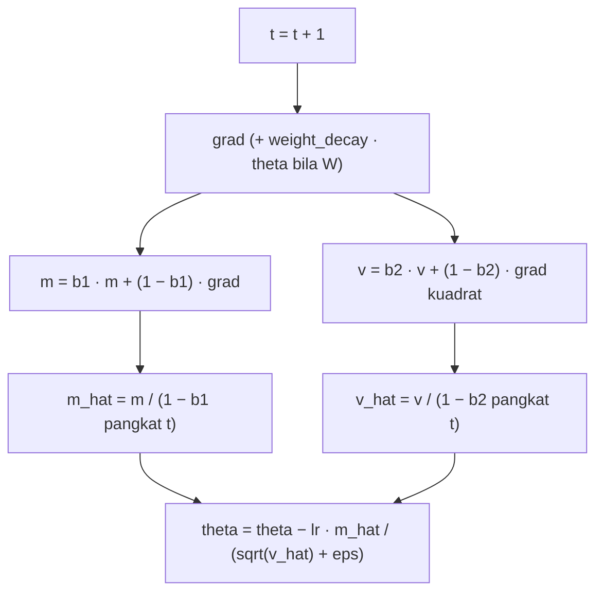
```mermaid
flowchart TB
    A["t = t + 1"] --> B["grad (+ weight_decay · theta bila W)"]
    B --> C["m = b1 · m + (1 − b1) · grad"]
    B --> D["v = b2 · v + (1 − b2) · grad kuadrat"]
    C --> E["m_hat = m / (1 − b1 pangkat t)"]
    D --> F["v_hat = v / (1 − b2 pangkat t)"]
    E --> G["theta = theta − lr · m_hat / (sqrt(v_hat) + eps)"]
    F --> G
```
:::

**Penjelasan baris demi baris:**

- **`self.t = 0`** — penghitung langkah global; dinaikkan tiap `step` dan dipakai untuk koreksi bias.
- **`self.m` / `self.v`** — dua kamus momen (pertama dan kedua) tiap parameter, diinisialisasi nol dan diindeks `(li, name)`.
- **`self.t += 1`** lalu **`bc1 = 1.0 - b1 ** self.t`**, **`bc2 = 1.0 - b2 ** self.t`** — faktor koreksi bias; karena `m` dan `v` mulai dari nol, pada langkah awal ia bias ke nol, koreksi ini mengompensasinya (mendekati 1 saat `t` besar).
- **`if self.weight_decay and name == "W"`** — sama seperti SGDM, penalti L2 hanya untuk bobot `W`.
- **`m *= b1; m += (1.0 - b1) * grad`** — pembaruan rata-rata bergerak momen pertama: `m = b1·m + (1−b1)·g`.
- **`v *= b2; v += (1.0 - b2) * (grad * grad)`** — momen kedua memakai kuadrat gradien `g^2` (elemen demi elemen): `v = b2·v + (1−b2)·g^2`.
- **`m_hat = m / bc1`**, **`v_hat = v / bc2`** — versi terkoreksi-bias dari kedua momen.
- **`layer.params[name] -= self.lr * m_hat / (np.sqrt(v_hat) + self.eps)`** — langkah adaptif: gradien terskala dibagi akar momen kedua, sehingga tiap parameter memperoleh laju efektif sendiri; `eps` (1e-8) mencegah pembagian nol. Pembaruan in-place (`-=`).

## A.14 Training loop mini-batch

`Trainer.fit` menjalankan satu putaran epoch: tiap epoch mengatur laju belajar (cosine), melewatkan seluruh mini-batch (opsional diaugmentasi daring), lalu mengevaluasi train/val dan menyimpan snapshot bobot dengan `val_acc` terbaik untuk dipulihkan di akhir.

:::pair Gambar A.14 — Loop pelatihan mini-batch dengan cosine LR dan restore bobot val terbaik (`src/cnn/trainer.py`)
```python
def fit(self, x_train, y_train, x_val=None, y_val=None, epochs=15,
        verbose=True, restore_best=True):
    best_val_acc, best_snapshot, best_epoch = -1.0, None, 0
    for epoch in range(1, epochs + 1):
        if self.cosine_lr:
            self.optimizer.lr = 0.5 * self.base_lr * (
                1.0 + np.cos(np.pi * (epoch - 1) / max(1, epochs - 1)))
        self.model.train()  # dropout hidup saat latih
        for xb, yb in self._iterate_minibatches(x_train, y_train):
            if self.augment:
                xb = random_augment(xb, self.rng, **self.aug_params)
            scores = self.model.forward(xb)
            loss = self.loss_fn.forward(scores, yb)
            dscores = self.loss_fn.backward()
            self.model.backward(dscores)
            self.optimizer.step()
        # ... catat train_loss/acc ke history ...
        if x_val is not None:
            val_loss, val_acc = self._evaluate(x_val, y_val)
            if val_acc > best_val_acc:
                best_val_acc, best_epoch = val_acc, epoch
                best_snapshot = self._snapshot()
    if restore_best and best_snapshot is not None:
        self._restore(best_snapshot)
```
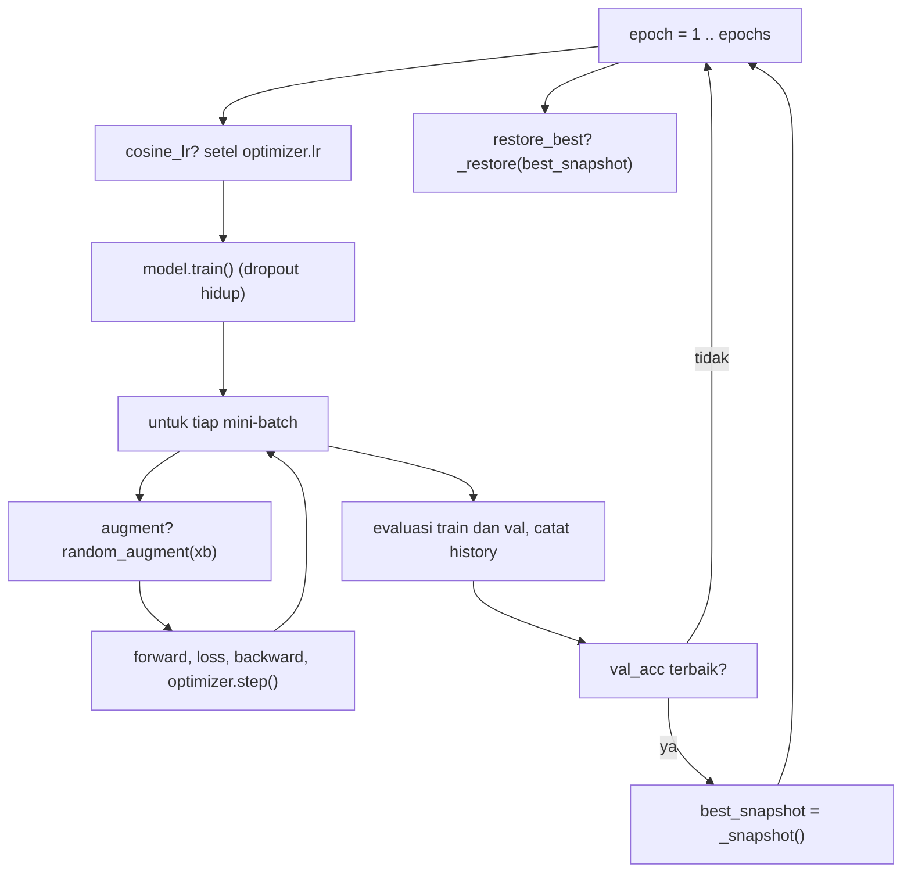
```mermaid
flowchart TB
    A["epoch = 1 .. epochs"] --> B["cosine_lr? setel optimizer.lr"]
    B --> C["model.train() (dropout hidup)"]
    C --> D["untuk tiap mini-batch"]
    D --> E["augment? random_augment(xb)"]
    E --> F["forward, loss, backward, optimizer.step()"]
    F --> D
    D --> G["evaluasi train dan val, catat history"]
    G --> H["val_acc terbaik?"]
    H -->|"ya"| I["best_snapshot = _snapshot()"]
    H -->|"tidak"| A
    I --> A
    A --> J["restore_best? _restore(best_snapshot)"]
```
:::

**Penjelasan baris demi baris:**

- **`best_val_acc, best_snapshot, best_epoch = -1.0, None, 0`** — inisialisasi pelacak model terbaik; `best_val_acc = -1.0` memastikan epoch pertama pasti mengalahkannya.
- **`for epoch in range(1, epochs + 1)`** — satu iterasi = satu kali lewat seluruh data latih.
- **`self.optimizer.lr = 0.5 * self.base_lr * (1.0 + np.cos(...))`** — jadwal *cosine annealing*: laju belajar meluruh mulus dari `base_lr` menuju ~0 sepanjang pelatihan, menstabilkan epoch akhir dan meredam *bouncing* akurasi validasi. `max(1, epochs - 1)` mencegah pembagian nol saat `epochs == 1`.
- **`self.model.train()`** — mengaktifkan mode latih (dropout hidup); pasangannya `self.model.eval()` di `_evaluate` mematikan dropout saat pengukuran.
- **`for xb, yb in self._iterate_minibatches(...)`** — generator yang mengacak indeks (`self.rng.shuffle`) lalu memotong data menjadi potongan sebesar `batch_size`.
- **`if self.augment: xb = random_augment(xb, self.rng, **self.aug_params)`** — augmentasi *daring*: batch diacak ulang tiap epoch sehingga model nyaris tak pernah melihat citra identik dua kali (lihat A.15).
- **`scores = ...; loss = ...; dscores = ...; self.model.backward(dscores); self.optimizer.step()`** — empat langkah inti: forward → hitung loss → backprop gradien loss → perbarui parameter (SGD+momentum atau Adam).
- **`if val_acc > best_val_acc:`** — kriteria *early-stopping* implisit berbasis validasi; saat lebih baik, `_snapshot()` menyalin dalam (deep copy) seluruh parameter tiap lapisan.
- **`if restore_best and best_snapshot is not None: self._restore(best_snapshot)`** — di akhir pelatihan, bobot dikembalikan ke epoch dengan `val_acc` tertinggi, bukan bobot epoch terakhir yang mungkin sudah *overfit*.

## A.15 Augmentasi daring

`random_augment` menghasilkan salinan batch yang diacak per-citra tiap kali dipanggil: flip horizontal, geser integer dengan replikasi tepi, lalu transformasi fotometrik (kontras, kecerahan, noise). Karena dipanggil ulang tiap epoch, ragam data efektif tumbuh besar tanpa menambah memori.

:::pair Gambar A.15 — Augmentasi acak per-citra pada batch terstandardisasi (`src/cnn/augment.py`)
```python
def random_augment(x, rng, max_shift=3, brightness=0.15, contrast=0.15,
                   noise_std=0.05, flip_p=0.5):
    n = x.shape[0]
    out = x.copy()
    for i in range(n):
        img = out[i]
        if rng.random() < flip_p:          # flip horizontal
            img = img[:, :, ::-1]
        dy = int(rng.integers(-max_shift, max_shift + 1))
        dx = int(rng.integers(-max_shift, max_shift + 1))
        img = _shift_replicate(np.ascontiguousarray(img), dy, dx)
        if contrast:                        # kontras: kali faktor
            img = img * (1.0 + rng.uniform(-contrast, contrast))
        if brightness:                      # kecerahan: tambah konstanta
            img = img + rng.uniform(-brightness, brightness)
        if noise_std:                       # noise Gaussian aditif
            img = img + rng.normal(0.0, noise_std, size=img.shape)
        out[i] = img
    return out
```
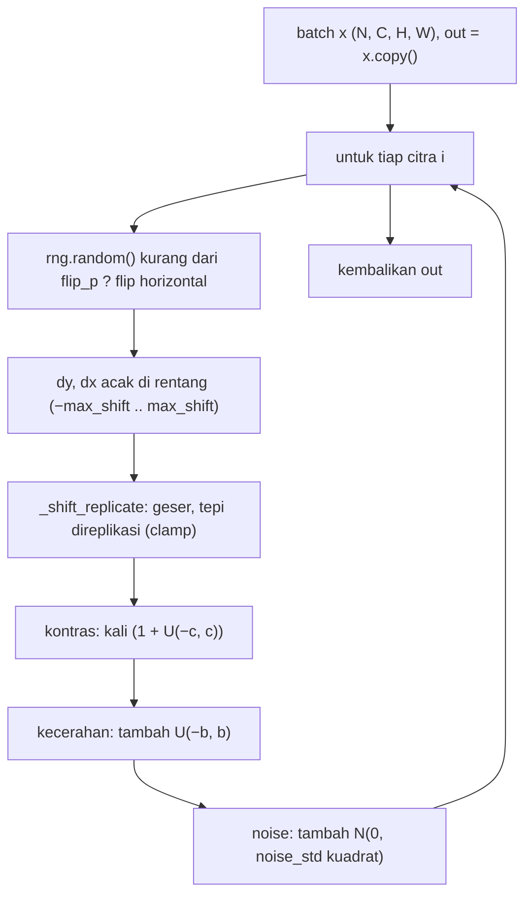
```mermaid
flowchart TB
    A["batch x (N, C, H, W), out = x.copy()"] --> B["untuk tiap citra i"]
    B --> C["rng.random() kurang dari flip_p ? flip horizontal"]
    C --> D["dy, dx acak di rentang (−max_shift .. max_shift)"]
    D --> E["_shift_replicate: geser, tepi direplikasi (clamp)"]
    E --> F["kontras: kali (1 + U(−c, c))"]
    F --> G["kecerahan: tambah U(−b, b)"]
    G --> H["noise: tambah N(0, noise_std kuadrat)"]
    H --> B
    B --> I["kembalikan out"]
```
:::

**Penjelasan baris demi baris:**

- **`out = x.copy()`** — bekerja pada salinan agar tensor latih asli tak termodifikasi; batch berikutnya tetap bersih.
- **`for i in range(n):`** — tiap citra diaugmentasi *independen*, jadi satu batch memuat campuran transformasi berbeda.
- **`if rng.random() < flip_p: img = img[:, :, ::-1]`** — flip horizontal berpeluang `flip_p` (default 0.5) dengan membalik sumbu lebar (`W`).
- **`dy = int(rng.integers(-max_shift, max_shift + 1))`** — pergeseran integer acak; `+1` karena `integers` batas-atasnya eksklusif, sehingga `+max_shift` ikut terpilih.
- **`img = _shift_replicate(np.ascontiguousarray(img), dy, dx)`** — geser via `np.roll` lalu tepi yang "terlipat" ditimpa nilai tepi (replikasi/clamp) agar tak muncul artefak nol; `ascontiguousarray` merapikan memori setelah slicing terbalik dari flip.
- **`img = img * (1.0 + rng.uniform(-contrast, contrast))`** — kontras sebagai transformasi afin perkalian; sah dilakukan di ruang terstandardisasi.
- **`img = img + rng.uniform(-brightness, brightness)`** — kecerahan sebagai pergeseran aditif konstan ke seluruh piksel.
- **`img = img + rng.normal(0.0, noise_std, size=img.shape)`** — noise Gaussian per-piksel untuk menambah ketahanan terhadap derau sensor.
- **`rng`** — instance `np.random.Generator` milik trainer, sehingga augmentasi tetap *reproducible* mengikuti seed.

## A.16 Preprocessing dan split

`load_image` membuka citra, me-resize ke `IMG_SIZE`, dan mengembalikan tensor `(C, H, W)` dalam `[0,1]` — RGB (`transpose`) atau grayscale luminance sesuai `config.IMG_CHANNELS`. Di `main`, data dibagi *stratified* 70/15/15 lalu distandardisasi dengan statistik data latih.

:::pair Gambar A.16 — Muat citra RGB (C,H,W), split stratified, standardisasi skalar (`src/preprocess.py`)
```python
def load_image(path):
    with Image.open(path) as im:
        im = im.convert("RGB").resize(
            (config.IMG_SIZE, config.IMG_SIZE), Image.BILINEAR)
        arr = np.asarray(im, dtype=np.float64)      # (H, W, 3), 0..255
    if config.IMG_CHANNELS == 1:
        gray = to_grayscale(arr) / 255.0            # (H, W) di [0,1]
        return gray[np.newaxis, :, :]               # (1, H, W)
    rgb = arr / 255.0                               # (H, W, 3) di [0,1]
    return np.transpose(rgb, (2, 0, 1))             # (3, H, W)

# --- di main(): split stratified lalu standardisasi ---
x_tmp, x_test, y_tmp, y_test = train_test_split(
    X, y, test_size=config.TEST_RATIO, stratify=y, random_state=config.SEED)
val_frac = config.VAL_RATIO / (config.TRAIN_RATIO + config.VAL_RATIO)
x_train, x_val, y_train, y_val = train_test_split(
    x_tmp, y_tmp, test_size=val_frac, stratify=y_tmp, random_state=config.SEED)

mu = float(x_train.mean())
sigma = float(x_train.std() + 1e-8)
x_train = (x_train - mu) / sigma
x_val = (x_val - mu) / sigma
x_test = (x_test - mu) / sigma
```
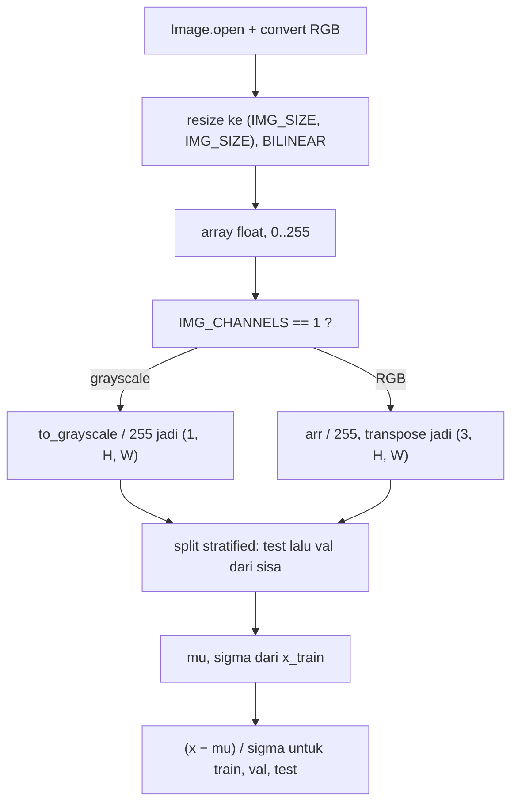
```mermaid
flowchart TB
    A["Image.open + convert RGB"] --> B["resize ke (IMG_SIZE, IMG_SIZE), BILINEAR"]
    B --> C["array float, 0..255"]
    C --> D["IMG_CHANNELS == 1 ?"]
    D -->|"grayscale"| E["to_grayscale / 255 jadi (1, H, W)"]
    D -->|"RGB"| F["arr / 255, transpose jadi (3, H, W)"]
    E --> G["split stratified: test lalu val dari sisa"]
    F --> G
    G --> H["mu, sigma dari x_train"]
    H --> I["(x − mu) / sigma untuk train, val, test"]
```
:::

**Penjelasan baris demi baris:**

- **`im.convert("RGB").resize((config.IMG_SIZE, config.IMG_SIZE), Image.BILINEAR)`** — samakan semua citra ke ukuran masukan LeNet-5 memakai interpolasi bilinear; `convert("RGB")` menyeragamkan mode (mis. RGBA/grayscale) menjadi 3 kanal.
- **`arr = np.asarray(im, dtype=np.float64)`** — tensor `(H, W, 3)` rentang 0..255 dalam presisi ganda.
- **`if config.IMG_CHANNELS == 1: ... gray[np.newaxis, :, :]`** — jalur grayscale: luminance BT.601 dinormalisasi ke `[0,1]`, lalu tambahkan sumbu kanal menjadi `(1, H, W)`.
- **`rgb = arr / 255.0; return np.transpose(rgb, (2, 0, 1))`** — jalur RGB (default): skalakan ke `[0,1]` lalu ubah tata sumbu dari `(H, W, C)` ke `(C, H, W)` sesuai konvensi tensor konvolusi. RGB menyimpan sinyal warna/tekstur aspal yang membantu membedakan lubang dari jalan utuh.
- **`train_test_split(..., test_size=config.TEST_RATIO, stratify=y, ...)`** — pisahkan test lebih dulu; `stratify=y` menjaga proporsi kelas identik di tiap subset.
- **`val_frac = config.VAL_RATIO / (config.TRAIN_RATIO + config.VAL_RATIO)`** — konversi rasio val terhadap *sisa* (train+val) setelah test dilepas, agar hasil akhir tepat 70/15/15.
- **`random_state=config.SEED`** — split deterministik supaya eksperimen bisa direproduksi.
- **`mu = float(x_train.mean()); sigma = float(x_train.std() + 1e-8)`** — standardisasi *skalar* (satu `mu`, satu `sigma` untuk seluruh tensor), dihitung **hanya** dari data latih agar tak ada kebocoran informasi. `1e-8` mencegah pembagian nol.
- **`x_train = (x_train - mu) / sigma; x_val = ...; x_test = ...`** — statistik latih yang sama diterapkan ke val dan test; `mu`/`sigma` disimpan ke `norm_stats.json` untuk dipakai saat inferensi.

## A.17 Ensembel dan TTA

`ensemble_proba` merata-ratakan probabilitas softmax dari beberapa model (satu per seed) di mana tiap model memakai *test-time augmentation*: `tta_proba` merata-ratakan prediksi citra asli dan versi flip. Dua lapis perata-rataan ini meredam varians dan menaikkan akurasi.

:::pair Gambar A.17 — Ensembel multi-seed dengan TTA flip pada softmax (`src/evaluate.py`)
```python
def tta_proba(model, x, batch_size=64):
    p = model.predict_proba(x, batch_size)
    p_flip = model.predict_proba(x[:, :, :, ::-1], batch_size)
    return 0.5 * (p + p_flip)

def ensemble_weight_paths():
    paths = []
    for seed in getattr(config, "ENSEMBLE_SEEDS", []):
        p = config.WEIGHTS_NPZ.replace(".npz", f"_seed{seed}.npz")
        if os.path.exists(p):
            paths.append(p)
    return paths or [config.WEIGHTS_NPZ]

def ensemble_proba(x):
    paths = ensemble_weight_paths()
    acc = None
    for p in paths:
        model = _new_model().load(p)
        pr = tta_proba(model, x)
        acc = pr if acc is None else acc + pr
    return acc / len(paths)
```
```mermaid
flowchart TB
    A["ensemble_weight_paths(): berkas seedNN.npz yang ada"] --> B["untuk tiap path bobot"]
    B --> C["_new_model().load(p)"]
    C --> D["tta_proba: predict_proba(x)"]
    D --> E["predict_proba(x flip horizontal)"]
    E --> F["p_tta = 0.5 (p + p_flip)"]
    F --> G["akumulasi: acc = acc + p_tta"]
    G --> B
    B --> H["kembalikan acc / jumlah model"]
```
:::

**Penjelasan baris demi baris:**

- **`p = model.predict_proba(x, batch_size)`** — softmax model pada citra asli.
- **`p_flip = model.predict_proba(x[:, :, :, ::-1], batch_size)`** — softmax pada citra yang dicermin kiri-kanan (balik sumbu `W`).
- **`return 0.5 * (p + p_flip)`** — prediksi lubang seharusnya *invarian* terhadap cermin, jadi rata-rata keduanya meredam derau dan biasanya menaikkan akurasi sedikit.
- **`for seed in getattr(config, "ENSEMBLE_SEEDS", []):`** — telusuri daftar seed; `getattr` dengan default `[]` aman bila konfigurasi tak mendefinisikannya.
- **`p = config.WEIGHTS_NPZ.replace(".npz", f"_seed{seed}.npz")`** — bentuk nama berkas bobot per-seed (mis. `weights_seed7.npz`).
- **`return paths or [config.WEIGHTS_NPZ]`** — jika tak ada bobot ensembel di disk, jatuh kembali ke satu bobot tunggal, sehingga alur evaluasi tetap jalan.
- **`model = _new_model().load(p)`** — bangun ulang arsitektur LeNet5 sesuai `IMG_CHANNELS`/`IMG_SIZE` aktif lalu muat parameter tersimpan.
- **`acc = pr if acc is None else acc + pr`** — akumulasi berjalan; inisialisasi pada iterasi pertama, lalu jumlahkan probabilitas TTA tiap model.
- **`return acc / len(paths)`** — bagi dengan jumlah model untuk memperoleh rata-rata softmax ensembel; `np.argmax` atasnya (di `main`) menghasilkan label akhir.


---

# LAMPIRAN B — KAMUS ISTILAH

> 💡 **Untuk pembaca awam:** kamus ini menerjemahkan istilah teknis ke bahasa
> sehari-hari. Setiap entri berisi satu kalimat definisi ditambah satu analogi.
> Anda tidak perlu membaca berurutan — pakai saja sebagai rujukan saat menemui
> istilah asing di dokumen lain atau di makalah.

**Tensor** — wadah angka berdimensi banyak yang menyimpan gambar atau hasil hitungan; seperti tumpukan lembar spreadsheet: satu angka (nilai), satu baris (deret), satu tabel (lembar), lalu banyak tabel ditumpuk.

**Matriks** — tabel angka dua dimensi (baris × kolom); persis seperti papan catur yang tiap kotaknya diisi satu angka.

**Vektor** — deretan angka satu baris; ibarat daftar belanja bernomor, tiap posisi punya makna tetap.

**Batch / mini-batch** — sekelompok kecil gambar yang diproses bersamaan dalam satu langkah belajar; seperti guru memeriksa 32 lembar ujian sekaligus, bukan satu-satu atau seluruh kelas sekaligus.

**Epoch** — satu putaran penuh saat model sudah melihat semua gambar latih tepat satu kali; ibarat membaca ulang seluruh buku dari halaman pertama sampai terakhir sekali jalan.

**Reshape** — menyusun ulang angka yang sama ke bentuk berbeda tanpa mengubah isinya; seperti menata 12 telur dari satu baris panjang menjadi kotak 3×4 — telurnya tetap 12.

**Transpos** — menukar baris jadi kolom pada sebuah tabel; seperti memutar tabel jadwal 90 derajat sehingga judul yang tadinya di atas kini di samping.

**Broadcasting** — trik agar angka kecil bisa "diregangkan" otomatis untuk berpasangan dengan tabel besar; seperti satu resep bumbu yang diterapkan ke semua porsi masakan tanpa menulis ulang resepnya.

**Fancy indexing** — mengambil banyak elemen sekaligus dengan menyebut daftar posisinya; seperti berkata "ambilkan kursi nomor 3, 7, dan 10" alih-alih menunjuk satu per satu.

**In-place** — mengubah isi wadah angka langsung di tempat tanpa membuat salinan baru; seperti mengedit dokumen asli, bukan menyimpannya sebagai file baru dulu.

**Mask** — daftar benar/salah yang menandai elemen mana yang dipakai dan mana yang diabaikan; seperti stabilo yang menyorot kata-kata penting dan membiarkan sisanya.

**Argmax** — mencari posisi angka terbesar dalam sebuah deret; seperti menunjuk siswa dengan nilai tertinggi di daftar, bukan menyebut nilainya.

**Gradien** — penunjuk arah dan seberapa besar suatu nilai harus diubah agar hasil membaik; seperti kompas yang menunjukkan ke mana harus melangkah supaya lebih cepat sampai puncak.

**Backpropagation** — cara menelusuri kesalahan dari hasil akhir mundur ke setiap bagian model untuk tahu siapa yang perlu diperbaiki; seperti menelusuri balik resep gagal untuk menemukan bumbu mana yang salah takar.

**Forward & backward** — dua arah proses: maju (forward) menghasilkan tebakan, mundur (backward) menghitung kesalahan dan cara memperbaikinya; seperti mengerjakan soal lalu mencocokkan dengan kunci untuk tahu di mana keliru.

**Softmax** — mengubah sekumpulan skor mentah menjadi persentase keyakinan yang totalnya 100%; seperti mengubah perolehan suara jadi persentase pemilih tiap kandidat.

**Cross-entropy** — ukuran seberapa jauh tebakan model meleset dari jawaban benar; makin yakin tapi salah, makin besar hukumannya — seperti denda yang membengkak kalau kita menjawab "pasti benar" padahal salah.

**One-hot** — cara menulis jawaban kategori sebagai deret 0 dengan satu angka 1 di posisi yang benar; seperti kartu absensi yang hanya satu kotak dicentang untuk menandai kelas yang dihadiri.

**Momentum** — teknik agar perbaikan model tidak berhenti-henti melainkan mempertahankan arah seperti benda yang sudah melaju; seperti bola menggelinding menuruni bukit yang tetap meluncur melewati lubang-lubang kecil.

**Varians** — ukuran seberapa berpencar-pencar hasil dari nilai rata-ratanya; seperti tembakan panah yang tersebar jauh dari titik pusat menunjukkan varians tinggi.

**Overfitting** — kondisi saat model terlalu hafal contoh latihan sampai gagal pada soal baru; seperti murid yang menghafal kunci jawaban ujian lama tapi bingung menghadapi soal yang sedikit diubah.

**Regularisasi** — sekumpulan cara menahan model agar tidak terlalu hafal, mencakup *dropout* (mematikan sebagian bagian secara acak saat berlatih) dan *weight decay* (menghukum angka-angka yang membesar berlebihan); seperti melatih tim dengan pemain bergantian diistirahatkan dan melarang satu bintang mendominasi.

**Kernel / filter** — jendela kecil berisi angka yang digeser ke seluruh gambar untuk mendeteksi pola tertentu; seperti stempel bermotif yang dicap ke tiap bagian gambar untuk menemukan garis atau tepi.

**Stride** — seberapa jauh jendela filter melompat setiap kali digeser; seperti langkah kaki — langkah lebar (stride besar) memindai lebih cepat tapi lebih kasar.

**Padding** — pinggiran angka nol yang ditambahkan mengelilingi gambar agar tepinya tetap terbaca; seperti bingkai kosong di sekeliling foto supaya sudut-sudutnya tidak terpotong saat dicap filter.

**Feature map** — gambar hasil setelah sebuah filter dijalankan, menyorot di mana pola yang dicari muncul; seperti peta panas yang menyala di lokasi-lokasi yang cocok dengan motif stempel.

**Konvolusi** — proses menggeser filter ke seluruh gambar sambil menghitung kecocokan di tiap posisi; seperti menyorotkan senter bermotif ke seluruh dinding untuk melihat bagian mana yang berpola sama.

**Normalisasi / standardisasi** — menyetel ulang angka agar berada pada skala setara, biasanya berpusat di rata-rata 0 dengan sebaran seragam; seperti menyamakan satuan agar tinggi badan dan berat badan bisa dibandingkan adil.

**Ensembel** — menggabungkan tebakan beberapa model lalu mengambil kesepakatannya untuk hasil lebih stabil; seperti panel juri — rata-rata banyak juri lebih tepercaya daripada satu juri saja.

**TTA (*Test-Time Augmentation*)** — memberi model beberapa versi gambar yang sama (dibalik, digeser) saat pengujian lalu merata-ratakan hasilnya; seperti melihat objek dari beberapa sudut sebelum memutuskan itu apa.

**Notasi ilmiah** — cara ringkas menulis angka sangat besar atau sangat kecil, misalnya `1e-8` berarti 0,00000001; seperti singkatan "8 nol di belakang koma" supaya tak perlu menulis deretan nol yang panjang.

## Simbol matematika

**Σ (sigma)** — perintah "jumlahkan semuanya"; seperti tombol total di kalkulator yang menambahkan seluruh angka dalam daftar.

**∂L/∂x** — seberapa besar hasil akhir (L) berubah bila x digeser sedikit, sekaligus arah perbaikannya; seperti mengukur berapa banyak rasa sup berubah kalau garam ditambah sejumput.

**∇ dan δ (nabla & delta)** — gradien, yaitu sinyal koreksi yang mengalir mundur ke tiap bagian model; seperti umpan balik dari pelanggan yang diteruskan mundur ke setiap bagian produksi untuk diperbaiki.

**ᵀ (transpos)** — tanda kecil yang berarti "tukar baris jadi kolom" pada sebuah tabel; seperti memutar tabel 90 derajat.

**𝒩 (skrip N)** — angka acak yang diambil dari sebaran berbentuk lonceng, banyak di tengah dan jarang di tepi; seperti tinggi badan orang: kebanyakan sedang, sedikit yang sangat pendek atau sangat tinggi.

**e (bilangan Euler)** — bilangan tetap ≈2,718 yang jadi dasar hitungan pertumbuhan dan eksponen; seperti angka istimewa alam, mirip peran π pada lingkaran.

**μ (mu)** — rata-rata sekumpulan angka; seperti nilai tengah rapor yang mewakili keseluruhan.

**σ (sigma kecil)** — simpangan baku, ukuran seberapa lebar angka menyebar dari rata-ratanya; seperti mengukur apakah nilai satu kelas rapat mengumpul atau berpencar jauh.

**ε (epsilon)** — angka super kecil yang ditambahkan sebagai penjaga agar tak terjadi pembagian dengan nol; seperti ganjalan tipis supaya mesin hitung tidak macet.

---

# DAFTAR PUSTAKA

[1] *Identification of Road Damage Using the Convolutional Neural Network (CNN)
Method.* Jurnal Ilmiah Sistem Informasi (JUISI), ejurnal.provisi.ac.id.

[2] *Deteksi Kerusakan Jalan Berdasarkan Citra Digital Menggunakan Convolutional
Neural Network (CNN).* Jurnal Indonesia: Manajemen Informatika dan Komunikasi
(JIMIK), journal.stmiki.ac.id.

[3] *Implementasi Algoritma YOLO untuk Mendeteksi Jalan Berlubang dan Retak.*
JITSI: Jurnal Ilmiah Teknologi Sistem Informasi, jurnal-itsi.org.

[4] *Automatic Classifier of Road Condition and Early Warning System for
Potholes.* Indonesian Journal of Artificial Intelligence and Data Mining (IJAIDM),
UIN Sultan Syarif Kasim Riau.

[5] D. Arya, H. Maeda, S. K. Ghosh, D. Toshniwal, Y. Sekimoto. *RDD2022: A
multi-national image dataset for automatic Road Damage Detection.* arXiv preprint
arXiv:2209.08538, 2022.

[6] D. Arya, et al. *RDD2020: An annotated image dataset for automatic road damage
detection using deep learning.* Data in Brief / Scientific Data, 2021.

[7] R. Munir. *Bahan Kuliah IF4073 Pemrosesan Citra Digital: "21 — Convolutional
Neural Network".* Program Studi Teknik Informatika, Institut Teknologi Bandung,
2024.

[8] Y. LeCun, L. Bottou, Y. Bengio, P. Haffner. *Gradient-based learning applied
to document recognition.* Proceedings of the IEEE, 86(11):2278–2324, 1998.

---

*Catatan reproduksibilitas: seluruh angka pada makalah ini dihasilkan oleh kode
pada repositori (seed=42). Jalankan `make all` untuk mereproduksi dataset,
pelatihan, evaluasi, dan figur. Detail teknis aliran antar hidden layer tersedia
pada folder `docs/` (diagram Mermaid).*
