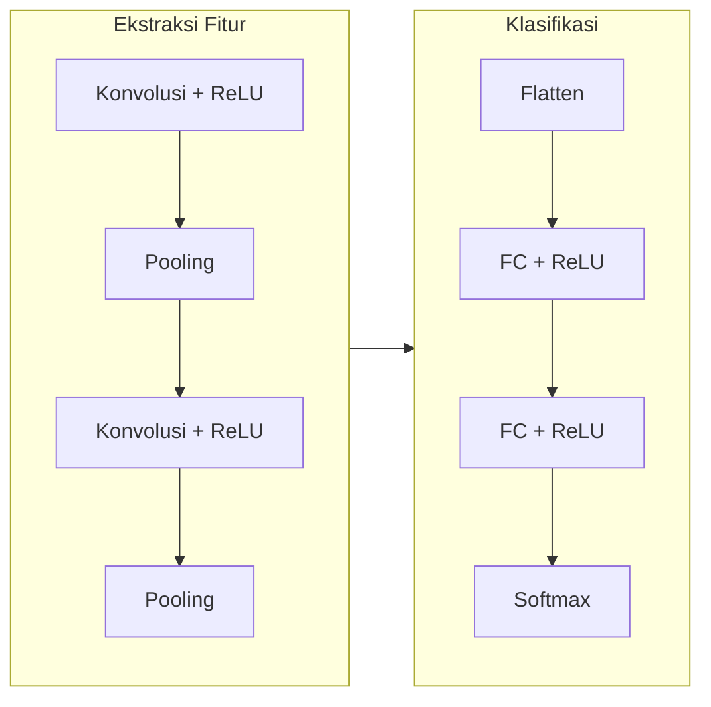
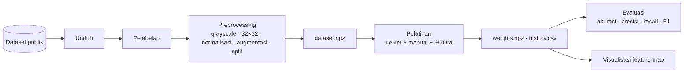
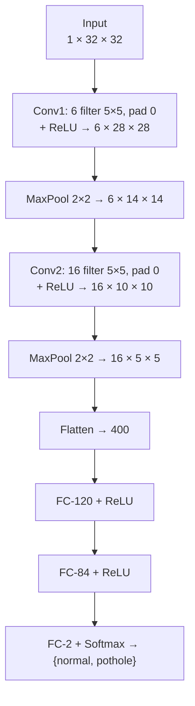
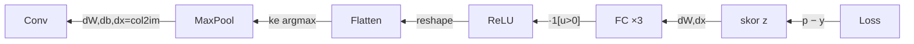

# DETEKSI JALAN BERLUBANG MENGGUNAKAN CONVOLUTIONAL NEURAL NETWORK (CNN) YANG DIIMPLEMENTASIKAN DARI NOL DENGAN ARSITEKTUR LeNet-5

**Makalah Penelitian — Pemrosesan Citra Digital & Pembelajaran Mendalam**

---

## ABSTRAK

Jalan berlubang merupakan salah satu penyebab kerusakan kendaraan dan kecelakaan
lalu lintas. Identifikasi lubang jalan secara manual memerlukan waktu dan biaya
besar, sehingga diperlukan sistem otomatis berbasis pengolahan citra. Penelitian
ini membangun sistem klasifikasi citra jalan menjadi dua kelas — **normal** dan
**berlubang (pothole)** — menggunakan *Convolutional Neural Network* (CNN)
dengan arsitektur **LeNet-5**. Berbeda dengan kebanyakan penelitian yang
memakai pustaka siap pakai (TensorFlow/Keras/PyTorch), seluruh **inti algoritma**
pada penelitian ini — operasi konvolusi, *pooling*, fungsi aktivasi ReLU,
*softmax*, *cross-entropy*, dan *backpropagation* — **diturunkan secara matematis
dan diimplementasikan manual menggunakan NumPy** tanpa fasilitas diferensiasi
otomatis. Kebenaran implementasi turunan (gradien) dibuktikan melalui *numerical
gradient checking* dengan galat relatif berkisar 10⁻⁹–10⁻¹¹. Dataset terdiri
dari 712 citra (348 normal, 364 berlubang) yang diunduh dari repositori publik,
lalu di-*preprocessing* menjadi citra grayscale 32×32, dinormalisasi,
diaugmentasi, dan dibagi 70/15/15. Model dilatih dengan *Stochastic Gradient
Descent with Momentum* (η=0.01, μ=0.9) selama 15 epoch. Hasil pengujian pada
data uji memperoleh **akurasi 75,70%**, **presisi 78,43%**, **recall 72,73%**,
dan **F1-score 75,47%**. Temuan utama menunjukkan implementasi manual mampu
belajar dengan benar (terbukti dapat *overfit* sempurna pada subset kecil dan
lulus *gradient checking*), namun mengalami *overfitting* pada dataset terbatas
sehingga generalisasi terhambat.

**Kata kunci:** deteksi jalan berlubang, convolutional neural network, LeNet-5,
backpropagation, implementasi dari nol, pengolahan citra digital.

*Abstract — This study builds a road image classifier (normal vs pothole) using a
LeNet-5 Convolutional Neural Network whose core operations (convolution, pooling,
ReLU, softmax, cross-entropy, backpropagation) are derived and implemented from
scratch in NumPy, without any deep-learning framework or autograd. Backward
correctness is verified by numerical gradient checking (relative error 1e-9–1e-11).
On 712 images preprocessed to 32×32 grayscale, the model attains 75.70% accuracy,
78.43% precision, 72.73% recall, and 75.47% F1 on the test set.*

---

## DAFTAR ISI

1. BAB I — PENDAHULUAN
2. BAB II — TINJAUAN PUSTAKA
3. BAB III — METODOLOGI PENELITIAN
4. BAB IV — HASIL DAN PEMBAHASAN
5. BAB V — TEMUAN
6. BAB VI — KESIMPULAN DAN SARAN
7. DAFTAR PUSTAKA

---

# BAB I — PENDAHULUAN

## 1.1 Latar Belakang

Infrastruktur jalan merupakan tulang punggung mobilitas masyarakat dan
perekonomian. Namun, kondisi jalan yang rusak — terutama berlubang — masih
menjadi masalah serius di banyak wilayah, termasuk Indonesia. Jalan berlubang
tidak hanya mempercepat kerusakan komponen kendaraan (ban, suspensi, pelek),
tetapi juga meningkatkan risiko kecelakaan lalu lintas, khususnya bagi pengendara
sepeda motor yang jumlahnya dominan.

Proses inventarisasi kerusakan jalan secara konvensional dilakukan melalui survei
manual oleh petugas. Cara ini memerlukan tenaga, waktu, dan biaya yang besar,
serta rentan terhadap subjektivitas penilai. Seiring berkembangnya teknologi
*computer vision* dan *deep learning*, identifikasi kerusakan jalan dapat
diotomatisasi melalui analisis citra: kamera merekam permukaan jalan, lalu sebuah
model klasifikasi menentukan apakah suatu citra mengandung lubang atau tidak.

*Convolutional Neural Network* (CNN) adalah arsitektur *deep learning* yang sangat
efektif untuk data bertopologi grid seperti citra. CNN mampu **belajar fitur
secara otomatis** langsung dari data, menggantikan ekstraksi fitur manual yang
selama ini menjadi tahap tersulit dalam pengolahan citra klasik. Keunggulan
inilah yang membuat CNN menjadi metode dominan pada tugas klasifikasi citra,
deteksi objek, hingga segmentasi.

Sebagian besar implementasi CNN dewasa ini mengandalkan pustaka tingkat tinggi
(TensorFlow, Keras, PyTorch) yang menyembunyikan detail matematis di balik
fungsi siap pakai — sering disebut sebagai "kotak hitam" (*black box*). Bagi
tujuan pembelajaran, pendekatan ini menyisakan kesenjangan pemahaman: bagaimana
sebenarnya konvolusi dihitung? Bagaimana gradien mengalir mundur melalui lapisan
*pooling*? Mengapa *softmax* dan *cross-entropy* selalu dipasangkan?

Penelitian ini menjawab kesenjangan tersebut dengan **mengimplementasikan inti
CNN dari nol** menggunakan NumPy, tanpa fasilitas diferensiasi otomatis. Setiap
operasi maju (*forward*) dan turunan mundurnya (*backward*) diturunkan secara
eksplisit dan dikodekan manual. Arsitektur yang dipilih adalah **LeNet-5**, model
CNN klasik yang relatif sederhana sehingga ideal untuk dipelajari ("minim magic"),
namun tetap memuat seluruh komponen esensial CNN modern: konvolusi, *pooling*,
lapisan terhubung penuh, dan *softmax*.

## 1.2 Rumusan Masalah

Berdasarkan latar belakang, rumusan masalah penelitian ini adalah:

1. Bagaimana mengimplementasikan operasi inti CNN (konvolusi, *pooling*, ReLU,
   *softmax*, *cross-entropy*, dan *backpropagation*) secara manual tanpa pustaka
   *deep learning*?
2. Bagaimana membuktikan bahwa implementasi turunan (gradien) yang ditulis manual
   sudah benar?
3. Bagaimana kinerja model LeNet-5 hasil implementasi manual dalam
   mengklasifikasikan citra jalan berlubang, diukur dengan akurasi, presisi,
   *recall*, dan F1-score?

## 1.3 Tujuan Penelitian

1. Menurunkan dan mengimplementasikan seluruh komponen inti CNN secara manual
   menggunakan NumPy.
2. Memverifikasi kebenaran *backpropagation* melalui *numerical gradient checking*.
3. Melatih dan menguji model LeNet-5 untuk klasifikasi citra jalan berlubang serta
   melaporkan metrik evaluasinya secara jujur.
4. Memvisualisasikan pergerakan data antar *hidden layer* untuk memahami cara
   kerja CNN.

## 1.4 Batasan Masalah

1. Tugas dibatasi pada **klasifikasi citra biner** (normal vs berlubang), bukan
   deteksi objek (*bounding box*) maupun segmentasi.
2. Citra masukan diubah menjadi **grayscale berukuran 32×32** agar pelatihan murni
   NumPy (tanpa GPU) selesai dalam waktu wajar dan dapat direproduksi.
3. Pustaka pihak ketiga hanya dipakai sebagai *helper* pinggiran: Pillow (baca/
   resize citra), scikit-learn (pembagian data), dan matplotlib (visualisasi).
   **Inti pembelajaran 100% manual.**
4. Arsitektur dibatasi pada LeNet-5 (varian ReLU + *max pooling*).

## 1.5 Manfaat Penelitian

- **Akademis:** memberikan pemahaman mendalam mengenai mekanika internal CNN yang
  biasanya tersembunyi di balik pustaka, beserta bukti matematis kebenarannya.
- **Praktis:** menjadi prototipe sistem deteksi jalan berlubang otomatis yang
  dapat dikembangkan lebih lanjut untuk pemantauan kondisi jalan.

---

# BAB II — TINJAUAN PUSTAKA

## 2.1 Penelitian Terdahulu (Jurnal Acuan)

Bagian ini merangkum lima penelitian relevan tentang deteksi/klasifikasi
kerusakan jalan berbasis CNN dan *deep learning*.

**[1] Identification of Road Damage Using Convolutional Neural Network (CNN)**
(Jurnal Ilmiah Sistem Informasi / JUISI). Penelitian ini menerapkan CNN untuk
mengidentifikasi kerusakan jalan dan memperoleh akurasi keseluruhan **97,50%**,
presisi rata-rata 96,77%, *recall* 99,37%, serta F1-score 97,72%. Hasil ini
menunjukkan potensi CNN yang sangat tinggi bila didukung data memadai dan
arsitektur yang tepat.

**[2] Deteksi Kerusakan Jalan Berdasarkan Citra Digital Menggunakan CNN**
(Jurnal Indonesia: Manajemen Informatika dan Komunikasi / JIMIK, STMIKI).
Penelitian ini membangun model CNN untuk mengklasifikasikan citra jalan rusak
dan utuh. Studi tersebut juga membandingkan arsitektur konvensional dengan
ResNet-18, di mana ResNet-18 unggul (akurasi ~92%) dibanding CNN sederhana
(~85%) karena kemampuan *residual block* mengatasi masalah *vanishing gradient*.

**[3] Implementasi Algoritma YOLO untuk Mendeteksi Jalan Berlubang dan Retak**
(JITSI: Jurnal Ilmiah Teknologi Sistem Informasi). Penelitian ini memakai
pendekatan deteksi objek (YOLO). Dengan pembagian data latih–validasi 90%–10%,
diperoleh tingkat keyakinan tertinggi 97%, mAP 93,2%, F1-score 88,7%, *recall*
90,8%, dan presisi 86,7% pada epoch ke-100. Ini menegaskan pendekatan deteksi
objek cocok untuk melokalisasi posisi lubang, melengkapi pendekatan klasifikasi.

**[4] Automatic Classifier of Road Condition and Early Warning System for
Potholes** (Indonesian Journal of Artificial Intelligence and Data Mining /
IJAIDM, UIN Suska). Penelitian ini mengklasifikasikan kondisi jalan menggunakan
dataset besar berisi 22.538 citra dalam dua kelas (pothole dan normal), serta
mengusulkan sistem peringatan dini. Ukuran dataset yang besar menjadi faktor
penting dalam mencapai generalisasi yang baik.

**[5] Arya et al., RDD2022: A Multi-national Image Dataset for Automatic Road
Damage Detection** (arXiv). Penelitian ini menyediakan dataset citra kerusakan
jalan berskala multinasional (termasuk data dari beberapa negara) untuk deteksi
kerusakan jalan otomatis, dan menjadi tolok ukur (*benchmark*) penting di bidang
ini. Dataset RDD juga memuat empat tipe kerusakan: retak memanjang, retak
melintang, retak buaya (*alligator crack*), dan lubang (*pothole*).

**Tabel 2.1. Perbandingan penelitian terdahulu**

| No | Metode | Tugas | Dataset | Metrik utama |
|----|--------|-------|---------|--------------|
| [1] | CNN | Klasifikasi | — | Akurasi 97,5% |
| [2] | CNN vs ResNet-18 | Klasifikasi | Citra digital jalan | Akurasi 85% vs 92% |
| [3] | YOLO | Deteksi objek | Lubang & retak | mAP 93,2%; F1 88,7% |
| [4] | CNN | Klasifikasi | 22.538 citra | — (dataset besar) |
| [5] | Benchmark (RDD2022) | Deteksi | Multinasional | Dataset acuan |
| **Penelitian ini** | **CNN LeNet-5 (manual/dari nol)** | **Klasifikasi** | **712 citra** | **Akurasi 75,7%; F1 75,5%** |

Posisi penelitian ini berbeda dari kelima acuan: alih-alih mengejar akurasi
tertinggi dengan pustaka siap pakai, fokusnya adalah **transparansi dan
pemahaman** — membuktikan bahwa CNN dapat dibangun dan dilatih dengan benar dari
prinsip dasar.

## 2.2 Pembelajaran Mendalam (Deep Learning)

*Deep learning* adalah cabang *machine learning* di mana model belajar
melaksanakan tugas klasifikasi langsung dari data (citra, teks, suara). Istilah
"*deep*" merujuk pada banyaknya lapisan dalam jaringan: jaringan saraf
tradisional hanya memiliki 2–3 lapisan, sedangkan jaringan dalam dapat memiliki
puluhan hingga ratusan lapisan. Perbedaan mendasar antara *machine learning*
klasik dan *deep learning* terletak pada ekstraksi fitur: pada *machine learning*
fitur dirancang manual, sedangkan *deep learning* menggabungkan ekstraksi fitur
dan klasifikasi dalam satu jaringan yang dilatih bersama.

## 2.3 Convolutional Neural Network (CNN)

CNN (ConvNet) adalah algoritma *deep learning* yang umum dipakai untuk memproses
data bertopologi grid seperti citra. Secara ringkas, **CNN = ANN + konvolusi**.
Tidak seperti jaringan saraf biasa, neuron pada CNN tersusun dalam tiga dimensi
(lebar, tinggi, kedalaman). CNN terdiri atas tiga jenis lapisan utama:

1. **Lapisan Konvolusi (+ ReLU)** — ekstraksi fitur lokal.
2. **Lapisan Pooling** — peringkasan & pengurangan dimensi spasial.
3. **Lapisan Terhubung Penuh (Fully-Connected/MLP)** — klasifikasi.



### 2.3.1 Lapisan Konvolusi

Lapisan konvolusi melakukan operasi konvolusi pada citra masukan dengan sejumlah
penapis (*filter/kernel*). Tiap penapis menghasilkan satu *feature map*. Untuk
satu filter *f* dan posisi keluaran (*i*, *j*):

$$O[f,i,j] = b_f + \sum_{c}\sum_{m}\sum_{n} X[c,\,iS+m,\,jS+n]\cdot W[f,c,m,n]$$

Ukuran *feature map* keluaran dihitung dengan rumus:

$$\text{output} = \frac{W - N + 2P}{S} + 1$$

dengan W = tinggi/lebar masukan, N = ukuran kernel, P = *padding*, dan S =
*stride*. Terdapat tiga jenis *padding*: *valid* (tanpa padding), *same* (ukuran
keluaran sama dengan masukan), dan *full*.

Penapis yang berbeda menghasilkan *feature map* yang berbeda — misalnya penapis
Sobel mendeteksi tepi, penapis *box blur* memperhalus. Pada CNN, nilai penapis
**tidak ditentukan manual** melainkan **dipelajari** melalui pelatihan.

### 2.3.2 Fungsi Aktivasi ReLU

*Rectified Linear Unit* memetakan nilai negatif ke nol dan mempertahankan nilai
positif:

$$f(u) = \max(0, u)$$

ReLU memberi sifat non-linier yang memungkinkan jaringan memodelkan hubungan
kompleks, sekaligus mempercepat pelatihan dibanding sigmoid karena tidak
mengalami saturasi pada sisi positif.

### 2.3.3 Lapisan Pooling

*Pooling* mengurangi dimensi spasial *feature map* untuk menekan beban komputasi
dan memberi sedikit invariansi terhadap pergeseran. Dua jenis yang umum: *max
pooling* (mengambil nilai maksimum jendela) dan *average pooling* (mengambil
rata-rata). Umumnya CNN memakai *max pooling* dengan jendela 2×2 dan *stride* 2.

### 2.3.4 Lapisan Terhubung Penuh dan Softmax

Setelah ekstraksi fitur, *feature map* diratakan (*flatten*) lalu dialirkan ke
lapisan terhubung penuh (MLP). Lapisan terakhir menghasilkan vektor berdimensi K
(jumlah kelas) yang diubah menjadi peluang oleh fungsi *softmax*:

$$\sigma(\vec{z})_i = \frac{e^{z_i}}{\sum_{j=1}^{K} e^{z_j}}$$

Keluaran *softmax* bernilai 0–1 dan berjumlah satu, sehingga dapat ditafsirkan
sebagai distribusi peluang antar kelas. Metode pembelajaran yang dipakai adalah
*supervised learning* dengan mekanisme *backpropagation*.

## 2.4 Prinsip Backpropagation dan Aturan Rantai

*Backpropagation* adalah algoritma untuk menghitung gradien fungsi loss terhadap
seluruh parameter jaringan secara efisien, dengan menerapkan **aturan rantai**
(*chain rule*) kalkulus secara berulang dari lapisan keluaran ke lapisan masukan.

Misalkan sebuah jaringan merupakan komposisi fungsi berlapis:

$$L = f_n(f_{n-1}(\cdots f_1(x)))$$

Aturan rantai menyatakan bahwa turunan loss terhadap keluaran lapisan ke-*k*
dapat diperoleh dari turunan loss terhadap keluaran lapisan ke-(*k*+1):

$$\frac{\partial L}{\partial h_k} = \frac{\partial L}{\partial h_{k+1}} \cdot \frac{\partial h_{k+1}}{\partial h_k}$$

Inilah inti efisiensi *backpropagation*: alih-alih menghitung ulang turunan dari
awal untuk tiap parameter, gradien "diwariskan" mundur lapis demi lapis. Setiap
lapisan hanya perlu mengetahui gradien yang datang dari lapisan sesudahnya
(disebut *upstream gradient*, dilambangkan δ), lalu:

1. menghitung gradien terhadap parameternya sendiri (untuk pembaruan bobot), dan
2. meneruskan gradien terhadap masukannya ke lapisan sebelumnya.

Pola "forward menyimpan cache, backward memakai cache" inilah yang menjadi dasar
desain modular pada implementasi penelitian ini: tiap lapisan adalah objek dengan
metode `forward(x)` dan `backward(δ)` yang seragam.

## 2.5 Metrik Evaluasi dan Confusion Matrix

Kinerja klasifikasi biner diukur dengan *confusion matrix* yang mencatat empat
kemungkinan hasil prediksi (kelas positif = pothole):

- **TP** (*true positive*): berlubang, diprediksi berlubang — benar.
- **TN** (*true negative*): normal, diprediksi normal — benar.
- **FP** (*false positive*): normal, diprediksi berlubang — salah (alarm palsu).
- **FN** (*false negative*): berlubang, diprediksi normal — salah (lubang terlewat).

Dari keempatnya diturunkan empat metrik:

$$\text{Akurasi} = \frac{TP+TN}{TP+TN+FP+FN}, \qquad
\text{Presisi} = \frac{TP}{TP+FP}$$
$$\text{Recall} = \frac{TP}{TP+FN}, \qquad
F1 = \frac{2\cdot\text{Presisi}\cdot\text{Recall}}{\text{Presisi}+\text{Recall}}$$

**Akurasi** mengukur proporsi prediksi benar secara keseluruhan, namun bisa
menyesatkan bila kelas tak seimbang. **Presisi** menjawab "dari semua yang
diprediksi berlubang, berapa yang benar?", sedangkan **recall** menjawab "dari
semua lubang sebenarnya, berapa yang berhasil ditemukan?". **F1-score** adalah
rata-rata harmonik presisi dan recall, memberi satu angka ringkas yang seimbang.
Dalam konteks keselamatan jalan, recall sering lebih diutamakan karena lubang
yang terlewat (FN) lebih berbahaya daripada peringatan palsu (FP).

## 2.6 Arsitektur LeNet-5

LeNet-5 diperkenalkan oleh Yann LeCun untuk pengenalan tulisan tangan dan
merupakan salah satu CNN pertama yang berhasil dilatih dengan *backpropagation*.
Strukturnya: Konvolusi 5×5 → *pooling* → Konvolusi 5×5 → *pooling* → FC-120 →
FC-84 → keluaran. LeNet asli memakai *average pooling* dan fungsi *sigmoid*.

Pada penelitian ini dipakai **varian modern**: *max pooling* dan *ReLU*, yang
lebih stabil dilatih, sambil tetap mempertahankan kerangka LeNet-5 yang sederhana
dan mudah dipelajari. Tabel 2.2 membandingkan LeNet dengan AlexNet (CNN
generasi berikut yang jauh lebih dalam) untuk menempatkan LeNet pada konteks.

**Tabel 2.2. Perbandingan LeNet dan AlexNet**

| Aspek | LeNet-5 | AlexNet |
|-------|---------|---------|
| Masukan | 32×32×1 (grayscale) | 227×227×3 (RGB) |
| Jumlah konvolusi | 2 | 5 |
| Aktivasi | sigmoid (asli) | ReLU |
| Pooling | average (asli) | max |
| Jumlah kelas | 10 | 1000 |
| Parameter | ~60 ribu | ~60 juta |

Kesederhanaan LeNet-5 menjadikannya pilihan ideal untuk implementasi manual:
seluruh aliran dimensi dan gradien dapat ditelusuri dengan mudah.

---

# BAB III — METODOLOGI PENELITIAN

## 3.1 Alur Penelitian

Penelitian mengikuti tujuh tahap berurutan, dari pengumpulan data hingga
visualisasi, sebagaimana digambarkan pada diagram berikut.



Alur ini selaras dengan kerangka pelatihan CNN baku (memuat data → membagi data
latih/validasi → mendefinisikan arsitektur → menentukan opsi pelatihan → melatih
→ menguji).

## 3.2 Dataset

Dataset diunduh otomatis dari repositori publik GitHub berlisensi MIT yang
menyimpan citra jalan dalam dua folder kelas: *Pothole* (berlubang) dan *Plain*
(normal). Hanya berkas citra yang diperlukan yang diunduh melalui
`raw.githubusercontent.com`, kemudian disusun menjadi:

- `data/raw/pothole/` → label 1 (berlubang)
- `data/raw/normal/` → label 0 (normal)

Total **712 citra** berhasil diunduh dan diverifikasi (tidak korup). Catatan:
dataset ini bersifat umum (bukan khusus Indonesia). Pipeline dirancang agar mudah
diganti sumbernya — untuk data khusus Indonesia (misalnya Roboflow *Road Damage
Indonesia* atau subset RDD2022 Indonesia) cukup meletakkan citra pada kedua
folder kelas tersebut, lalu menjalankan kembali pipeline.

## 3.3 Pelabelan

Karena citra sudah terpisah per folder kelas, pelabelan dilakukan dengan membaca
struktur folder dan menulis berkas `labels.csv` berisi pasangan (path, label).
Hasil pelabelan dirangkum pada Tabel 3.1.

**Tabel 3.1. Hasil pelabelan dataset**

| Kelas | Label | Jumlah | Proporsi |
|-------|-------|--------|----------|
| normal | 0 | 348 | 48,9% |
| pothole | 1 | 364 | 51,1% |
| **Total** | | **712** | 100% |

Dataset relatif **seimbang** (≈49% : 51%), sehingga metrik akurasi cukup
representatif tanpa perlu penanganan kelas tak seimbang.

## 3.4 Preprocessing

Tahap *preprocessing* mengubah citra mentah beragam ukuran menjadi tensor seragam
siap latih, melalui lima langkah:

**1. Grayscale.** Citra RGB diubah menjadi grayscale dengan rumus luminansi
(BT.601), dihitung manual dari ketiga kanal:

$$Y = 0{,}299\,R + 0{,}587\,G + 0{,}114\,B$$

Penggunaan grayscale mengurangi dimensi (3 kanal → 1 kanal) sehingga komputasi
lebih ringan, sementara informasi bentuk/tekstur lubang sebagian besar tetap
terjaga.

**2. Resize.** Setiap citra di-*resize* menjadi **32×32** piksel sesuai ukuran
masukan LeNet-5.

**3. Normalisasi.** Nilai piksel diskalakan ke rentang [0, 1] lalu
distandardisasi:

$$x' = \frac{x - \mu}{\sigma}$$

dengan μ dan σ dihitung dari data latih. Diperoleh **μ = 0,4634** dan
**σ = 0,2161**. Standardisasi mempercepat konvergensi karena menyamakan skala
fitur.

**4. Augmentasi (data latih saja).** Untuk memperbanyak variasi dan mengurangi
*overfitting*, tiap citra latih diperbanyak dengan: *flip* horizontal serta dua
pergeseran kecil (2 piksel). Augmentasi melipatgandakan data latih menjadi empat
kali lipat.

**5. Pembagian data (split).** Data dibagi *stratified* (proporsi kelas terjaga)
menjadi 70% latih, 15% validasi, dan 15% uji. Hasil pembagian dirangkum pada
Tabel 3.2.

**Tabel 3.2. Pembagian data**

| Subset | Jumlah (sebelum augmentasi) | Jumlah (setelah augmentasi) |
|--------|------------------------------|------------------------------|
| Latih (train) | 498 | 1.992 |
| Validasi (val) | 107 | 107 |
| Uji (test) | 107 | 107 |

Contoh citra hasil *preprocessing* ditunjukkan pada Gambar 3.1.


*Gambar 3.1. Contoh citra grayscale 32×32 untuk kelas normal (atas) dan pothole
(bawah).*

## 3.5 Arsitektur Model

Model LeNet-5 yang diimplementasikan menerima citra 1×32×32 dan menghasilkan dua
keluaran kelas. Aliran dimensi tiap *hidden layer* ditunjukkan pada Gambar 3.2.



*Gambar 3.2. Arsitektur LeNet-5 dan aliran dimensi antar hidden layer.*

Perhitungan dimensi memakai rumus (W − N + 2P)/S + 1, dirangkum pada Tabel 3.3.

**Tabel 3.3. Perhitungan dimensi tiap lapisan**

| Tahap | Operasi | Rumus | Keluaran |
|-------|---------|-------|----------|
| Input | — | — | 1 × 32 × 32 |
| Conv1 | 6×(5×5), P=0, S=1 | (32−5)/1+1 = 28 | 6 × 28 × 28 |
| Pool1 | max 2×2, S=2 | (28−2)/2+1 = 14 | 6 × 14 × 14 |
| Conv2 | 16×(5×5), P=0, S=1 | (14−5)/1+1 = 10 | 16 × 10 × 10 |
| Pool2 | max 2×2, S=2 | (10−2)/2+1 = 5 | 16 × 5 × 5 |
| Flatten | 16·5·5 | — | 400 |
| FC1 | 400 → 120 | — | 120 |
| FC2 | 120 → 84 | — | 84 |
| FC3 | 84 → 2 | — | 2 |

## 3.6 Penurunan Formula (Forward dan Backward)

Bagian inti penelitian: setiap operasi diturunkan secara matematis lalu dikodekan
manual. *Forward* menghitung keluaran; *backward* menghitung gradien loss
terhadap masukan dan parameter memakai aturan rantai.

### 3.6.1 Konvolusi

Operasi maju seperti Persamaan pada 2.3.1. Untuk efisiensi, konvolusi
diimplementasikan dengan teknik **im2col**: tiap jendela konvolusi diratakan
menjadi satu kolom matriks, sehingga konvolusi menjadi satu perkalian matriks
`W_col @ X_col`. Gradien mundurnya:

$$\frac{\partial L}{\partial W} = \delta_{\text{col}} \cdot X_{\text{col}}^{\top},\quad
\frac{\partial L}{\partial b_f} = \sum_{i,j}\delta[f,i,j],\quad
\frac{\partial L}{\partial X} = \text{col2im}(W_{\text{col}}^{\top}\,\delta_{\text{col}})$$

Fungsi `col2im` mengakumulasikan kontribusi gradien tiap piksel yang muncul di
banyak jendela.

### 3.6.2 ReLU

$$f(u)=\max(0,u), \qquad \frac{\partial L}{\partial u} = \delta\cdot\mathbb{1}[u>0]$$

### 3.6.3 Max Pooling

*Forward* mengambil nilai maksimum tiap jendela dan menyimpan posisinya (argmax).
*Backward* meneruskan gradien **hanya** ke posisi pemenang; posisi lain bernilai
nol.

### 3.6.4 Lapisan Terhubung Penuh

$$y = xW + b,\qquad
\frac{\partial L}{\partial W} = x^{\top}\delta,\quad
\frac{\partial L}{\partial b} = \sum\delta,\quad
\frac{\partial L}{\partial x} = \delta W^{\top}$$

### 3.6.5 Softmax + Cross-Entropy

*Cross-entropy* untuk label benar (one-hot):

$$L = -\sum_i y_i \ln p_i$$

Jika softmax dan cross-entropy diturunkan **bersama**, gradiennya menyederhana
menjadi bentuk yang sangat ringkas dan stabil:

$$\frac{\partial L}{\partial z_i} = p_i - y_i$$

Inilah alasan keduanya selalu dipasangkan. Vektor (p − y) menjadi titik awal
aliran gradien mundur.

### 3.6.6 Inisialisasi Bobot

$$\text{He (ReLU)}:\; W\sim\mathcal{N}\!\Big(0,\tfrac{2}{n_{in}}\Big), \qquad
\text{Xavier}:\; W\sim\mathcal{N}\!\Big(0,\tfrac{1}{n_{in}}\Big)$$

Inisialisasi He dipakai pada lapisan ber-ReLU, Xavier pada lapisan keluaran.

### 3.6.7 Aliran Gradien Mundur



## 3.7 Skema Pelatihan

Model dilatih dengan **Stochastic Gradient Descent with Momentum (SGDM)**.
Aturan pembaruan tiap parameter:

$$v \leftarrow \mu v - \eta\nabla, \qquad \theta \leftarrow \theta + v$$

Hyperparameter pelatihan dirangkum pada Tabel 3.4.

**Tabel 3.4. Hyperparameter pelatihan**

| Parameter | Nilai |
|-----------|-------|
| Learning rate (η) | 0,01 |
| Momentum (μ) | 0,9 |
| Batch size | 32 |
| Epoch | 15 |
| Optimizer | SGD + momentum |
| Fungsi loss | Cross-entropy |
| Inisialisasi | He / Xavier |
| Seed | 42 (reproducible) |

Satu iterasi pelatihan terdiri atas empat langkah: *forward* → *loss* →
*backward* → *update*, diulang untuk tiap mini-batch. Algoritma pelatihan secara
ringkas dapat dituliskan sebagai *pseudocode* berikut:

```
untuk setiap epoch:
    acak urutan data latih (shuffle)
    untuk setiap mini-batch (x, y):
        skor   = model.forward(x)            # maju
        loss   = SoftmaxCrossEntropy(skor, y)
        dskor  = loss.backward()             # = (p - y) / N
        model.backward(dskor)                # mundur, isi gradien tiap lapisan
        optimizer.step()                     # v = μv - η∇ ; θ = θ + v
    hitung loss & akurasi (train, val)
    jika val_acc terbaik: simpan snapshot bobot
pulihkan bobot val terbaik   # early stopping ringan
```

Karena dataset kecil dan rawan *overfitting*, Trainer menyimpan bobot pada epoch
dengan akurasi validasi tertinggi dan memulihkannya di akhir.

## 3.8 Lingkungan Implementasi dan Reproduksibilitas

Seluruh eksperimen dijalankan pada lingkungan berikut:

**Tabel 3.5. Lingkungan implementasi**

| Komponen | Spesifikasi |
|----------|-------------|
| Bahasa | Python 3.11 |
| Pustaka inti | NumPy (komputasi numerik manual) |
| Helper | Pillow (I/O citra), scikit-learn (split), matplotlib (plot) |
| Perangkat keras | CPU (tanpa GPU) |

Untuk menjamin **reproduksibilitas**, seluruh sumber keacakan (inisialisasi
bobot, pengacakan mini-batch, pembagian data, pemilihan sampel augmentasi)
dikendalikan oleh satu *seed* global (42) yang ditetapkan pada berkas `config.py`.
Dengan demikian, menjalankan kembali pipeline menghasilkan angka yang sama persis.
Seluruh tahapan dapat dijalankan berurutan melalui satu perintah `make all`, yang
memanggil: unduh data → pelabelan → *preprocessing* → *gradient checking* →
pelatihan → evaluasi → visualisasi.

Teknik **im2col** yang menjadi tulang punggung efisiensi konvolusi mengubah
operasi empat-perulangan-bersarang menjadi satu perkalian matriks. Idenya: tiap
jendela konvolusi diratakan menjadi satu kolom, lalu seluruh kolom disusun menjadi
matriks `X_col`; konvolusi menjadi `W_col @ X_col`. Pada *backward*, fungsi
`col2im` melakukan kebalikannya — menebarkan kembali gradien kolom ke posisi
piksel asal sambil menjumlahkan kontribusi piksel yang dipakai banyak jendela.

---

# BAB IV — HASIL DAN PEMBAHASAN

## 4.1 Verifikasi Kebenaran Backpropagation

Sebelum pelatihan, kebenaran seluruh turunan diperiksa dengan *numerical gradient
checking*. Gradien analitik (dari `backward`) dibandingkan dengan gradien numerik
yang dihampiri beda hingga terpusat:

$$\frac{\partial L}{\partial\theta} \approx
\frac{L(\theta+\varepsilon)-L(\theta-\varepsilon)}{2\varepsilon}$$

Galat relatif < 10⁻⁵ menandakan implementasi benar. Hasil aktual jauh lebih kecil
(Tabel 4.1), membuktikan seluruh *backward* diturunkan dengan benar.

**Tabel 4.1. Hasil gradient checking**

| Komponen | Galat relatif | Status |
|----------|---------------|--------|
| Conv2D — dx | 4,61 × 10⁻⁹ | LULUS |
| Conv2D — dW | 2,33 × 10⁻⁹ | LULUS |
| Conv2D — db | 1,30 × 10⁻¹⁰ | LULUS |
| MaxPool2D — dx | 3,36 × 10⁻¹¹ | LULUS |
| ReLU — dx | 3,05 × 10⁻¹¹ | LULUS |
| Dense — dx | 6,95 × 10⁻¹⁰ | LULUS |
| Dense — dW | 9,29 × 10⁻¹¹ | LULUS |
| Dense — db | 9,49 × 10⁻¹¹ | LULUS |
| Softmax+CE — dscores | 1,28 × 10⁻¹⁰ | LULUS |

## 4.2 Sanity Check (Overfit Subset Kecil)

Sebagai uji kewarasan, model dilatih pada 32 sampel saja selama 40 epoch. Model
mencapai **akurasi latih 100%** dengan loss mendekati nol. Ini membuktikan model
dan *backpropagation* memang mampu belajar — sebuah prasyarat penting sebelum
pelatihan penuh.

## 4.3 Proses Pelatihan

Model dilatih penuh selama 15 epoch. Perkembangan loss dan akurasi ditunjukkan
pada Gambar 4.1 dan Tabel 4.2.


*Gambar 4.1. Kurva loss (kiri) dan akurasi (kanan) untuk data latih dan validasi.*

**Tabel 4.2. Riwayat pelatihan lengkap (15 epoch)**

| Epoch | train_loss | train_acc | val_loss | val_acc |
|-------|-----------|-----------|----------|---------|
| 1 | 0,5032 | 0,7806 | 0,5671 | 0,7290 |
| 2 | 0,4388 | 0,8052 | 0,5229 | 0,7664 |
| 3 | 0,3707 | 0,8293 | 0,5486 | 0,7664 |
| 4 | 0,2390 | 0,9116 | 0,5165 | 0,7850 |
| 5 | 0,2218 | 0,9137 | 0,5390 | 0,7944 |
| 6 | 0,2099 | 0,9076 | 0,7444 | 0,8318 |
| 7 | 0,1202 | 0,9578 | 0,6016 | 0,8131 |
| 8 | 0,0876 | 0,9719 | 0,5605 | 0,7850 |
| 9 | 0,0876 | 0,9679 | 0,6199 | 0,7944 |
| 10 | 0,2188 | 0,9167 | 0,8951 | 0,7290 |
| 11 | 0,0311 | 0,9920 | 0,9530 | 0,7383 |
| **12** | 0,0518 | 0,9849 | 0,7871 | **0,8411** |
| 13 | 0,0317 | 0,9905 | 0,9927 | 0,7757 |
| 14 | 0,0137 | 0,9960 | 1,0158 | 0,7944 |
| 15 | 0,0015 | 1,0000 | 1,0721 | 0,8037 |

Akurasi validasi tertinggi (**84,11%**) tercapai pada epoch 12, sehingga bobot
pada epoch tersebut yang disimpan. Terlihat jelas bahwa setelah epoch ke-6, loss
latih terus menurun mendekati nol sementara loss validasi justru naik — gejala
khas **overfitting** pada dataset terbatas.

## 4.4 Hasil Pengujian

Model dengan bobot validasi terbaik diuji pada 107 citra uji yang belum pernah
dilihat. Hasil metrik dirangkum pada Tabel 4.3.

**Tabel 4.3. Hasil pengujian pada test set**

| Metrik | Nilai |
|--------|-------|
| Akurasi | **75,70%** |
| Presisi | **78,43%** |
| Recall | **72,73%** |
| F1-score | **75,47%** |

*Confusion matrix* pengujian ditunjukkan pada Tabel 4.4 dan Gambar 4.2.

**Tabel 4.4. Confusion matrix (test set)**

| | Prediksi: normal | Prediksi: pothole |
|---|---|---|
| **Asli: normal** | 41 (TN) | 11 (FP) |
| **Asli: pothole** | 15 (FN) | 40 (TP) |


*Gambar 4.2. Confusion matrix pada data uji.*

Dari 55 citra berlubang, 40 dikenali benar (TP) dan 15 terlewat (FN); dari 52
citra normal, 41 benar (TN) dan 11 keliru dianggap berlubang (FP). Nilai *recall*
(72,73%) sedikit lebih rendah dari presisi (78,43%), menandakan model cenderung
**melewatkan** sebagian lubang (FN > FP). Dalam konteks keselamatan jalan, *recall*
tinggi penting karena lubang yang terlewat lebih berisiko daripada peringatan
palsu.

Contoh prediksi pada data uji ditunjukkan pada Gambar 4.3.


*Gambar 4.3. Contoh prediksi (hijau = benar, merah = salah).*

## 4.5 Visualisasi Pergerakan Hidden Layer

Untuk memahami cara kerja model, keluaran tiap lapisan tersembunyi divisualkan
sebagai *feature map* (Gambar 4.4 dan 4.5). Terlihat bahwa lapisan awal
(Conv1) menangkap fitur kasar seperti tepi dan tekstur permukaan jalan, sedangkan
lapisan lebih dalam (Conv2, Pool2) menghasilkan aktivasi yang lebih jarang dan
abstrak — merepresentasikan pola tingkat tinggi yang relevan untuk membedakan
lubang dari permukaan normal.


*Gambar 4.4. Pergerakan data melalui hidden layer untuk citra kelas pothole.*


*Gambar 4.5. Pergerakan data melalui hidden layer untuk citra kelas normal.*

## 4.6 Pembahasan

Hasil akurasi 75,70% memang lebih rendah dibanding penelitian acuan yang mencapai
>90%. Perbedaan ini wajar dan dapat dijelaskan oleh beberapa faktor:

1. **Ukuran dataset.** Penelitian ini hanya memakai 712 citra, jauh lebih kecil
   dibanding [4] (22.538 citra). CNN sangat bergantung pada banyaknya data
   berlabel; dataset kecil membatasi generalisasi dan memicu *overfitting*.
2. **Resolusi rendah (32×32 grayscale).** Demi menjaga pelatihan murni-NumPy
   tetap selesai dalam waktu wajar tanpa GPU, citra dikecilkan secara agresif,
   sehingga banyak detail tekstur lubang hilang.
3. **Arsitektur sederhana.** LeNet-5 jauh lebih dangkal dibanding ResNet/VGG yang
   dipakai penelitian modern. [2] menunjukkan ResNet-18 (92%) mengungguli CNN
   sederhana (85%) berkat *residual block*.
4. **Tujuan berbeda.** Fokus penelitian ini adalah **transparansi dan
   pembuktian** implementasi dari nol, bukan mengejar akurasi tertinggi.

Meskipun demikian, capaian ini bermakna: model yang seluruh intinya ditulis
manual **terbukti belajar dengan benar** (lulus *gradient checking*, mampu
*overfit* sempurna pada subset kecil, dan mencapai akurasi jauh di atas tebakan
acak 50% pada data uji). Dengan kata lain, fondasi matematis dan implementasinya
sahih; peningkatan akurasi tinggal soal memperbesar data, menaikkan resolusi,
dan memperdalam arsitektur.

---

# BAB V — TEMUAN

Beberapa temuan utama dari penelitian ini:

1. **Implementasi manual terbukti benar.** Seluruh operasi *backward* lulus
   *numerical gradient checking* dengan galat 10⁻⁹–10⁻¹¹, jauh di bawah ambang
   10⁻⁵. Ini membuktikan penurunan matematis dan kode yang ditulis sahih tanpa
   bantuan diferensiasi otomatis.

2. **Penggabungan softmax + cross-entropy sangat menyederhanakan gradien.**
   Gradien gabungan (p − y) jauh lebih sederhana dan stabil dibanding menurunkan
   keduanya terpisah — sebuah pelajaran penting tentang mengapa keduanya selalu
   dipasangkan.

3. **Model belajar, tetapi overfitting pada dataset kecil.** Akurasi latih
   mencapai 100% sementara akurasi validasi mentok di ~80–84%. *Early stopping*
   ringan (menyimpan bobot val terbaik) membantu, tetapi tidak menghilangkan
   *overfitting*. Ini menegaskan bahwa **ukuran dan keragaman data** adalah faktor
   penentu utama keberhasilan CNN.

4. **Augmentasi membantu, namun terbatas.** Melipatgandakan data latih melalui
   *flip* dan pergeseran menambah variasi, tetapi tidak menggantikan kebutuhan
   akan data nyata yang lebih banyak dan beragam.

5. **Visualisasi feature map mengkonfirmasi cara kerja CNN.** Lapisan awal
   menangkap tepi/tekstur, lapisan dalam menangkap pola abstrak — sesuai teori,
   sekaligus memvisualkan "pergerakan" representasi antar hidden layer.

6. **Trade-off resolusi vs kecepatan.** Implementasi murni NumPy tanpa GPU
   memaksa penggunaan citra 32×32; ini realistis untuk pembelajaran, tetapi
   membatasi akurasi karena detail halus lubang hilang.

---

# BAB VI — KESIMPULAN DAN SARAN

## 6.1 Kesimpulan

1. Seluruh komponen inti CNN — konvolusi, *pooling*, ReLU, *softmax*,
   *cross-entropy*, dan *backpropagation* — berhasil diturunkan dan
   diimplementasikan **manual dengan NumPy** tanpa pustaka *deep learning*.
2. Kebenaran implementasi *backpropagation* **terbukti** melalui *numerical
   gradient checking* (galat 10⁻⁹–10⁻¹¹) dan uji *overfit* subset kecil (akurasi
   100%).
3. Model LeNet-5 hasil implementasi manual mengklasifikasikan citra jalan
   berlubang dengan **akurasi 75,70%, presisi 78,43%, recall 72,73%, dan F1-score
   75,47%** pada data uji — jauh di atas tebakan acak, membuktikan model belajar
   dengan benar meskipun pada data dan resolusi terbatas.
4. Visualisasi *feature map* berhasil memperlihatkan pergerakan dan transformasi
   data antar *hidden layer*, dari fitur tepi kasar menjadi fitur abstrak.

## 6.2 Saran

1. **Perbesar dan ragamkan dataset**, idealnya memakai data jalan Indonesia
   (mis. RDD2022 Indonesia atau Roboflow *Road Damage Indonesia*), untuk
   meningkatkan generalisasi.
2. **Naikkan resolusi citra** (mis. 64×64 atau lebih) dan pertimbangkan kanal
   warna penuh agar detail tekstur lubang lebih terjaga.
3. **Eksperimen arsitektur lebih dalam** (tambah lapisan konvolusi, *batch
   normalization*, *dropout*) atau *transfer learning* dari model *pretrained*.
4. **Tambahkan regularisasi** (L2 *weight decay*, *dropout*) untuk menekan
   *overfitting* yang teramati.
5. **Kembangkan ke deteksi objek** (mis. YOLO) agar tidak hanya
   mengklasifikasikan keberadaan lubang, tetapi juga melokalisasi posisinya.

---

# DAFTAR PUSTAKA

[1] *Identification of Road Damage Using the Convolutional Neural Network (CNN)
Method.* Jurnal Ilmiah Sistem Informasi (JUISI), ejurnal.provisi.ac.id.

[2] *Deteksi Kerusakan Jalan Berdasarkan Citra Digital Menggunakan Convolutional
Neural Network (CNN).* Jurnal Indonesia: Manajemen Informatika dan Komunikasi
(JIMIK), journal.stmiki.ac.id.

[3] *Implementasi Algoritma YOLO untuk Mendeteksi Jalan Berlubang dan Retak.*
JITSI: Jurnal Ilmiah Teknologi Sistem Informasi, jurnal-itsi.org.

[4] *Automatic Classifier of Road Condition and Early Warning System for
Potholes.* Indonesian Journal of Artificial Intelligence and Data Mining (IJAIDM),
UIN Sultan Syarif Kasim Riau.

[5] D. Arya, H. Maeda, S. K. Ghosh, D. Toshniwal, Y. Sekimoto. *RDD2022: A
multi-national image dataset for automatic Road Damage Detection.* arXiv preprint
arXiv:2209.08538, 2022.

[6] D. Arya, et al. *RDD2020: An annotated image dataset for automatic road damage
detection using deep learning.* Data in Brief / Scientific Data, 2021.

[7] R. Munir. *Bahan Kuliah IF4073 Pemrosesan Citra Digital: "21 — Convolutional
Neural Network".* Program Studi Teknik Informatika, Institut Teknologi Bandung,
2024.

[8] Y. LeCun, L. Bottou, Y. Bengio, P. Haffner. *Gradient-based learning applied
to document recognition.* Proceedings of the IEEE, 86(11):2278–2324, 1998.

---

*Catatan reproduksibilitas: seluruh angka pada makalah ini dihasilkan oleh kode
pada repositori (seed=42). Jalankan `make all` untuk mereproduksi dataset,
pelatihan, evaluasi, dan figur. Detail teknis aliran antar hidden layer tersedia
pada folder `docs/` (diagram Mermaid).*
